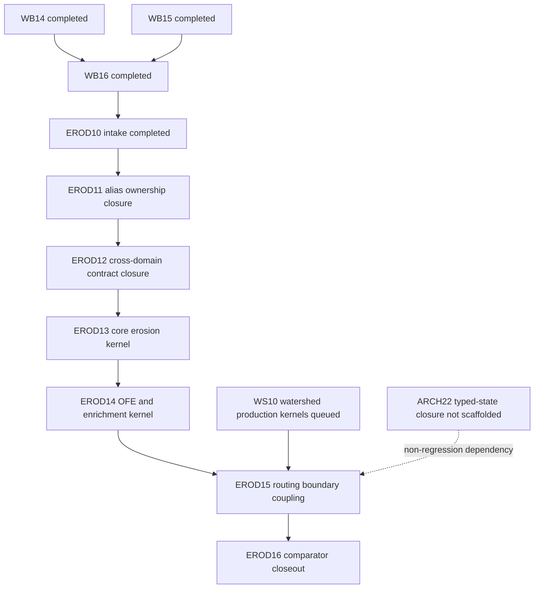

# EROD10 Sediment-Kernelization Dependency Graph

Status: `completed`
Evidence mode: `Static + Ran`

Static:
- Dependency edges derive from PL09 post-closeout queue addendum, PL15 decision
  posture, WB16 completion evidence, and companion contract gap registers.
- Erosion-lane implementation target is legacy WEPP process-physics migration
  (Chapter-11 family + coupled hydraulics/runoff/routing physics), authored in
  canonical `SC-*` contracts and implemented in openWEPP runtime kernels.
- Legacy migration physics authority defaults to pinned baseline
  `/workdir/wepp-forest_260430_baseline` at commit
  `dac3c950d8b16cc73774bf5ce2e7e11f80baac70` unless explicitly justified.

Ran:
- Dependency sources were enumerated and cross-checked via `rg`/`sed` reads in
  the repository worktree.

## Graph Goal (Normative)

This dependency graph exists to deliver **legacy-physics implementation**, not
placeholder/surrogate closure. For erosion-lane packages (`EROD11..EROD16`):

1. Canonical contracts must encode the required legacy physics equations,
   symbols, units, guards, and branch semantics.
2. Contract-derived tests and pre-implementation contract-gate evidence must
   be completed before production code edits.
3. Runtime kernels must implement those legacy-equivalent physics behaviors
   under typed guards.

## Node Inventory

| node_id | type | status | ownership lane | physics objective |
|---|---|---|---|---|
| `WB14` | upstream kernel package | completed | hydrology | Infiltration/hyetograph forcing required by erosion legacy physics. |
| `WB15` | upstream kernel package | completed | hydrology+plant coupling | Canopy-interception coupling required for physically consistent forcing inputs. |
| `WB16` | upstream kernel package | completed | hydrology+routing coupling | Peak/duration forcing (`peakro`, `watdur`) required by erosion legacy physics. |
| `EROD10` | intake package | completed | erosion intake/governance | Ratify executable wave path to legacy erosion-physics implementation. |
| `EROD11` | planned follow-on | queued (planned) | governance+contracts | Close alias/ownership ambiguity so legacy symbols and physics terms are authoritative in `SC-*`. |
| `EROD12` | planned follow-on | queued (planned) | contracts | Close cross-domain contract gaps so legacy coupled physics is promotable. |
| `EROD13` | planned follow-on | queued (planned) | hillslope erosion kernel | Implement core legacy hillslope erosion physics (continuity/detachment/deposition/transport). |
| `EROD14` | planned follow-on | queued (planned) | hillslope erosion kernel | Implement legacy multi-OFE/enrichment routing physics. |
| `WS10` | external follow-on dependency | queued | watershed kernel | Provide production watershed consumer path needed for legacy-consistent sediment routing handoff. |
| `EROD15` | planned follow-on | queued (planned) | erosion-routing integration | Implement production erosion-to-routing payload coupling under legacy physics contracts. |
| `EROD16` | planned follow-on | queued (planned) | closeout/comparator | Close out legacy-physics implementation claims with tiered comparator evidence. |
| `ARCH22` | external architecture dependency | not scaffolded | architecture | Typed-surface non-regression guard for stable physics-boundary coupling. |

## Dependency Edges

| from | to | edge_class | rationale |
|---|---|---|---|
| `WB16` | `EROD10` | hard | EROD10 intake baseline requires completed peak-runoff payload authority. |
| `EROD10` | `EROD11` | hard | Alias/ownership closure is first mandatory gate before any legacy-physics erosion code-authoring package. |
| `EROD11` | `EROD12` | hard | Cross-domain contract closure requires alias and owner ratification first so legacy coupled physics is canonical. |
| `EROD12` | `EROD13` | hard | Contract-first sequencing requires legacy-physics contract + contract-test closure before production kernel edits. |
| `EROD13` | `EROD14` | hard | Legacy OFE/enrichment physics depends on completed core erosion state/branch surfaces. |
| `EROD14` | `EROD15` | hard | Legacy routing-boundary integration requires complete hillslope sediment physics payloads. |
| `WS10` | `EROD15` | hard | Production watershed consumer path must exist before legacy-consistent erosion-routing production coupling closes. |
| `ARCH22` | `EROD15` | soft-investigation | Typed-surface migration is a non-regression architecture guard for boundary stability at integration seam. |
| `EROD15` | `EROD16` | hard | Comparator/closeout package requires complete production coupling path for legacy-physics claim validation. |

## Graph (Mermaid)

## Gate Classes

- `hard`: downstream package remains `HOLD` until upstream edge is complete.
- `soft-investigation`: downstream package may proceed only with explicit
  documented exception/risk acceptance and non-regression evidence.

## Critical Path

1. `EROD10 -> EROD11 -> EROD12`
   Contract authority path to make legacy erosion physics normative in `SC-*`.
2. `EROD12 -> EROD13 -> EROD14`
   Core + OFE/enrichment legacy hillslope erosion physics implementation path.
3. `EROD14 + WS10 -> EROD15`
   Legacy-consistent sediment export payload and routing consumer coupling path.
4. `EROD15 -> EROD16`
   Comparator/governance closeout path for evidence-backed legacy-physics claims.

This is the authoritative erosion-lane execution sequence ratified by EROD10.
