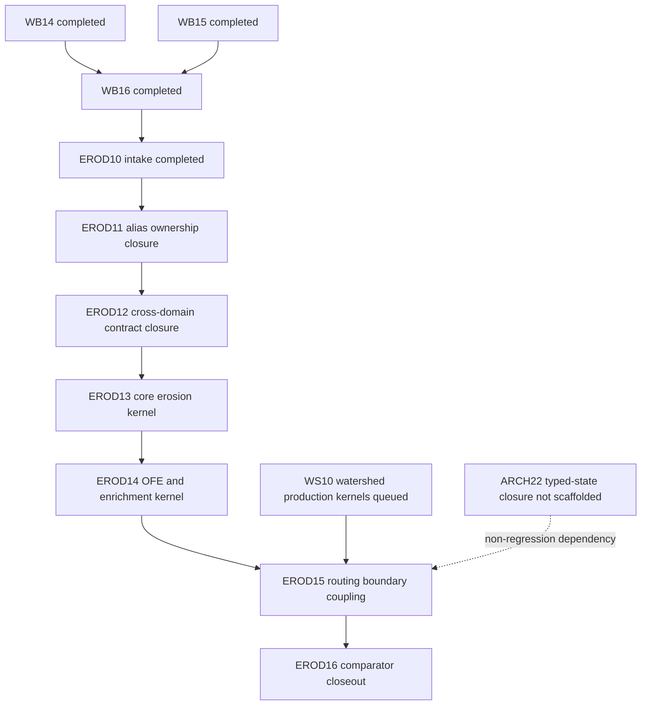

# EROD10 Sediment-Kernelization Dependency Graph

Status: `completed`
Evidence mode: `Static + Ran`

Static:
- Dependency edges derive from PL09 post-closeout queue addendum, PL15 decision
  posture, WB16 completion evidence, and companion contract gap registers.

Ran:
- Dependency sources were enumerated and cross-checked via `rg`/`sed` reads in
  the repository worktree.

## Node Inventory

| node_id | type | status | ownership lane |
|---|---|---|---|
| `WB14` | upstream kernel package | completed | hydrology |
| `WB15` | upstream kernel package | completed | hydrology+plant coupling |
| `WB16` | upstream kernel package | completed | hydrology+routing coupling |
| `EROD10` | intake package | completed | erosion intake/governance |
| `EROD11` | planned follow-on | queued (planned) | governance+contracts |
| `EROD12` | planned follow-on | queued (planned) | contracts |
| `EROD13` | planned follow-on | queued (planned) | hillslope erosion kernel |
| `EROD14` | planned follow-on | queued (planned) | hillslope erosion kernel |
| `WS10` | external follow-on dependency | queued | watershed kernel |
| `EROD15` | planned follow-on | queued (planned) | erosion-routing integration |
| `EROD16` | planned follow-on | queued (planned) | closeout/comparator |
| `ARCH22` | external architecture dependency | not scaffolded | architecture |

## Dependency Edges

| from | to | edge_class | rationale |
|---|---|---|---|
| `WB16` | `EROD10` | hard | EROD10 intake baseline requires completed peak-runoff payload authority. |
| `EROD10` | `EROD11` | hard | Alias/ownership closure is first mandatory gate before any erosion code-authoring package. |
| `EROD11` | `EROD12` | hard | Cross-domain contract closure requires alias and owner ratification first. |
| `EROD12` | `EROD13` | hard | Contract-first sequencing requires contract + contract-test closure before production kernel edits. |
| `EROD13` | `EROD14` | hard | OFE/enrichment phase depends on core erosion state/branch surfaces. |
| `EROD14` | `EROD15` | hard | Routing-boundary integration requires complete hillslope sediment payloads. |
| `WS10` | `EROD15` | hard | Production watershed consumer path must exist before erosion-routing production coupling closes. |
| `ARCH22` | `EROD15` | soft-investigation | Typed-surface migration is a non-regression architecture guard for boundary stability at integration seam. |
| `EROD15` | `EROD16` | hard | Comparator/closeout package requires complete production coupling path. |

## Graph (Mermaid)

## Gate Classes

- `hard`: downstream package remains `HOLD` until upstream edge is complete.
- `soft-investigation`: downstream package may proceed only with explicit
  documented exception/risk acceptance and non-regression evidence.

## Critical Path

1. `EROD10 -> EROD11 -> EROD12`
2. `EROD12 -> EROD13 -> EROD14`
3. `EROD14 + WS10 -> EROD15`
4. `EROD15 -> EROD16`

This is the authoritative erosion-lane execution sequence ratified by EROD10.
