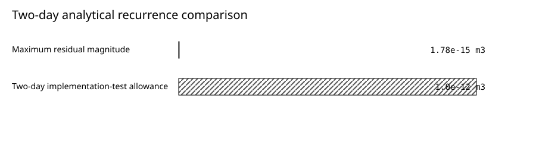
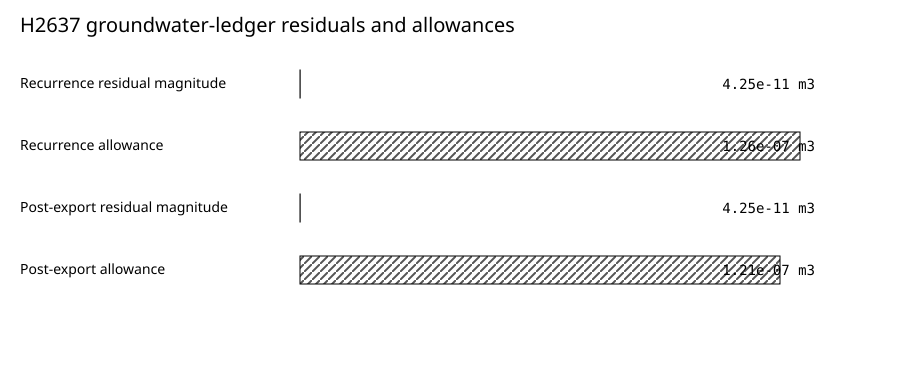

# Verification of openWEPP's Daily Linear Groundwater-Reservoir Recurrence

> **TEST ONLY — NOT SCIENTIFICALLY APPROVED**
*Version 0.1 — 2026-07-15*

*Audience: hydrologists, soil scientists, environmental-model researchers, and
practitioners assessing the implementation basis of openWEPP groundwater
outputs.*

Internal architecture-fixture author: Codex (AI coding agent). Accountable human
report lead: unassigned. Scientific approver: unassigned.

## Key Findings

- openWEPP reproduced the authorized two-day linear-reservoir recurrence with
  a maximum absolute residual of
  `1.78e-15 m3`, below the
  `1.0e-12 m3` implementation-test allowance,
  including the one-day timing of storage debits.
- An independently reconstructed production case spanning
  731 d closed both terminal-storage identities
  within `4.25e-11 m3`, against allowances
  of about `1.21e-07 m3`.
- Generated baseflow and deep seepage reached the watershed consumer through
  the production hillslope-pass boundary; the enabled branch did not
  substitute the separate channel baseflow coefficient (`cbase`) or return
  groundwater to surface routing.

### Authorship and review disclosure

This manuscript is the internal, nonpublic ASSURE-04A source-contract fixture
derived from the ASSURE-02 architecture prototype. Codex drafted both versions
under maintainer direction. The exact model/configuration used for the
ASSURE-02 draft was not retained; this incomplete agent provenance is disclosed
in the structured source and blocks review entry. ASSURE-02 received internal
coding-agent architecture review, not external scientific peer review. No human
report lead or scientific approver has accepted this manuscript. It demonstrates
how evidence is presented and identified; it is not approved for publication
and does not replace accountable human authorship or scientific review of a
future production report.

## Plain-Language Summary

openWEPP represents delayed groundwater discharge with a reservoir that
receives deep drainage from the soil and releases fixed daily fractions as
baseflow and deep seepage. We checked whether the software follows the
authorized equations, keeps the day-to-day accounting in the correct order,
rejects physically inconsistent coefficient combinations, and delivers the
calculated baseflow to the watershed model. A two-day calculation matched
independently computed values. A production run spanning
731 d balanced groundwater
recharge, storage, and discharge to much less than a billionth of a cubic
meter. These results show that the assessed software realization correctly
carries out and transfers this specific recurrence. They do not show how
accurately baseflow will be predicted for an untested watershed; that requires
observations and site-appropriate parameters in a separate empirical study.

## Abstract

Groundwater baseflow can sustain streamflow after rapid surface and lateral
responses decline. The WEPP linear-reservoir extension represents this process
with daily storage forced by deep percolation and proportional releases to
baseflow and deep seepage. We evaluated whether the assessed openWEPP
implementation realizes the authorized recurrence, enforces its domain, and
preserves generated groundwater fluxes through the watershed consumer. The
method combined formulation traceability, an independently calculable two-day
vector, negative domain tests, production consumer tests, and reconstruction
of a run spanning 731 d with
19 OFEs. The two-day vector produced storage of
`12.0 m3` and
`14.2 m3`, baseflow of
`1.20 m3` and
`1.42 m3`, and deep seepage of
`0.60 m3` and
`0.71 m3`, matching the analytical recurrence.
In the production case, the terminal-storage identities closed within
`4.25e-11 m3`. Generated baseflow and deep seepage also traversed the
hillslope-pass boundary. We conclude that the assessed realization is verified
for this bounded daily recurrence and tested consumer path. Field performance,
coefficient transferability, uncertainty in deep-percolation forcing, and
fitness for a particular watershed were not evaluated.

## 1. Introduction

Streamflow in forest watersheds can contain surface runoff, lateral subsurface
flow, and delayed groundwater baseflow. Srivastava et al. (2013) coupled WEPP
deep percolation to a linear groundwater reservoir. In a calibrated evaluation
at Priest River Experimental Forest, the authors reported improved streamflow
performance when the baseflow routine was included.

Those calibration-conditioned statistics describe a complete coupled-model
application, including its forcing, parameters, and interacting processes.
They motivate the formulation but do not establish that a new software
realization implements the recurrence correctly. This study therefore asks a
bounded prior question: does openWEPP perform the accepted calculation and
move its outputs through the production model without loss, substitution, or
double counting?

## 2. Model Formulation

For day `i`, recharge `D_i` is the hillslope volume of WEPP deep percolation.
Storage is updated by adding current recharge and removing the preceding day's
baseflow and deep seepage:

`S_i = S_(i-1) + D_i - Qb_(i-1) - Qs_(i-1)`.

Current-day baseflow and deep seepage are proportional to accepted storage:

`Qb_i = kb S_i Δt`, and `Qs_i = ks S_i Δt`,

where `S`, `D`, `Qb`, and `Qs` are daily volumes in cubic meters, `kb` and `ks`
have units of inverse days, and `Δt = 1 d`. The
contract and code use the equivalent shorthand `Q = kS` because the interval is
fixed at one day.

Current openWEPP authority admits finite nonnegative coefficients. For positive
accepted storage, combined daily exports may not exceed storage. Negative
`ks`, which could represent upward exchange in broader modeling lineages, is
outside current authority.

## 3. Materials and Methods

### 3.1 Assessed realization and authority

The integrated evidence was generated at Git commit
`de520f1ff867ca5c65b1f82dfe32a19c213ae18c`. ASSURE-02 confirmed that the
declared implementation and test paths were unchanged at its documentation
intake. The recurrence and coefficient domain are identified by
`SC-GWBASEFLOW-001`; exact source and evidence identities are retained in the
supplement and structured source manifest.

### 3.2 Analytical recurrence test

The two-day vector uses `1000 m2` of area,
`0.010 m` initial storage depth,
`kb = 0.10 d^-1`, `ks = 0.05 d^-1`, and recharge
of `2.0 m3` then
`4.0 m3`.
Expected values were computed directly from the equations. The absolute
acceptance allowance is `1.0e-12 m3` for each
storage or export value.
This is a floating-point implementation-test tolerance, not a hydrologic
accuracy threshold.

### 3.3 Domain and integration tests

Negative tests reject coefficient combinations whose combined exports exceed
accepted storage. Consumer tests follow generated volumes through direct
runtime publication, hillslope binary serialization and parsing, watershed
contribution construction, and channel routing. Separate assertions distinguish
generated groundwater baseflow from the channel `cbase` contribution and from
surface-runoff routing.

### 3.4 Production recurrence reconstruction

The retained H2637 case spans 731 d and
19 OFEs. We independently
reconstructed the terminal pre-export identity

`SN = S0 + sum(D) - [sum(Qb) - QbN] - [sum(Qs) - QsN]`

and the complete post-export ledger

`SN - QbN - QsN = S0 + sum(D) - sum(Qb) - sum(Qs)`.

Storage-scaled acceptance allowances accommodate floating-point accumulation;
they are not measurement uncertainty, convergence criteria, or calibrated
error targets.

## 4. Results

### 4.1 Two-day analytical vector

**Two-day analytical recurrence vector.** Independent analytical and openWEPP daily storage and export values for the two-day recurrence vector.

| Day | Recharge (`m3`) | Storage before (`m3`) | Storage after (`m3`) | Baseflow (`m3`) | Deep seepage (`m3`) |
| --- | ---: | ---: | ---: | ---: | ---: |
| First day | 2.0 | 10.0 | 12.0 | 1.20 | 0.60 |
| Second day | 4.0 | 12.0 | 14.2 | 1.42 | 0.71 |

*Accessible table summary: The two rows show recharge, accepted storage before and after the recurrence, baseflow, and deep seepage for each simulated day.*

*Figure: Maximum implementation residual compared with the coded allowance for the two-day analytical vector.*

| Series | Value (`m3`) |
| --- | ---: |
| Maximum residual magnitude | 1.78e-15 |
| Two-day implementation-test allowance | 1.0e-12 |

*Accessible data alternative: Tabular values show exact agreement within the binary64 allowance for both simulated days.*

The maximum absolute residual was
`1.776356839400250e-15 m3`, below the
`1.0e-12 m3` allowance. Second-day storage equals
`12.0 m3 + 4.0 m3 -
1.20 m3 -
0.60 m3 =
14.2 m3`, confirming the prior-day debit timing.

### 4.2 Production ledger reconstruction

**H2637 terminal groundwater ledger.** Retained groundwater-ledger operands, independently reconstructed residuals, and coded allowances for H2637.

| Quantity | Value (`m3`) |
| --- | ---: |
| Initial storage | 0.0 |
| Cumulative recharge | 3668.610172576748 |
| Cumulative baseflow | 3547.636225849919 |
| Cumulative deep seepage | 0.0 |
| Terminal pre-export storage | 126.01452784040274 |
| Terminal-day baseflow | 5.04058111361611 |
| Terminal-day deep seepage | 0.0 |
| Recurrence residual | -4.249045559845399e-11 |
| Complete post-export ledger residual | -4.250466645316919e-11 |
| Recurrence allowance | 1.260145278404028e-07 |
| Post-export allowance | 1.209739467267866e-07 |

*Accessible table summary: The table lists the complete cubic-metre operands, both signed residuals, and both storage-scaled allowances.*

*Figure: Independently reconstructed terminal groundwater-ledger residuals compared with coded storage-scaled allowances.*

| Series | Value (`m3`) |
| --- | ---: |
| Recurrence residual magnitude | 4.25e-11 |
| Recurrence allowance | 1.26e-07 |
| Post-export residual magnitude | 4.25e-11 |
| Post-export allowance | 1.21e-07 |

*Accessible data alternative: Both residual bars are far shorter than their corresponding allowance bars; exact values appear in the visible data table.*

Both identities passed their storage-scaled allowances, which were about
`1.21e-07 m3`. The residuals characterize
ledger consistency, not agreement with observed baseflow.

### 4.3 Guards and downstream consumption

The over-export vector (`kb = 0.80 d^-1`,
`ks = 0.30 d^-1`) failed before an inconsistent state was
accepted. Separate tests showed nonzero generated
groundwater fields in the hillslope-pass payload, consumption by the watershed
linear-reservoir branch, suppression below the declared contributing-area
threshold, and rejection when enabling coefficient authority was absent.

## 5. Discussion

The evidence supports a bounded positive conclusion: the assessed realization
implements the authorized daily recurrence, handles its tested domain boundary,
publishes operands needed for reconstruction, and connects generated fluxes to
a real watershed consumer. Showing equations, timing, units, operands,
residuals, and consumer behavior makes that conclusion independently auditable.

The latest runoff-event record differed from the terminal-day baseflow because
the final runoff event need not occur on the final simulation day. Publishing
timing-qualified operands prevented that plausible but incorrect alias from
entering the reconstruction.

The Priest River study is observational evidence for the coupled formulation,
not empirical validation of this openWEPP realization. A current empirical
study must rerun a frozen realization against admitted observations, document
calibration/evaluation separation, characterize forcing and measurement
uncertainty, and report performance over a declared domain.

## 6. Limitations and Intended Use

This evidence applies to the daily linear-reservoir recurrence, admitted
coefficient domain, named implementation realization, and tested publication
and consumer paths. It does not establish parameter transferability,
observational accuracy, timing at subdaily scales, uncertainty bounds,
numerical convergence, or suitability for a specific watershed decision.

The appropriate use is software and formulation assurance preceding empirical
evaluation. Users should not treat this bounded verification as a claim that
baseflow predictions are accurate everywhere or that a watershed application
is fit for purpose.

## 7. Conclusions

For the equations, vectors, production case, and consumer branches examined,
the assessed openWEPP realization follows the authorized daily groundwater-
reservoir recurrence and preserves generated fluxes through the tested
watershed handoff. That is a positive, bounded software-verification result.
The next distinct evidence step is empirical corroboration of a frozen release
realization against independently admitted watershed observations. A
practitioner should not treat this result as a site-specific baseflow-prediction
warranty.

## 8. Reproducibility

The [technical supplement](supplement.md) maps every finding to stable claim,
method, dependency, result, and reference identities. Machine-readable
[two-day result](research-objects/two-day-recurrence.json) and
[H2637 ledger](research-objects/h2637-ledger.json) objects retain the exact
claim-bearing operands. The
[portable science contract](research-objects/SC-GWBASEFLOW-001.md)
retains the formulation authority. The broader
[model-science narrative](../../../../hillslope-hydrology-and-sediment-physics.md)
explains how groundwater interacts with the rest of the hillslope and watershed
formulation. ASSURE-04C validates these sources offline and verifies their
content hashes; later packages own review locks and publication.

## References

Srivastava, A., Dobre, M., Wu, J. Q., Elliot, W. J., Bruner, E. A., Dun, S., Brooks, E. S., and Miller, I. S. 2013. Modifying WEPP to improve streamflow simulation in a Pacific Northwest watershed. Transactions of the ASABE 56(2), 603-611. [doi:10.13031/2013.42691](https://doi.org/10.13031/2013.42691)

openWEPP daily groundwater reservoir and baseflow/deep-seepage publication science contract. (`sha256:97ee00e87df4a87221aa34fc1f44c77176f43922bcfac96c69d4b6de8e230d60`)

## About This Report Source

- Report identity: `linear-groundwater-reservoir-recurrence`, source version
  `0.1.0`.
- Assessed realization: `de520f1ff867ca5c65b1f82dfe32a19c213ae18c`.
- Source role: nonpublic ASSURE-04A architecture fixture; not scientifically
  approved, release-transferred, exported, or vendored.
- Accountable human report lead and scientific approver: unassigned; review
  entry is blocked.
- Agent assistance: disclosed in the source manifest; the exact ASSURE-02
  model/configuration was not retained, so provenance is incomplete.
- Review: internal coding-agent architecture review only; external scientific
  peer review is not claimed.
- Supersession: a revised and approved ASSURE-05 report replaces this fixture
  rather than promoting it unchanged.

## Revision Log

| Version | Date | Changes |
| --- | --- | --- |
| 0.1 | 2026-07-15 | Established the internal manuscript fixture and deterministic result-bound assembly source for scientific review preparation. |
