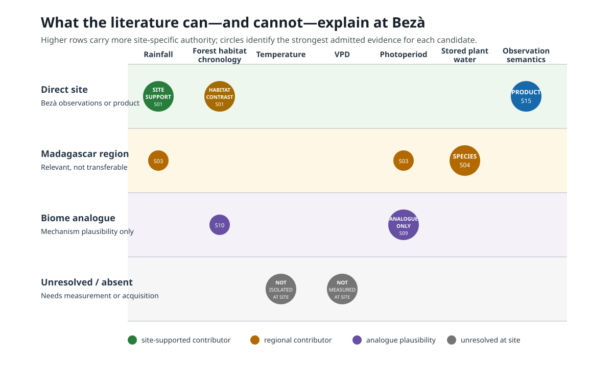

# Evidence Authority Map

## Caption

The candidate explanations do not have equal authority. Direct Bezà evidence
supports rainfall as a contributor and demonstrates different leaf-retention
chronology between gallery and xerophytic forest. The public PhenoCam archive
directly establishes an observation-product distinction. Stored plant water
has regional support in western-Madagascar baobabs, while photoperiod and
soil-water/hydraulic mechanisms remain regional or biome analogues.
Temperature was seasonally correlated but not independently isolated at Bezà;
VPD was not measured as an independent site driver.

## How to read the figure

Rows represent the strongest admitted authority, not the number of papers.
Higher is more site-specific. Large circles mark the main disposition for a
candidate; smaller circles show supporting evidence at another tier. Source
IDs map to `../source-register.csv`.

The green rainfall circle means “supported contributor,” not “sole trigger.”
The forest-habitat circle records the observed gallery/xerophytic chronology
contrast; groundwater causation remains unmeasured. The blue observation circle concerns
the identity and semantics of the site data product, not a biological
mechanism.

## Ancillary information

- Direct-site phenology authority: S01.
- Regional rainfall and species-heterogeneity authority: S03.
- Stored-water physiological authority: S04.
- Photoperiod analogue: S09.
- Soil-water/hydraulic analogue: S10.
- Site transition-product authority: S15.
- Evidence statuses and limits: `../claim-evidence-matrix.csv`.
- Product-specific date differences: `../phenocam-transition-product-audit.csv`.

The figure is a qualitative authority map. Circle position within a row and
circle size are not effect-size estimates, confidence intervals, or source
counts. It must not be used to select a production equation or parameter.
