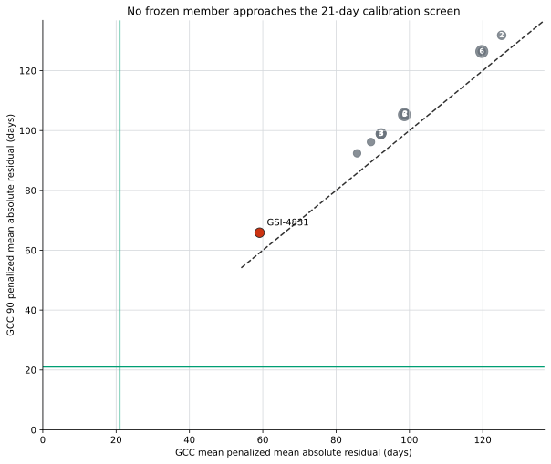

# Cross-Product Calibration Screen

## Caption

Every frozen member remains far outside the 21-day screen under both products.
The best joint member, `GSI-4831`, has penalized mean absolute residuals of
59.12 days for `gcc_mean` and 65.87 days for `gcc_90`. Product ranks are
identical (`Spearman = 1.0`), so changing products does not reveal a hidden
calibration candidate.

## How to read the figure

Each bubble is one unique pair of product scores. Bubble size represents the
number of members with identical scores, and white numbers label groups larger
than one. The dashed line is equal performance under both products. Green
lines mark the prospective 21-day screen. The red point is the lowest combined
score, not a calibrated or recommended parameter set.

The score is mean absolute residual with each missing seasonal crossing
penalized by 183 days. That penalty is a declared ranking device, not a
physical bound. The binding decision also requires crossing completeness,
confidence-interval coverage, direction coherence, parameter plausibility, and
empirical-role separation.

## Ancillary information

- Members: 37 frozen CAL-04B accepted candidates.
- Product top-quartile overlap: 100%.
- Members complete for all 12 transitions in both products: zero.
- Members passing uncertainty fit in both products: zero.
- Members passing rising/falling direction coherence in both products: zero.
- Exact member metrics: `../member-summary.csv`.
- Exact rank pairs: `../product-rank-comparison.csv`.
- Binding disposition: `../decision-screen.csv`.

The figure supports a no-calibration disposition; it does not select
`GSI-4831` for production.
