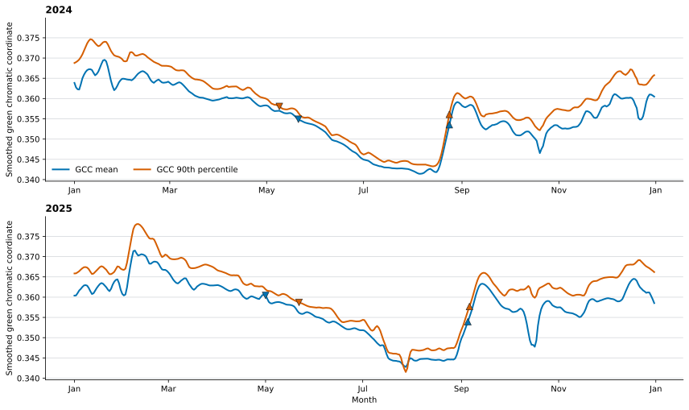

# Bezà GCC Product Curves

## Caption

The retained provisional `gcc_mean` and `gcc_90` curves describe the same
broad 2024 and 2025 seasonal cycle. Downward triangles mark falling T50 dates;
upward triangles mark rising T50 dates. Rising dates nearly coincide across
products. Falling dates are visibly product-sensitive, especially in 2025.

## How to read the figure

Blue is the smoothed daily GCC mean; orange is the smoothed daily 90th
percentile. Triangle height is the product-specific fitted T50 threshold, so
the two products' markers need not lie at the same y-value. These thresholds
are relative fractions of fitted seasonal GCC amplitude, not fractions of
leaf cover, LAI, biomass, GSI, or physiological activity.

The 2024 and 2025 curves contain 731 consecutive daily rows. All retained
outlier flags are zero. Twenty-one 2025 days carry provider interpolation
flags; none of the source transitions is inferred solely from a CAL-07F
interpolation rule.

## Ancillary information

- Daily source: CAL-07 retained provisional Data Record 4, processed
  26 July 2026.
- Transition source: CAL-07E checksum-bound provisional Data Record 5 rows.
- ROI: one foreground tropical dry-forest mask effective from 4 July 2023
  through the provider's open-ended end date.
- `source-transition-audit.csv` verifies all 24 transitions against the daily
  smooth curves. Twenty-three select the same nominal date; 2024 `gcc_90`
  falling T25 selects a daily threshold crossing 4.625 days later, inside its
  reported confidence interval.
- Exact daily values: `../daily-product-curves.csv`.

The figure is diagnostic-only and does not establish which GCC product is a
better biological observation operator.
