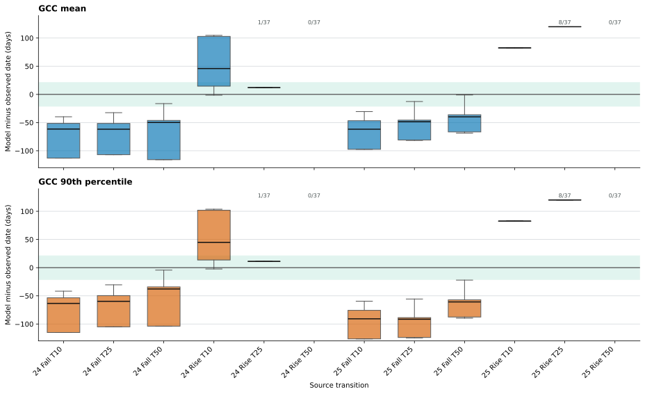

# Product-Specific Timing Residuals

## Caption

Across both products, the frozen BASE ensemble loses canopy too early and
regains it too late. Falling medians are approximately 38 to 92 days early.
Rising T10 medians are approximately 45 days late in 2024 and 83 days late in
2025. Rising T50 has no season-window crossing for any of the 37 members in
either year. The green band is the prospective ±21-day calibration screen.

## How to read the figure

Residual equals model crossing date minus observed transition date:

- negative is early model timing;
- positive is late model timing; and
- a missing box means no member supplied a valid crossing in that seasonal
  window.

Text such as `1/37`, `8/37`, or `0/37` reports incomplete crossing
availability. Boxes summarize available members only; missing crossings are
not silently converted to zero residual.

## Ancillary information

- Comparison operator: event-year-relative model levels T10/T25/T50, used only
  as a retrospective scale analogy.
- Falling windows begin 1 January and end halfway between product-specific
  falling T10 and rising T10.
- Rising windows begin at that midpoint and end 31 December.
- Each box can contain at most 37 frozen CAL-04B members.
- `gcc_mean` has one confidence-interval hit across the best member's 12
  comparisons; `gcc_90` has none.
- Exact rows: `../member-comparisons.csv`.

The plot does not imply that GCC and GSI are equivalent states or that the
21-day band is observational uncertainty.
