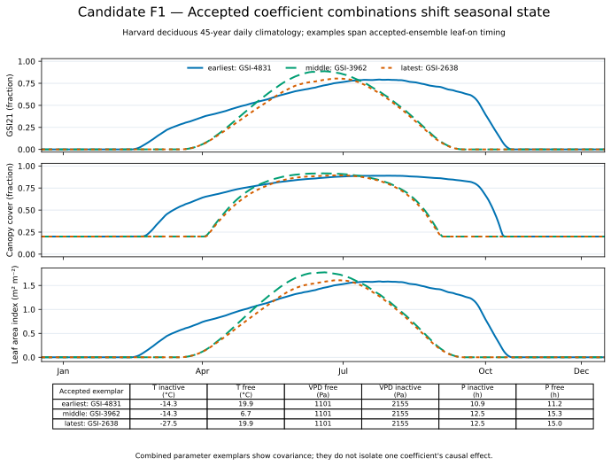

# Candidate F1 — Coefficient Response

## Candidate Caption

Three accepted Hubbard calibration members spanning the earliest, middle, and
latest Harvard leaf-on responses produce materially different annual GSI21,
canopy-cover, and LAI trajectories. The table gives each member's temperature,
VPD, and photoperiod threshold pairs. These are correlated, accepted parameter
combinations, so the contrast shows ensemble covariance rather than the causal
effect of changing one coefficient in isolation.

## Reader Context

This is the most direct candidate for explaining how user coefficients alter
model dynamics. The persistent 0.2 canopy floor remains when deciduous foliage
is absent. The earliest example stays active much longer and has a lower,
broader peak; the middle and latest examples have similar seasonal shapes
despite different temperature and photoperiod thresholds.

## Data And Method

- Model surface: Harvard deciduous, 45-year daily climatology.
- Members: three exemplars selected by first day GSI21 reaches 0.5 among the
  frozen 37-member ensemble.
- Quantities: GSI21 and canopy cover are fractions; LAI is m² m⁻².
- Sources: CAL-06 `daily-climatology.csv`, CAL-04B
  `candidate-configurations.csv`, and
  `accepted-calibration-ensemble.csv`.
- Exact exemplar rows: `f1-exemplar-coefficients.csv`.

## Limitations

This is a model-response comparison, not a one-at-a-time sensitivity experiment
or independent empirical validation. The selected lines summarize three
combinations and do not represent confidence bounds or parameter priors.
