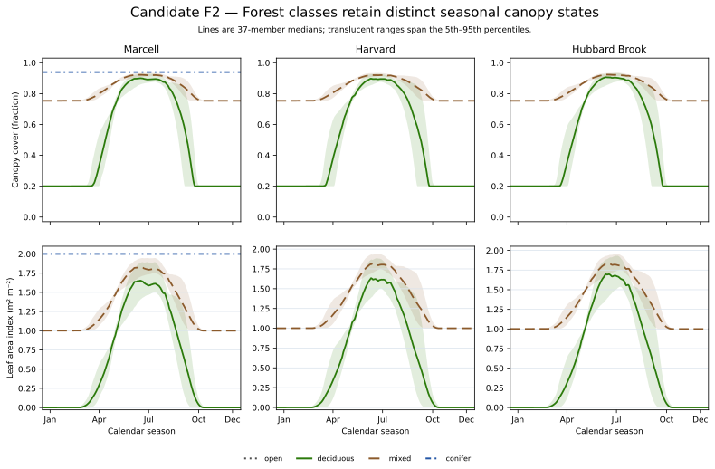

# Candidate F2 — Forest-Class Seasonality

## Candidate Caption

Daily modeled canopy cover and LAI distinguish deciduous, mixed, conifer, and
open strata across Marcell, Harvard, and Hubbard Brook. Lines are medians across
the frozen 37-member timing ensemble and translucent regions span its 5th–95th
percentiles. Only source-supplied strata appear; missing categories are not
manufactured.

## Reader Context

This candidate gives readers the broadest view of the seasonal states produced
by the native forest model. Deciduous lanes return to their structural canopy
floor and zero seasonal LAI; mixed lanes retain evergreen foliage; the Marcell
conifer lane remains persistent.

## Data And Method

- Source: CAL-06 `daily-climatology.csv`.
- Period: 45-year daily climatology for every production run.
- Quantities: canopy-cover fraction and LAI in m² m⁻².
- Ensemble display: daily median and 5th–95th percentile.

## Limitations

The figure demonstrates within-model state differentiation. It does not provide
observed canopy-amplitude validation, and the available sites do not contain
every forest stratum.
