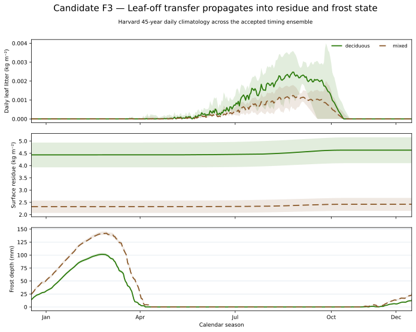

# Candidate F3 — Litter, Residue, And Frost

## Candidate Caption

Harvard deciduous and mixed simulations show the modeled seasonal sequence from
leaf-off litter transfer to aggregate surface-residue state and frost depth.
Lines are accepted-ensemble medians and bands span the daily 5th–95th
percentiles over the 45-year climatology.

## Reader Context

The top panel exposes the autumn litter-transfer pulse. The middle panel shows
that the aggregate forest-floor pool is much larger and changes more slowly.
The bottom panel shows the downstream frost state that consumes the residue
depth and snow boundary.

## Data And Method

- Source: CAL-06 `daily-climatology.csv`.
- Quantities: daily leaf litter and aggregate surface residue in kg m⁻²; frost
  depth in mm.
- Forest types: source-supplied Harvard deciduous and mixed lanes.

## Limitations

The production model has one aggregate surface-residue pool. Predictive needle
and fine-woody sources are absent, and this figure cannot establish that the
residue or frost magnitudes are empirically adequate. Similar timing does not
prove unique causation because snow and soil conditions also control frost.
