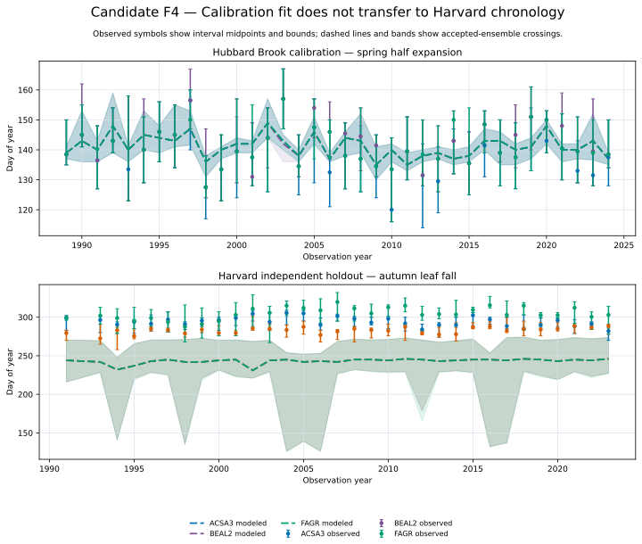

# Candidate F4 — Temperate Observed And Modeled Timing

## Candidate Caption

Observed phenology intervals and modeled accepted-ensemble crossings are shown
through time for the Hubbard Brook spring calibration and independent Harvard
autumn holdout. Observed symbols give interval midpoints and bounds. Dashed
lines give modeled medians and shaded regions span the 5th–95th percentiles of
the retained record-member crossings.

## Reader Context

The upper panel makes the calibration relationship inspectable rather than
reporting only an objective score. The lower panel exposes the poor Harvard
transfer: modeled leaf fall is generally much earlier than the observed
intervals, with some years showing a wide ensemble range.

## Data And Method

- Hubbard role: `CALIBRATION`.
- Harvard role: `INDEPENDENT_VALIDATION`, opened once and scored without refit.
- Source identities: recorded in `source-manifest.csv`.
- Derived plotted rows: `f4-temperate-timing-summary.csv`.
- Aggregation: species-year median observations and modeled crossings, with
  observed interval extent and modeled 5th–95th percentiles.

## Limitations

Aggregation combines plot-level records and ensemble members to make the
long-term chronology readable. It is not a confidence interval, and record
correlation means the plotted ranges are not independent samples.
