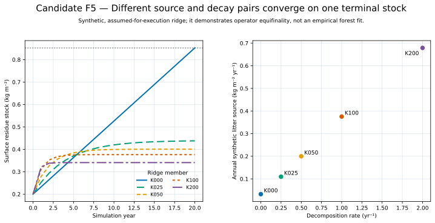

# Candidate F5 — Source And Decay Trajectories

## Candidate Caption

Five synthetic litter-source and decomposition-rate pairs follow different
20-year surface-residue trajectories but converge on the same terminal stock.
The right panel shows the strong positive source-rate relationship required to
hold that endpoint fixed.

## Reader Context

This is the clearest visual explanation of why a terminal forest-floor stock
cannot uniquely identify both recurring litter input and decomposition. A
larger source can be offset by a faster decay rate.

## Data And Method

- Source: CAL-05 `terminal-stock-ridge-design.csv`.
- Initial stock: 0.2 kg m⁻².
- Target year-20 stock: approximately 0.852271 kg m⁻².
- Daily recurrence uses each retained daily rate and a uniformly distributed
  synthetic annual source.

## Limitations

The ridge is `ASSUMED_FOR_EXECUTION` synthetic evidence. It demonstrates
operator behavior and equifinality, not a calibrated source, physiological
bound, probability distribution, or empirical forest trajectory.
