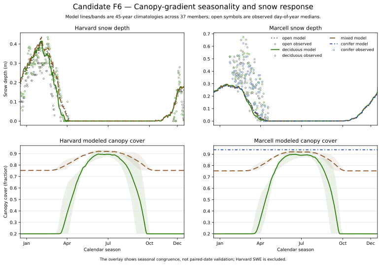

# Candidate F6 — Canopy-Gradient Snow Response

## Candidate Caption

Harvard and Marcell daily model climatologies show snow-depth response and the
corresponding modeled canopy-cover gradient. Lines are ensemble medians and
bands span the 5th–95th percentiles. Open symbols show admitted observed
snow-depth medians by day of year for each bound stratum.

## Reader Context

This required candidate lets readers see the seasonal trends behind the CAL-06
summary metrics. It shows whether open, deciduous, mixed, and conifer strata
retain coherent ordering and whether the observed snow season occupies a
similar calendar window.

## Data And Method

- Model source: CAL-06 `daily-climatology.csv`, 45-year climatology across 37
  accepted timing members.
- Observations: bound Harvard HF237 and Marcell RDS-2021-0016 snow-depth rows.
- Derived observation rows: `f6-observed-snow-climatology.csv`.
- Units: snow depth in m; canopy cover as a fraction.
- Harvard SWE is intentionally absent because the source unit metadata
  contradict its same-row depth-density identity.

## Limitations

The model and observation overlays share day of year but are not paired-date or
forcing-matched series. This candidate shows seasonal congruence and motivates
the formal score table; it cannot replace the paired observation evaluation or
establish canopy causation for a snow residual.
