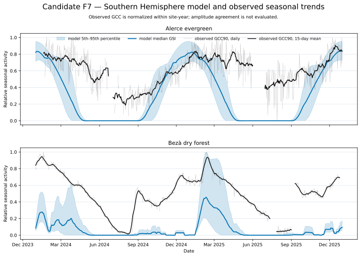

# Candidate F7 — Southern Hemisphere Seasonality

## Candidate Caption

Accepted-ensemble GSI time series are compared with observed GCC90 seasonal
activity for Alerce evergreen forest and Bezà tropical dry forest during the
2024–2025 evaluation years. Model bands span the 5th–95th percentiles. The thin
gray observation line shows daily values and the black line is a centered
15-day mean.

## Reader Context

The shared layout makes the biome contrast obvious. Alerce has a positive but
moderate observed/model shape association (median Pearson correlation about
0.47 to 0.49), which is bounded evidence rather than aligned-phase
confirmation. The combined signed-latitude and observed seasonal-direction
cell remains contradicted, and phase-transformed real-consumer chronology was
not evaluated. Bezà retains long observed seasonal transitions that are
absent, early, or strongly compressed in the model.

## Data And Method

- Source: CAL-07C `ensemble-daily.csv`.
- Observation transformation: GCC90 normalized independently within each
  site-year; the displayed smooth is a centered 15-day mean with at least five
  observations.
- Derived plotted rows: `f7-relative-seasonality.csv`.
- Model quantity: daily GSI fraction.

## Limitations

GCC and GSI are related activity indices, not the same physical quantity.
Within-year normalization removes amplitude information, and missing camera
days remain gaps. This figure addresses seasonal shape and chronology only.
