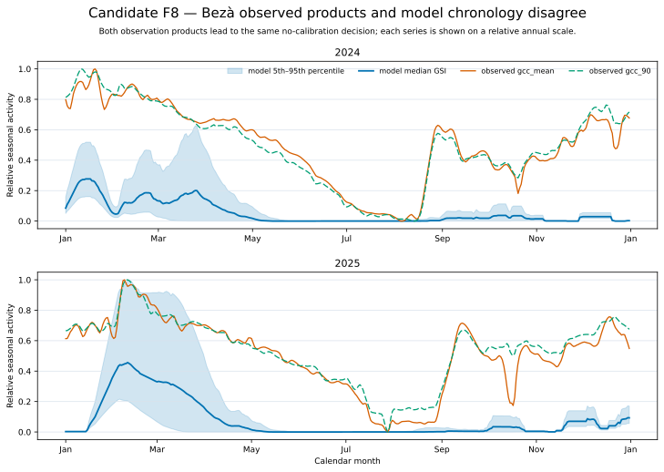

# Candidate F8 — Bezà Observed And Modeled Chronology

## Candidate Caption

The Bezà accepted-ensemble GSI trajectory is shown against independently
normalized `gcc_mean` and `gcc_90` observation products for both evaluation
years. The two products closely agree with each other but not with the modeled
seasonal chronology, supporting the product-consistent no-calibration decision.

## Reader Context

This is the most direct visual statement of the retained tropical dry-forest
limitation. The model produces short early-season activity pulses and little
late-season recovery while both observation products show long, multi-phase
seasonal structure.

## Data And Method

- Model source: CAL-07C `ensemble-daily.csv`.
- Observation source: CAL-07F `daily-product-curves.csv`.
- Each observation product is normalized within evaluation year.
- Model display: median and 5th–95th percentile of all 37 frozen members.

## Limitations

Relative scaling does not test GCC amplitude, LAI, or canopy-cover magnitude.
The mismatch cannot select a new production equation. The CAL-07F stop-loss
requires field-corresponded evidence, authoritative process science, or an
independently testable alternative formulation before reopening calibration.
