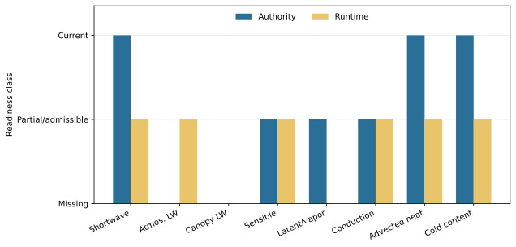

# Authority And Runtime Readiness

Caption: Authority and runtime coverage for the energy components needed by a
coupled snow surface balance. Shortwave and cold-content handling exist in
current/opt-in paths;
atmospheric and canopy longwave are missing from the snow runtime and lack
complete admitted process authority.

Question: Which components can a successor compose now, and which require new
authority or implementation?

Population: Current production and opt-in snow paths at base `31e14bdf`, plus
the shared meteorology surface-energy helpers.

Units: Ordinal readiness: `0` missing, `1` partial or authority-admissible, and
`2` current. The scale is categorical, not a performance score.

Processing: Each component was traced from canonical contract through helper,
runtime producer, and snow consumer. “Runtime” requires a real consuming path,
not an unused helper.

Uncertainty and exclusions: The figure does not assess numerical accuracy and
does not promote Stage 3. It excludes prospective equations.

Interpretation: EB-03 can reuse substantial turbulent and conversion
infrastructure, but EB-02 is blocked by load-bearing longwave inputs and
composition authority.

Limitation: A partial classification can combine different gaps; consult
[the implementation ledger](../current-implementation-ledger.csv) and
[authority ledger](../authority-gap-ledger.csv) for exact findings.
