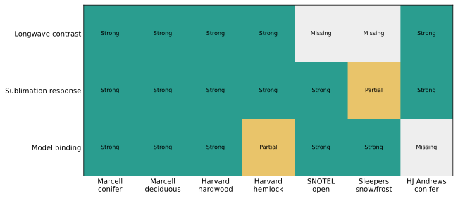

# Observation Discrimination And Binding

Caption: Ability of candidate observation lanes to distinguish a canopy
longwave contrast, constrain sublimation response, and bind to a modeled
stratum. Green is strong, amber partial, and gray missing.

Question: Which installed observations can identify the proposed mechanisms,
and where is the decisive transfer gap?

Population: Installed Marcell, Harvard, SNOTEL, and Sleepers observations plus
the identified but unavailable HJ Andrews warm-maritime conifer lane.

Units: Categorical evidence strength, not sample count. “Strong” requires a
useful response or contrast and an adequate binding for the named row.

Processing: Source custody, normalized observations, model fixture bindings,
measured quantities, climate, and stratum were reconciled before assigning
roles.

Uncertainty and exclusions: SNOTEL sites are open controls and cannot identify
canopy longwave. Sleepers provides a downstream frost consequence but not
paired SWE. Harvard hemlock is unbound.

Interpretation: Current data support cold-continental canopy and humid
hardwood/open evaluation. A warm-maritime conifer transfer claim remains
unidentified.

Limitation: The matrix summarizes identifiability; row counts, periods,
operators, and precise limitations are in
[the observation ledger](../observation-fixture-ledger.csv).
