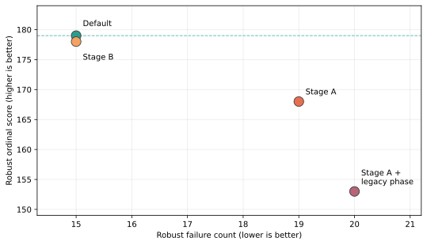

# Prior Sublimation Candidate Outcomes

Caption: Retained robust outcomes for the current default and prior
sublimation candidates. Better results move up and left. Stage B matched the
default's failure count but scored one ordinal point lower.

Question: Did an existing sublimation candidate already justify promotion?

Population: The ten-site, 640-cell Stage B unlock matrix retained by
SNOWDENSITY-10.3.20.

Units: Robust failure count and unitless robust ordinal score under that
package's preregistered rubric.

Processing: Values are read from the retained Stage B JSON. No rerun or
rescoring was performed.

Uncertainty and exclusions: The rubric aggregates multiple mechanisms and
sites; proximity to the default does not establish physical correctness.

Interpretation: Stage B is the closest prior candidate, but remains
nonpromoted. EB-03 must reconcile physics and ledgers rather than reactivate it
as a default.

Limitation: This plot does not show site-level residuals or uncertainty and is
not evidence for a longwave formulation.
