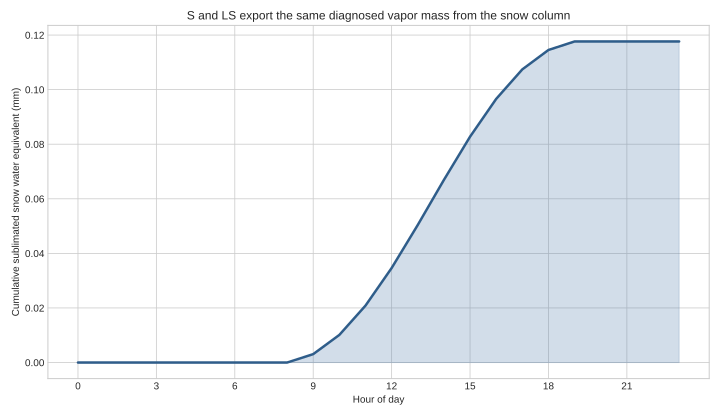

# EB-03 cumulative sublimation



The curve translates the signed vapor exchange into the more familiar depth
of snow water equivalent removed from the Stage 3 column. The S and LS cells
use this one mass exchange to derive both snow-state loss and latent energy;
the vapor is not routed as liquid or melt.

This is a deterministic analytical interpretation artifact, not site
calibration or observed validation. It uses the same prescribed forcing as
the companion hourly-energy figure. The plotted mass is loss-positive for
readability; the internal vapor flux and latent energy are negative under the
contract’s positive-toward-snow convention. This curve does not establish a
viable runtime: the real S/LS consumers reach the absolute-zero provider bound
with material SWE remaining.

Regenerate with:

```bash
.venv/bin/python docs/work-packages/20260730-snow-surface-eb-03-shared-thermal-energy-composition-001/tools/generate_figures.py
```
