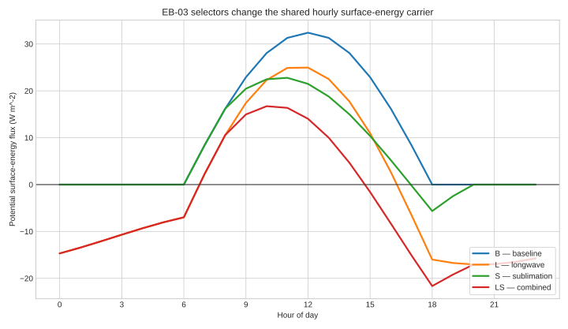

# EB-03 hourly energy cells



The figure separates what each default-off selector contributes to the one
Stage 3 hourly carrier. `B` contains absorbed shortwave; `L` adds canonical
sub-canopy net longwave; `S` adds the negative latent-energy consequence of
sublimation; and `LS` carries both. Negative values increase snow cold
content, while positive potential first reduces cold content and is not
converted to energy-balance melt in EB-03.

This is a deterministic analytical interpretation artifact, not a calibrated
or observed time series. It uses a prescribed diurnal air/snow temperature
cycle, `45%` effective canopy cover, `3 m s^-1` wind, `-12 degC` dew point,
the runtime neutral-exchange constants (`kappa=0.4`, `z=10 m`,
`z0=0.005 m`), and daily clearness index `0.5`. The component equations and
signs mirror `SC-SNOWENERGY-001`, but this one-day illustration is not runtime
acceptance: the real S and LS consumers fail the shared thermal-provider gate,
as shown in the companion provider-failure figure.

Regenerate with:

```bash
.venv/bin/python docs/work-packages/20260730-snow-surface-eb-03-shared-thermal-energy-composition-001/tools/generate_figures.py
```
