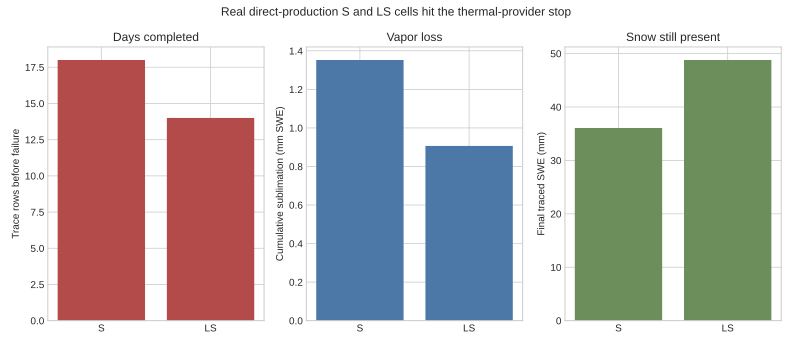

# EB-03 real-consumer provider failure



The S and LS cells do not complete the real H.J. Andrews conifer run. S fails
after 18 daily trace rows with only `1.3524 mm` SWE sublimated and
`36.0654 mm` SWE still present. LS fails after 14 rows with `0.9066 mm`
sublimated and `48.8007 mm` SWE still present. Both reach the Stage 3
provider's absolute-zero cold-content bound.

This is the load-bearing EB-03 result. Exact local mass/latent identities do
not make the selected thermal provider physical over time. The package
therefore closes `HOLD / CLOSE_AS_MODEL_LIMITATION`; it does not proceed to
the EB-04 factorial and does not authorize a clamp, limiter, or fitted
coefficient.

Values come from the real
`openwepp-cli-hill --direct-production-executor` run recorded in
[`consumer-cells.json`](../consumer-cells.json). Regenerate with:

```bash
.venv/bin/python docs/work-packages/20260730-snow-surface-eb-03-shared-thermal-energy-composition-001/tools/generate_figures.py
```
