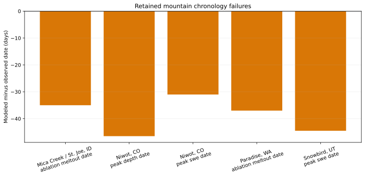

# Retained Mountain Chronology Offsets

## Caption

Frozen EB-04U/EB-04T median chronology offsets for five observation operators.
Every bar is negative, meaning the modeled peak or melt-out occurs earlier than
the corresponding observation. Niwot contributes separate depth-peak and
SWE-peak operators but shares one model execution lane.

## What To Notice

The retained errors span approximately `-31` to `-46.5 days`: Mica Creek
melt-out `-35`, Niwot peak depth `-46.5`, Niwot peak SWE `-31`, Paradise
melt-out `-37`, and Snowbird peak SWE `-44.5`. EB-04W executes the canonical
frozen observation/melt-out rubric directly and reproduces all five retained
offsets exactly in the baseline cell.

## Methods And Provenance

Offsets are modeled date minus observed date in days. They are prospectively
frozen in `population-freeze.json`, inherited from EB-04U, and reconstructed
from the exact EB-04W cohort with the canonical rubric. The figure is
descriptive; no threshold was tuned and no efficacy comparison was performed.

## Interpretation Limits

Timing offsets alone cannot identify a mechanism. They must be read with the
observed/simulated SWE figure and the phase/mass/melt ledgers. Existing
observations remain diagnostic-only and cannot support promotion.

## Accessibility

The zero line marks exact timing agreement. All orange bars extend downward;
greater downward length means a larger early-model timing error.
