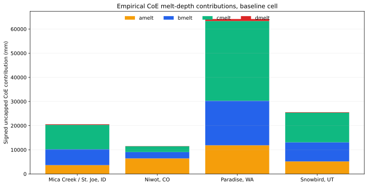

# Empirical CoE Melt-Depth Contributions

## Caption

Signed uncapped totals of the four exact CoE melt formula contributions for the
baseline cell at each mountain lane. `amelt` is the radiation contribution;
`bmelt` combines temperature and cloud; `cmelt` combines wind, dewpoint,
temperature, and canopy; and `dmelt` is the rain/temperature contribution.

## What To Notice

The mixed `cmelt` contribution is the largest total at Mica Creek, Paradise,
and Snowbird, while radiation (`amelt`) is largest at Niwot. The rain term is
smallest at all four sites. This establishes which current empirical formula
terms dominate the modeled melt-depth calculation; it does not establish that
the corresponding real-world energy process is biased.

## Methods And Provenance

The values are summed from all active hourly v3 trace rows across the retained
simulation period, before the separate pack-availability cap. All four terms
are converted from legacy inches to metres of water equivalent at production
runtime, then displayed in millimetres. Maximum component-plus-cap closure over
all 16 cells is `2.027e-17 m`.

## Interpretation Limits

These are empirical melt-depth formula contributions, not measured energy
fluxes. In particular, `bmelt` and `cmelt` are mixed-driver terms and may not be
called pure sensible or turbulent heat. Their magnitude cannot override the
strong pre-peak mass deficit or authorize coefficient tuning.

## Accessibility

Each site's stacked bar uses the same bottom-to-top order and legend: `amelt`
orange, `bmelt` blue, `cmelt` green, and `dmelt` red. Bar height is the total
uncapped signed contribution in millimetres.
