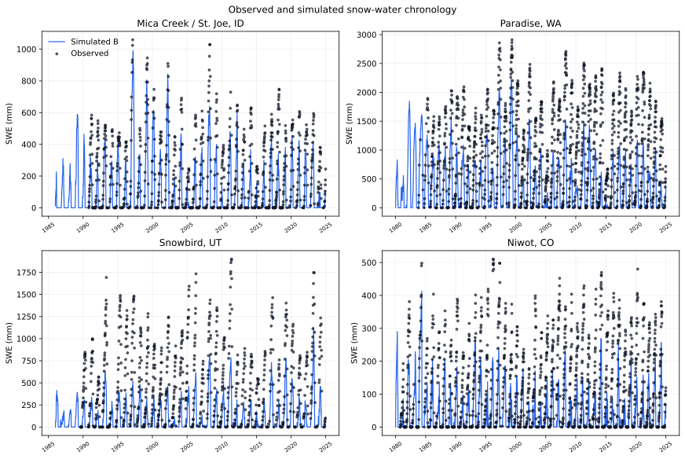

# Observed And Simulated Snow-Water Chronology

## Caption

Weekly sampled baseline-cell (`B`) simulated snow-water equivalent (blue line)
and quality-controlled SNOTEL observations (black points) for the four unique
EB-04W mountain lanes. The repeated pattern is more important than an
individual storm: simulated seasonal peaks are substantially smaller and occur
earlier than observed peaks.

## Why This Figure Matters

These lanes produced five retained chronology failures. The figure shows a
substantial storage deficit at the observed SWE peak. Baseline
modeled-to-observed seasonal peak ratios are about `0.62` at Mica Creek,
`0.47-0.50` at Niwot, `0.47` at Paradise, and `0.39` at Snowbird. This does not
by itself distinguish deficient realized input from excessive modeled pre-peak
loss.

## Methods And Provenance

- Observations: frozen SNOTEL site CSVs referenced by the EB-04U population.
- Simulation: fresh EB-04W release binary, baseline factorial cell `B`.
- Display sampling: every seventh daily modeled/observed row to keep the SVG
  readable; all daily values were used for operator and peak-ratio analysis.
- Units: millimetres of water equivalent.

## Interpretation Limits

The observations are diagnostic-only and were used in predecessor studies.
The figure identifies a storage deficit but cannot uniquely distinguish
precipitation representativeness, gauge undercatch, phase partition, endogenous
liquid retention, physical wind redistribution, or phase-conditioned pre-peak
modeled loss. The model's redistribution term is zero because drifting is not
implemented; that does not mean physical redistribution was zero.

## Accessibility

Each panel uses the same axes and encodings. Blue continuous lines represent
simulation; black discrete points represent observations. Panel titles give
the site names, and the vertical axis is SWE in millimetres.
