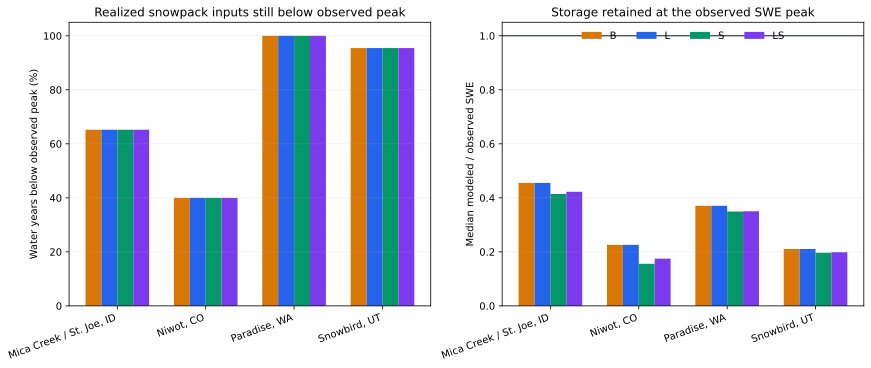

# Pre-Peak Input And Storage Decomposition

## Caption

The left panel shows the percentage of evaluated water years in which initial
SWE plus realized modeled snowfall SWE and retained rain through the observed
SWE-peak date remain below that observed peak. The right panel shows median
modeled SWE retained at the observed peak as a fraction of observed peak SWE.
Bars distinguish the B/L/S/LS cells.

## What To Notice

Paradise is the only lane where every cell and water year remains below the
observed peak on this realized-input basis. Mica Creek, Niwot, and Snowbird
include years where realized snowpack inputs reach or exceed the observed peak,
even though the right panel shows a substantial storage deficit. The horizontal
line at `1.0` marks equality with observed peak SWE.

## Methods And Provenance

For each cell and water year, the ledger reconstructs initial SWE plus snowfall
SWE plus retained rain through the observed SWE-peak date. It separately sums
snowpack loss and sublimation and checks final SWE against trace and WAT output.
Maximum pre-peak mass closure is `2.998e-15 m`; maximum trace-to-WAT SWE/depth
closure is `8.882e-16 m`. Inputs and losses are direct model operands, not
inferred physical corrections.

## Interpretation Limits

This is an algebraic realized-input diagnostic, not a loss-free counterfactual.
Retained rain is endogenous to pack state, density, liquid capacity, and prior
losses. Therefore even Paradise does not prove an external forcing defect. The
figure cannot uniquely distinguish precipitation representativeness, gauge
undercatch, phase, liquid retention, physical redistribution, or excessive
phase-conditioned pre-peak modeled loss. Observations remain diagnostic-only.

## Accessibility

Both panels order sites from Mica Creek through Snowbird. Orange, blue, green,
and purple bars encode B, L, S, and LS. Taller left-panel bars mean realized
snowpack inputs remain below the observed peak in more water years; right-panel
bars below the black `1.0` line mean modeled storage is below observed peak SWE.
