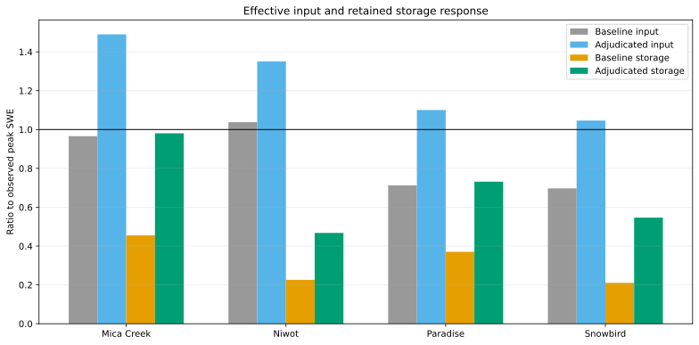

# Effective Input And Retained Storage Adjudication

## Caption

Baseline and adjudicated-multiplier median effective input and retained SWE are compared with observed peak SWE.

## What To Notice

If effective input reaches or exceeds 1.0 while storage remains low, pre-peak loss still controls the discrepancy. Lanes with no joint improver retain the baseline bars.

At Snowbird, the selected cell supplies `1.05` times observed peak SWE but
retains only `0.55` on the observed peak date. Niwot supplies `1.35` and retains
`0.47`. Those gaps show why precipitation scaling cannot be treated as proof
that forcing alone caused the baseline error. Mica Creek is distinct: at
`1.5`, retained storage reaches `0.98` and peak magnitude reaches `1.06`.

## Methods And Provenance

Effective input is initial SWE plus snowfall SWE plus retained rain through the observed SWE-peak date. Retained storage is modeled SWE on that date. Both are reconstructed from EB-04W diagnostics.

Each bar is a median ratio across the lane's paired water years. The
adjudicated bars use `1.5` for Mica Creek, Paradise, and Snowbird and `1.3` for
Niwot. The horizontal line marks parity with observed peak SWE.

## Interpretation Limits

The SNOTEL records are calibration data in EB-04W1. These curves are not independent validation and do not establish a transferable multiplier or authorize process/default promotion.
