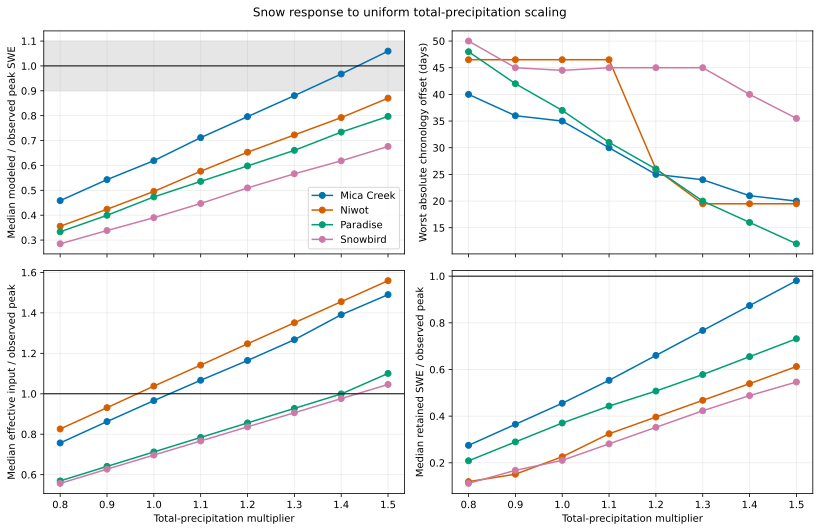

# Precipitation-Scaling Response Curves

## Caption

Four response measures are shown across the prospectively frozen 0.8-1.5 grid for each open mountain lane.

## What To Notice

A useful multiplier must move peak magnitude toward 1.0 while also reducing chronology error. Input response without storage or timing response indicates compensation rather than joint correction.

Mica Creek is the clearest near-closure: its peak ratio reaches `1.06` and its
chronology error falls from 35 to 20 days at `1.5`. Paradise also improves
strongly in timing, from 37 to 12 days, but remains low in peak magnitude at
`0.80`. Niwot's timing response changes abruptly above `1.1`, then ties while
magnitude continues upward; Snowbird's chronology response is comparatively
weak. Mica Creek magnitude is closest to parity at `1.4` and overshoots at
`1.5`, even though chronology improves one more day. Thus the right edge leaves
different unresolved joint-response and tradeoff questions by lane.

## Methods And Provenance

Every point is a real baseline-B direct-production run. Daily total precipitation alone is scaled; all other climate tokens and model inputs are unchanged and audited.

Peak magnitude is the median modeled/observed seasonal peak-SWE ratio. Niwot
chronology is the worse absolute median error across its peak-depth and
peak-SWE operators; the other lanes use their sole inherited peak or melt-out
operator. Effective input and retained storage are evaluated on the observed
SWE-peak date.

## Interpretation Limits

The SNOTEL records are calibration data in EB-04W1. These curves are not independent validation and do not establish a transferable multiplier or authorize process/default promotion.
