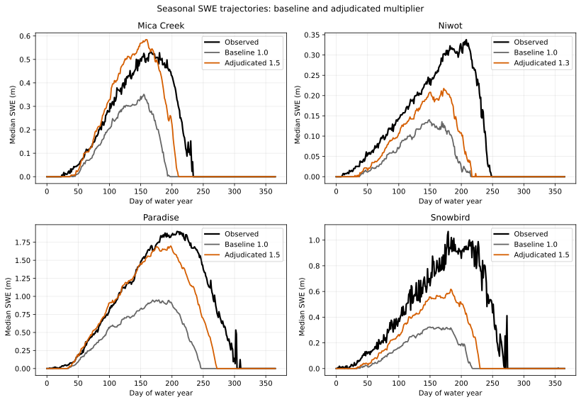

# Seasonal SWE Trajectories Under Precipitation Scaling

## Caption

Median modeled daily SWE by day of water year compares the 1.0 baseline with the multiplier selected by the frozen rule; lanes without a joint improver retain 1.0.

## What To Notice

Look for both a higher seasonal mass trajectory and a later, more realistic decline. A taller curve with unchanged early disappearance is not a joint magnitude/chronology solution.

The added precipitation sustains visibly later snow at Mica Creek, Niwot, and
Paradise. Snowbird gains substantial SWE but still peaks well below the
observed median and disappears early. The plotted `1.5` trajectories at Mica
Creek, Paradise, and Snowbird are boundary cells selected by the frozen rule;
they are diagnostic endpoints, not final calibrated curves.

## Methods And Provenance

Daily modeled SWE is grouped by water-year day across the full calibration record. The adjudicated multiplier is selected from the frozen objective, not chosen for visual appearance.

The black observation line is the median SNOTEL SWE for each day of water year;
gray and orange are median modeled SWE. Day-of-water-year aggregation makes
the seasonal shape legible but suppresses interannual spread and should not be
read as a single observed year.

## Interpretation Limits

The SNOTEL records are calibration data in EB-04W1. These curves are not independent validation and do not establish a transferable multiplier or authorize process/default promotion.
