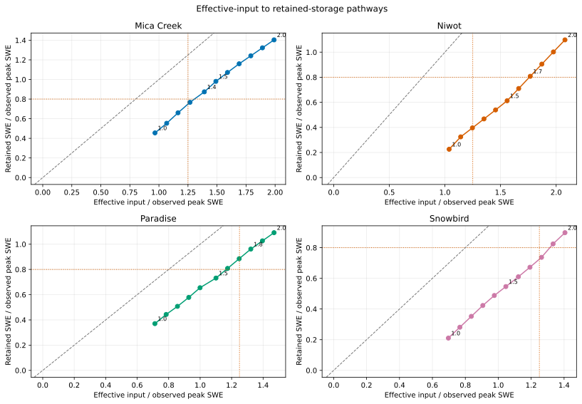

# Effective-Input And Retained-Storage Pathways

## Caption

Each lane traces how effective snowpack input and SWE retained on the observed peak date change with precipitation scaling. Labels identify baseline, the W1 boundary, the W2 candidate when distinct, and the 2.0 budget cell.

## What To Notice

The dashed diagonal is one-to-one storage. Orange dotted thresholds mark the frozen compensation-warning quadrant: input above 1.25 with retained storage below 0.8.

No selected candidate falls strictly inside that warning quadrant. Niwot
`1.7` sits just above its storage boundary (`input 1.767`, `storage 0.808`) and
therefore deserves caution despite the mechanical pass. Paradise `1.8` retains
`0.962` from input `1.322`; Snowbird `2.0` retains `0.898` from input `1.405`.
Mica progressively crosses the one-to-one reference because the ratios have
different denominators/ledger meanings; the diagonal is a visual reference,
not a conservation identity.

## Methods And Provenance

Effective input is initial SWE plus realized snowfall SWE plus retained rain through the observed SWE peak. Storage is modeled SWE on that date; both are median ratios across paired water years.

The dotted thresholds were frozen before extension results and are
`ASSUMED_FOR_EXECUTION`. Passing them does not establish physical causality or
absence of compensating error.

## Uncertainty And Interpretation Limits

The same SNOTEL records are calibration data in EB-04W1 and EB-04W2. Curves summarize medians and do not show interannual spread. They are not independent validation, do not identify precipitation error as the unique cause, and do not support a transferable multiplier, production default, or process promotion.
