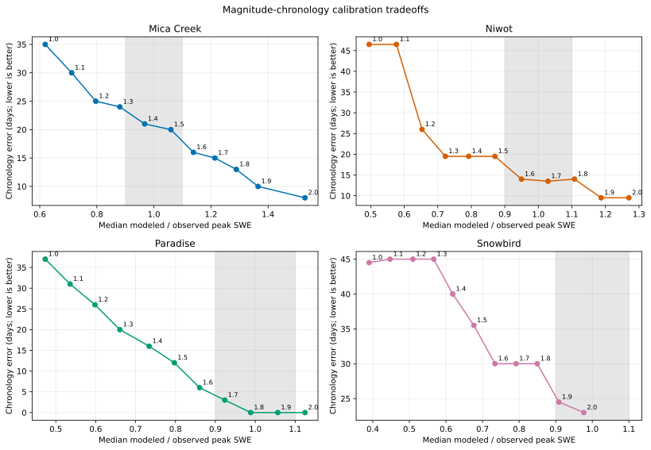

# Magnitude-Chronology Calibration Tradeoffs

## Caption

Each labeled point maps one precipitation multiplier to peak-SWE ratio and absolute chronology error; the gray vertical band is the frozen 0.9-1.1 magnitude target.

## What To Notice

The desirable direction is into the gray band and downward. A path that moves right but stops moving down exposes a magnitude-versus-timing tradeoff rather than a single optimum.

Paradise reaches the band and zero chronology error together at `1.8`. Mica's
path keeps moving down after it exits the magnitude band, and Niwot improves
timing again at `1.9` only after overshooting peak magnitude. Snowbird reaches
the band at `1.9-2.0`, yet its chronology error remains 23 days at the budget
boundary.

## Methods And Provenance

The plot uses the inherited peak/melt-out operator per lane; Niwot chronology is the worse of its depth-peak and SWE-peak offsets.

Labels are total-precipitation multipliers. The background band is a frozen
calibration target rather than an observation-confidence interval.

## Uncertainty And Interpretation Limits

The same SNOTEL records are calibration data in EB-04W1 and EB-04W2. Curves summarize medians and do not show interannual spread. They are not independent validation, do not identify precipitation error as the unique cause, and do not support a transferable multiplier, production default, or process promotion.
