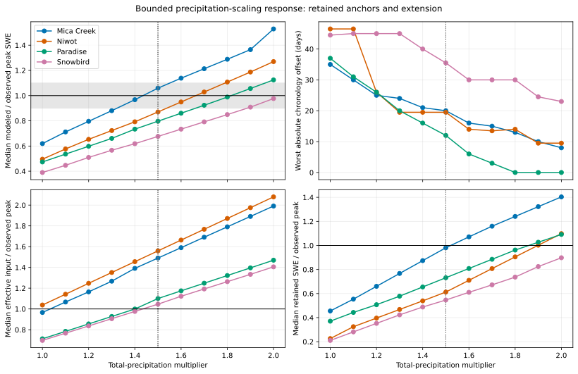

# Bounded Precipitation-Scaling Response Curves

## Caption

Peak magnitude, chronology, effective input, and retained storage span the combined 1.0-2.0 surface; the dotted line separates retained EB-04W1 anchors from new EB-04W2 cells.

## What To Notice

Look for the multiplier where peak ratio enters or crosses the gray 0.9-1.1 band, whether chronology improves at the same point, and whether input rises much faster than retained storage.

Mica Creek enters the band at `1.4` but overshoots above `1.5` while timing
continues improving. Niwot crosses parity between `1.6-1.7`. Paradise reaches
near-perfect magnitude and zero-day chronology error at `1.8`. Snowbird enters
the band at `1.9` and reaches `0.977` at the final `2.0` cell, but remains 23
days early.

## Methods And Provenance

Each point is a real baseline-B release run. Values at 1.0-1.5 are hash-verified EB-04W1 outputs; 1.6-2.0 are new EB-04W2 runs. Only daily total precipitation changes.

Peak ratios and effective-input/storage ratios are medians across paired water
years. Chronology is the absolute median inherited operator error; Niwot uses
the worse of its depth-peak and SWE-peak offsets.

## Uncertainty And Interpretation Limits

The same SNOTEL records are calibration data in EB-04W1 and EB-04W2. Curves summarize medians and do not show interannual spread. They are not independent validation, do not identify precipitation error as the unique cause, and do not support a transferable multiplier, production default, or process promotion.
