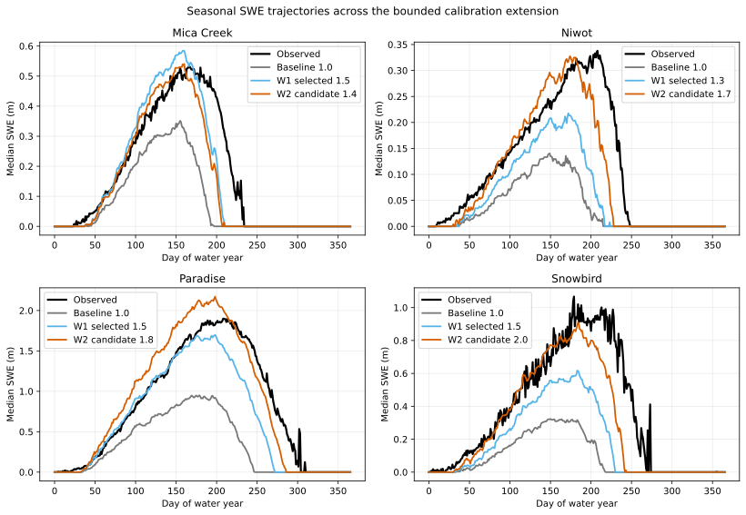

# Seasonal SWE Trajectories Across EB-04W2

## Caption

Median observed SWE is compared with baseline, the EB-04W1 selected cell, and the EB-04W2 magnitude-first candidate for each lane.

## What To Notice

A useful forcing correction should improve both seasonal mass and persistence. A taller trajectory that still disappears early, or grossly overshoots the observed curve, is a tradeoff or compensation warning.

Paradise is the strongest joint result: the `1.8` curve closely follows the
observed seasonal mass and melt-out. Niwot `1.7` substantially improves both
mass and persistence. Mica `1.4` improves magnitude but still melts early;
higher factors improve that timing only by overshooting mass. Snowbird `2.0`
nearly restores peak mass but still disappears early.

## Methods And Provenance

Daily SWE is grouped by day of water year and summarized by the median across the calibration record. The black line is observed; gray, blue, and orange are modeled.

The orange line is the new magnitude-first selection, except Snowbird where it
is the boundary cell. These median curves suppress year-to-year variability and
are intended for seasonal-shape interpretation, not uncertainty bounds.

## Uncertainty And Interpretation Limits

The same SNOTEL records are calibration data in EB-04W1 and EB-04W2. Curves summarize medians and do not show interannual spread. They are not independent validation, do not identify precipitation error as the unique cause, and do not support a transferable multiplier, production default, or process promotion.
