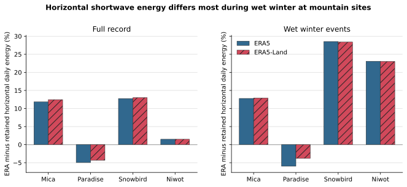

# Horizontal Daily Shortwave Relative Bias

## Caption

ERA horizontal daily shortwave energy is compared like-for-like with the retained daily climate `rad` field. Bars show summed ERA-minus-retained relative bias.

## What To Notice

Full-record agreement can mask winter structure: Niwot is only about +1.5% overall but about +23% on wet winter days. Snowbird reaches about +28.5%; Paradise is slightly lower than retained forcing.

## Plotted Data And Population

| Product | Site | Full n days | Full bias | Winter n days | Winter bias |
|---|---|---:|---:|---:|---:|
| ERA5 | Mica | 14244 | +11.83% | 3120 | +12.79% |
| ERA5 | Paradise | 16436 | -4.96% | 4517 | -5.97% |
| ERA5 | Snowbird | 14244 | +12.76% | 2464 | +28.53% |
| ERA5 | Niwot | 16436 | +1.49% | 2247 | +23.08% |
| ERA5-Land | Mica | 14244 | +12.45% | 3120 | +12.91% |
| ERA5-Land | Paradise | 16436 | -4.31% | 4517 | -3.79% |
| ERA5-Land | Snowbird | 14244 | +13.00% | 2464 | +28.39% |
| ERA5-Land | Niwot | 16436 | +1.49% | 2247 | +23.02% |

## Methods And Provenance

Values come from `../radiation-first-results.json`, which binds the validated ERA5/ERA5-Land inputs, retained climate/comparator identities, and `../radiation-comparison-manifest.json`. ERA intervals use `valid_time - 1 h` and fixed local standard time. No precipitation byte or multiplier was modified.

## Uncertainty And Interpretation Limits

This is comparison with retained Daymet/gridMET-derived climate forcing, not direct radiometer validation. Bias does not identify which provider is correct or establish a transferable correction.
