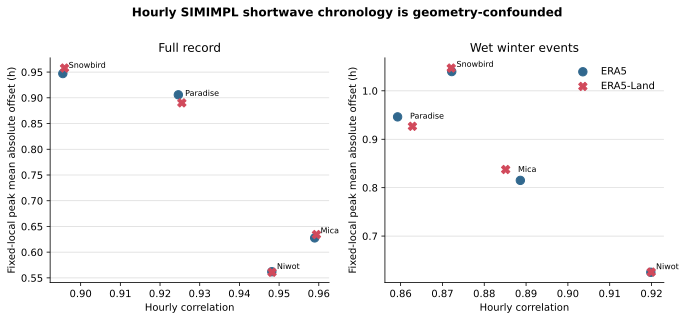

# Geometry-Confounded Hourly Shortwave Chronology

## Caption

ERA horizontal hourly shortwave is compared with the retained slope/aspect-transformed SIMIMPL hourly synthesis after interval-start alignment.

## What To Notice

The one-hour interval correction yields high correlations and peak offsets generally near one hour or less. ERA5 and ERA5-Land are nearly coincident by site.

## Plotted Data And Population

| Product | Site | Full n h / peak days | Full r / peak abs h | Winter n h / peak days | Winter r / peak abs h |
|---|---|---:|---:|---:|---:|
| ERA5 | Mica | 341871 / 14244 | 0.9590 / 0.63 | 74880 / 3120 | 0.8886 / 0.82 |
| ERA5 | Paradise | 394479 / 16436 | 0.9246 / 0.91 | 108408 / 4517 | 0.8593 / 0.95 |
| ERA5 | Snowbird | 341872 / 14244 | 0.8955 / 0.95 | 59136 / 2464 | 0.8722 / 1.04 |
| ERA5 | Niwot | 394480 / 16436 | 0.9482 / 0.56 | 53928 / 2247 | 0.9198 / 0.63 |
| ERA5-Land | Mica | 341871 / 14244 | 0.9594 / 0.63 | 74880 / 3120 | 0.8851 / 0.84 |
| ERA5-Land | Paradise | 394479 / 16436 | 0.9255 / 0.89 | 108408 / 4517 | 0.8628 / 0.93 |
| ERA5-Land | Snowbird | 341872 / 14244 | 0.8959 / 0.96 | 59136 / 2464 | 0.8721 / 1.05 |
| ERA5-Land | Niwot | 394480 / 16436 | 0.9482 / 0.56 | 53928 / 2247 | 0.9199 / 0.63 |

## Methods And Provenance

Values come from `../radiation-first-results.json`, which binds the validated ERA5/ERA5-Land inputs, retained climate/comparator identities, and `../radiation-comparison-manifest.json`. ERA intervals use `valid_time - 1 h` and fixed local standard time. No precipitation byte or multiplier was modified.

## Uncertainty And Interpretation Limits

The planes differ. This figure is chronology sensitivity only and cannot support magnitude, provider-accuracy, terrain-projection, or snow-improvement claims. The former Snowbird +84% magnitude interpretation is withdrawn.
