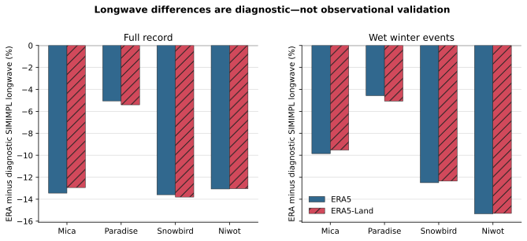

# Diagnostic Longwave Relative Bias

## Caption

Bars show summed daily-energy relative bias against SIMIMPL diagnostic longwave for complete full-record and wet-winter days.

## What To Notice

ERA longwave is lower than the diagnostic estimate at every site and in both products, with larger negative winter differences at Niwot and Snowbird.

## Plotted Data And Population

| Product | Site | Full n days | Full bias | Winter n days | Winter bias |
|---|---|---:|---:|---:|---:|
| ERA5 | Mica | 14244 | -13.44% | 3120 | -9.85% |
| ERA5 | Paradise | 16436 | -5.05% | 4517 | -4.57% |
| ERA5 | Snowbird | 14244 | -13.59% | 2464 | -12.50% |
| ERA5 | Niwot | 16436 | -13.07% | 2247 | -15.33% |
| ERA5-Land | Mica | 14244 | -12.94% | 3120 | -9.52% |
| ERA5-Land | Paradise | 16436 | -5.40% | 4517 | -5.06% |
| ERA5-Land | Snowbird | 14244 | -13.80% | 2464 | -12.35% |
| ERA5-Land | Niwot | 16436 | -13.04% | 2247 | -15.29% |

## Methods And Provenance

Values come from `../radiation-first-results.json`, which binds the validated ERA5/ERA5-Land inputs, retained climate/comparator identities, and `../radiation-comparison-manifest.json`. ERA intervals use `valid_time - 1 h` and fixed local standard time. No precipitation byte or multiplier was modified.

## Uncertainty And Interpretation Limits

The comparator is an emissivity estimate derived from retained temperature and cloud fraction, not measured longwave. Differences cannot determine which field is correct and cannot justify provider admission or model tuning.
