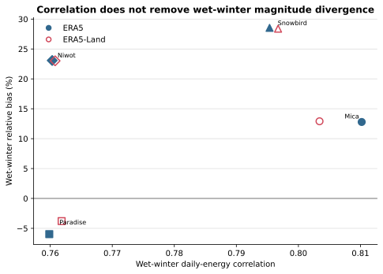

# Wet-Winter Shortwave Correlation And Bias

## Caption

Each point combines daily horizontal shortwave correlation and summed relative bias for complete wet November-March days selected by unchanged retained precipitation.

## What To Notice

Both products cluster tightly by site. Mica has the strongest winter correlation, while Snowbird and Niwot show the largest positive winter energy biases.

## Plotted Data And Population

| Product | Site | n days | Daily r | Bias |
|---|---|---:|---:|---:|
| ERA5 | Mica | 3120 | 0.8102 | +12.79% |
| ERA5 | Paradise | 4517 | 0.7598 | -5.97% |
| ERA5 | Snowbird | 2464 | 0.7954 | +28.53% |
| ERA5 | Niwot | 2247 | 0.7603 | +23.08% |
| ERA5-Land | Mica | 3120 | 0.8034 | +12.91% |
| ERA5-Land | Paradise | 4517 | 0.7618 | -3.79% |
| ERA5-Land | Snowbird | 2464 | 0.7967 | +28.39% |
| ERA5-Land | Niwot | 2247 | 0.7608 | +23.02% |

## Methods And Provenance

Values come from `../radiation-first-results.json`, which binds the validated ERA5/ERA5-Land inputs, retained climate/comparator identities, and `../radiation-comparison-manifest.json`. ERA intervals use `valid_time - 1 h` and fixed local standard time. No precipitation byte or multiplier was modified.

## Uncertainty And Interpretation Limits

Correlation measures chronology, not agreement in magnitude. The wet-day population is selected from calibration forcing and is diagnostic rather than independent validation.
