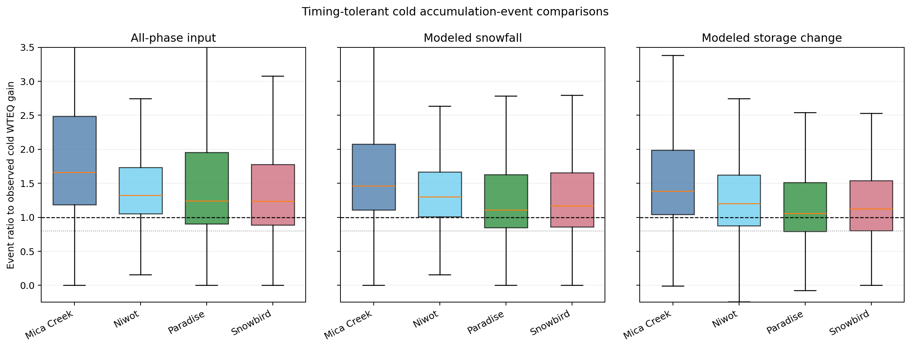

# Cold-Event Input And Storage Ratios

Evidence mode: `Ran`

Source: retained `tables/cold-events.csv`, SHA-256
`2462069e2d64a2e55d5eaad67877edac92aea144aef583fd33c724be20492b48`.
Figure SHA-256:
`a78f1c68eb1e8230e465a4812ebe26bee149ed96ce7a28c119cb38787c982d3d`.

All four sites have median all-phase input, snowfall, and storage-change ratios
above one over the selected cold observed-accumulation events. The frozen event
screen therefore does not find a systemic cold-event input shortfall.

The figure is a timing-tolerant magnitude comparison. Numerators include the
one-day event padding, while the observed denominator includes only qualifying
active-day WTEQ gains. It cannot be read as exact event closure or proof that
the forcing and phase operator are unbiased. In an independent active-day-only
sensitivity, Paradise and Snowbird pass both site-level all-phase and snowfall
screens, though the result remains non-systemic at two of four sites.
