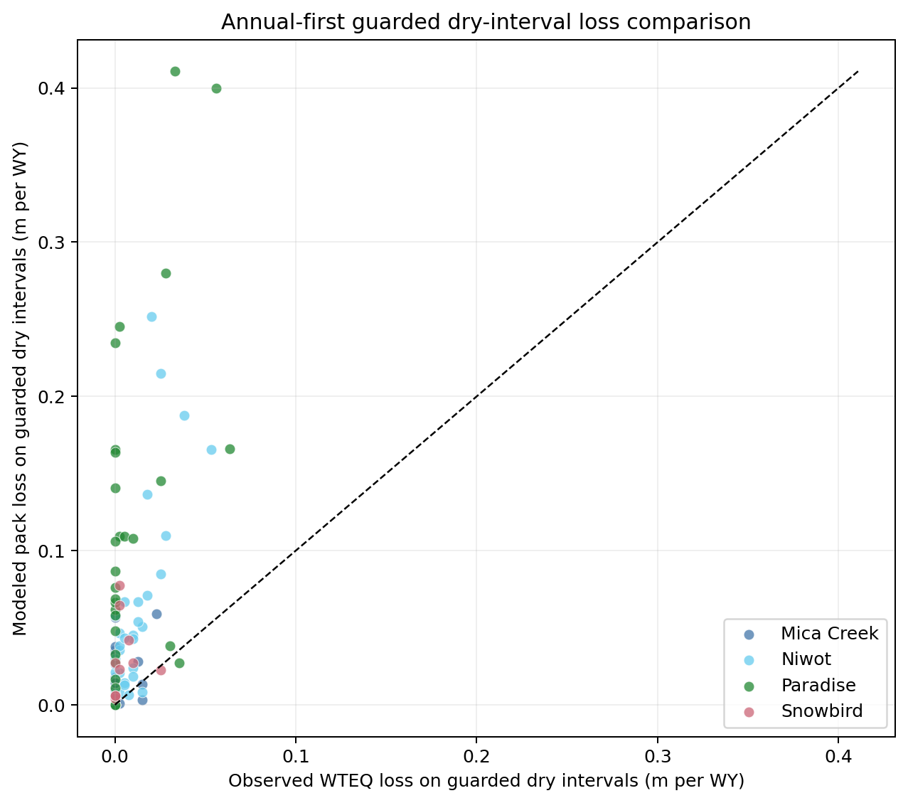

# Dry-Interval Loss Comparison

Evidence mode: `Ran`

Source: retained `tables/dry-annual.csv`, SHA-256
`4ed8beb67dfb3287799cc839a649f388fa7a82908b92400c81e1421bfdd1613a`.
Figure SHA-256:
`e5cc9d32fbaa6a6616921b9fbea7f84ac93744bd1f41718697cbd5663dec3afb`.

Annual-first modeled dry-period pack loss materially exceeds observed pillow
loss at Niwot, Paradise, and Snowbird. Mica Creek does not pass the frozen
materiality and prevalence screen. A separate cold-stratum check shows that
almost all modeled excess belongs to warm or mixed intervals.

Observed WTEQ is quantized at 0.1 inch and often reports zero interval loss.
These values prioritize investigation; they are not direct melt calibration
targets and do not identify a unique loss equation. Snowbird is the third
passing site with exactly the minimum 10 annuals, making the cohort verdict
threshold-passing but coverage-fragile. A one-increment-per-interval observation
stress check preserves the three passing sites.
