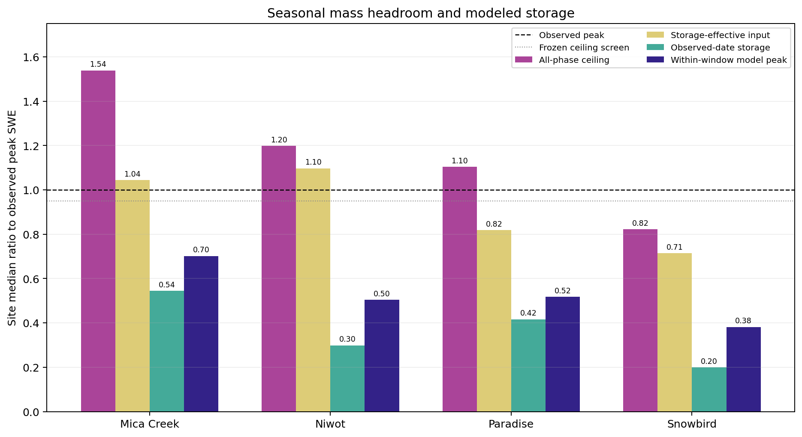

# Mass-Ceiling Pathways

Evidence mode: `Ran`

Source: retained `tables/site-summary.csv`, SHA-256
`9e0e0f950df46480515514d627f8e6b89b46e2246973f0735ef53a45d3771442`.
Figure SHA-256:
`98266c6356dd6cff8f43b0f1bcdb4de126f490209414a8b9199965a07d9e1897`.

The all-phase ceiling exceeds the observed peak at Mica Creek, Niwot, and
Paradise but not Snowbird. Every modeled storage pathway is much lower than the
corresponding ceiling. The separation makes the two findings compatible:
Snowbird lacks current input headroom, while conversion or loss between input
and storage remains material across the cohort.

The ratios compare a fixture hillslope with a point pillow. They do not assign
the separation to a unique forcing, canopy, redistribution, phase, or melt
mechanism.
