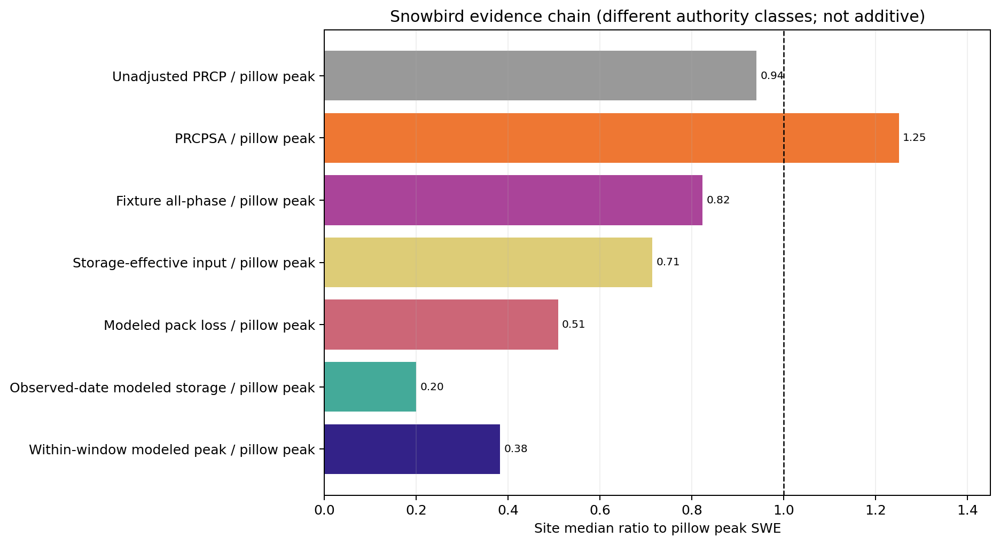

# Snowbird Evidence Chain

Evidence mode: `Ran`

Source: retained `figure-source-tables/snowbird-evidence-chain.csv`, SHA-256
`a19ee47c76e4842ad5f626742b44972d3cc0418cf84aa57ea252a62565cc8ec9`.
Figure SHA-256:
`3181aaadde4a3ed445afff9f9303b0b03f80171b79a85cbdf7e9b5aa40b2f6ee`.

The current fixture's loss-free all-phase ceiling is only 0.823 of Snowbird's
observed peak, while modeled pack loss is 0.508 and observed-date storage is
0.200. Snowbird therefore supports both an input-feasibility concern and an
excess-loss concern.

PRCPSA rises above one because its snow adjustment incorporates WTEQ changes.
It demonstrates possible station-scale headroom but is not independent of the
pillow target and cannot authorize a precipitation correction.
