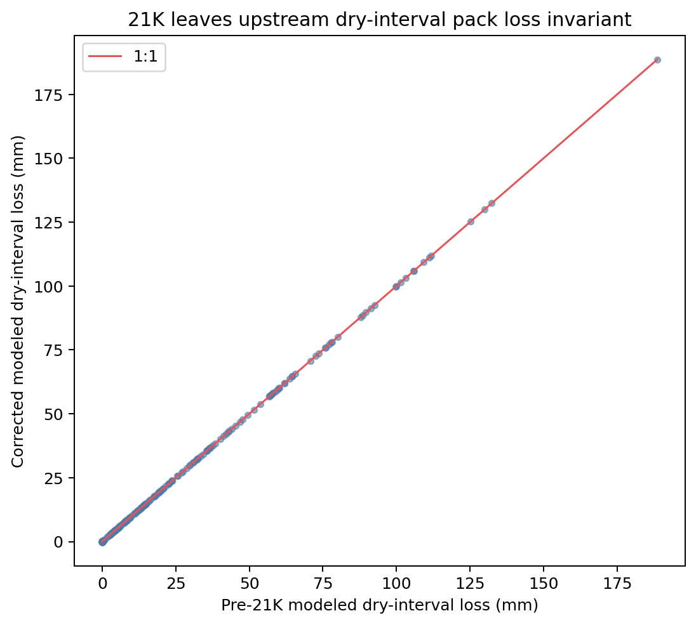

# Corrected dry-loss rebaseline

Source table: `target/snow_warm_mixed_prepeak_loss_energy_attribution_v2/figure-source-tables/dry-loss-rebaseline.csv`.

All 253 canonical dry intervals reproduce pre-21K pack loss within 9.02e-17 m. The wet-compaction correction changes density and downstream disposition, not the upstream loss diagnosed by 21J.
