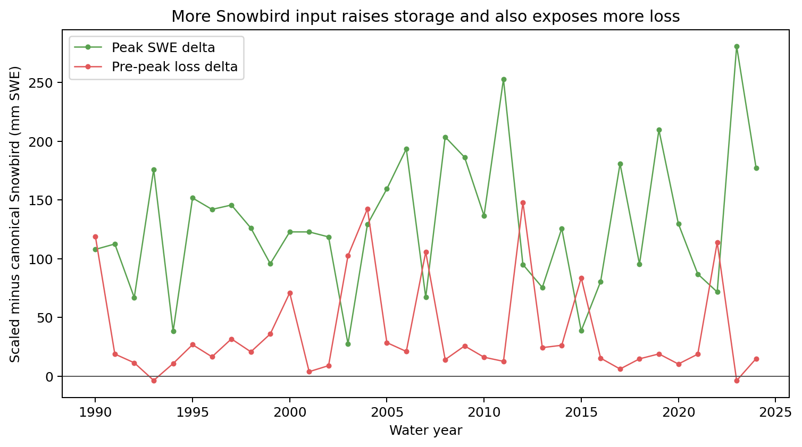

# Snowbird development-only paired state response

Source table: `target/snow_warm_mixed_prepeak_loss_energy_attribution_v2/figure-source-tables/snowbird-paired-state-response.csv`.

Across 35 paired years, scaled input raises median peak SWE by 125.8 mm and median pre-peak pack loss by 19.0 mm. The extra storage dominates the extra loss. This lane is DEVELOPMENT_ONLY and cannot establish precipitation truth.
