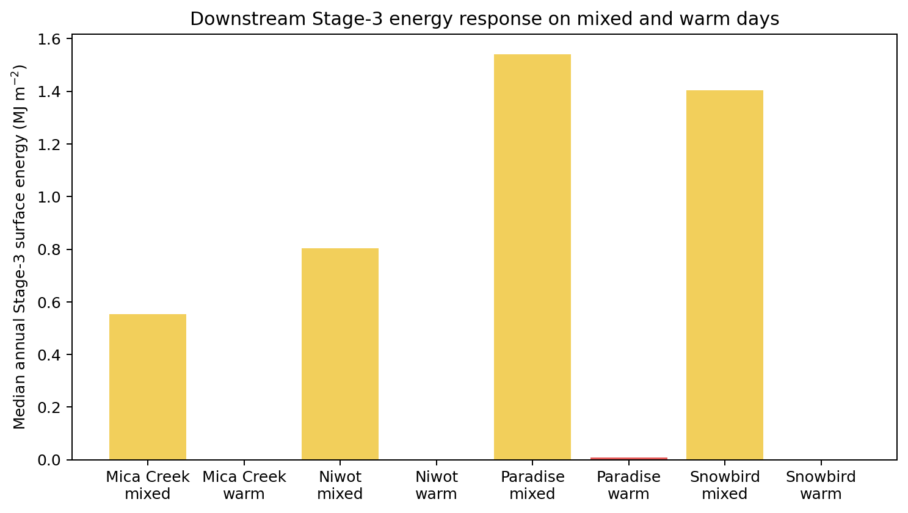

# Downstream Stage-3 energy response

Source table: `target/snow_warm_mixed_prepeak_loss_energy_attribution_v2/figure-source-tables/stage3-energy-response.csv`.

Stage-3 energy varies across sites and thermal classes but is evaluated after upstream CoE melt and snow-contact rain enter the layered solver. It constrains liquid disposition and refreeze; it is not evidence that Stage 3 generated the pre-peak melt.
