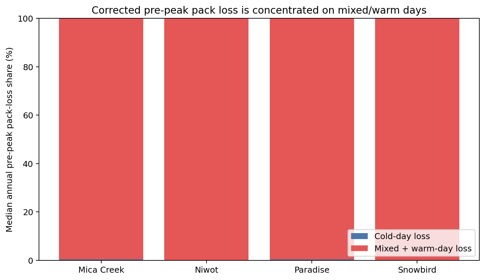

# Corrected pre-peak loss by thermal class

Source table: `target/snow_warm_mixed_prepeak_loss_energy_attribution_v2/figure-source-tables/thermal-loss-partition.csv`.

The annual-first site medians assign 99.61-99.91% of modeled pre-peak pack loss to days whose active-pack hourly temperature range crosses or stays above 0 C. This is chronology localization, not proof that air temperature alone causes the loss.
