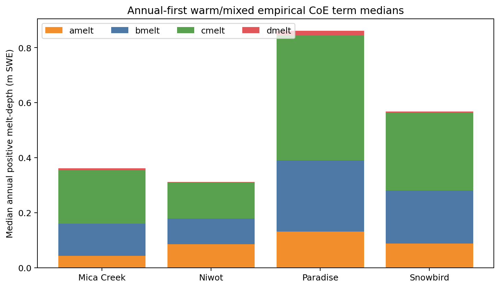

# Warm/mixed empirical CoE components

Source table: `target/snow_warm_mixed_prepeak_loss_energy_attribution_v2/figure-source-tables/warm-mixed-positive-coe-components.csv`.

The mixed `cmelt` formula term is the largest annual-first positive median at all four sites. `amelt`, `bmelt`, `cmelt`, and `dmelt` are empirical melt-depth terms, not measured energy shares; dominance only identifies the formula family requiring first-principles scrutiny.
