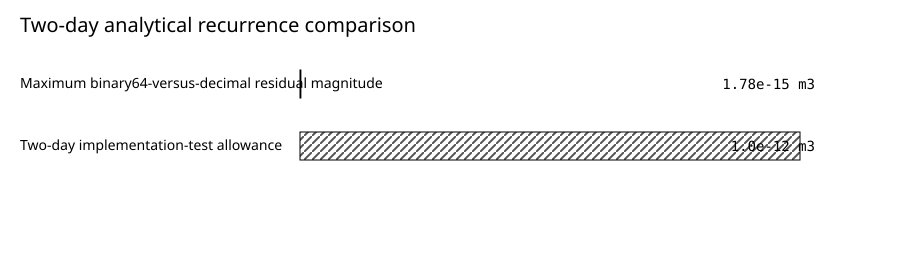

# Verification of openWEPP's Daily Linear Groundwater Reservoir

*Version 1.0 draft — 2026-07-16*

Prepared with disclosed Codex assistance for openWEPP scientific-assurance
maintainers and available for accountable human review.

**Authorship and accountability.** Draft authors: Codex (AI coding agent). Accountable report lead: Not yet assigned. Material producers: None recorded.


**Assurance status.** This report is `DRAFT`. Independent scientific, reproduction/publication, and assurance-steward approval remain pending; no approval lock exists. It does not authorize public export, vendoring, or an application-fitness determination.


## Key Findings

- The focused Rust recurrence test passed its preregistered
  `1.0e-12 m3` assertion allowance for the
  two-day case. Separately, an independent binary64 recurrence differed from
  decimal arithmetic by at most
  `1.78e-15 m3`.
- In the 731 d,
  19 OFEs H2637 production case, independent
  reconstruction of the terminal groundwater ledger differed from the
  published storage by at most
  `4.25e-11 m3`, compared with a
  storage-scaled allowance of
  `1.21e-07 m3`.
- Separate tests verified the production HBP writer/parser contract and the
  watershed consumer's handling of a generated-groundwater payload. They
  separated groundwater from lateral subsurface flow, channel `cbase`, and
  active surface-routing water. A single fresh nonzero-groundwater execution
  across the complete CLI adapter chain remains to be demonstrated.

## Plain-Language Summary

openWEPP represents delayed groundwater discharge as a reservoir. Deep drainage
from the soil enters storage; fixed fractions of that storage leave each day as
baseflow and deep seepage. We asked whether the software performs that daily
calculation in the specified order, rejects inconsistent inputs, reports enough
information to audit the water ledger, serializes the calculated groundwater
volumes, and consumes those fields correctly when supplied to the watershed
model.

The focused two-day Rust test passed its numerical assertion, and independent
arithmetic reconstructed both the analytical case and the 731-day production
ledger within floating-point allowances many orders of magnitude smaller than
the simulated volumes. Separate interface tests showed that generated fields
are serialized and that the watershed consumer uses them when supplied without
substituting a different baseflow term or returning them to surface routing.

This is a strong, bounded software-verification result. It does not show how
accurately openWEPP will predict groundwater or streamflow at an untested site.
That judgment requires observations, site-appropriate parameters, forcing and
measurement uncertainty, and a separate empirical evaluation.

## Abstract

Groundwater baseflow can sustain streamflow after rapid surface and shallow
subsurface responses decline. The WEPP groundwater extension represents this
delayed response with a daily linear reservoir forced by deep percolation. We
evaluated whether the assessed openWEPP realization implements the authorized
storage recurrence, enforces its coefficient and storage domain, exposes
auditable run-level operands, and transfers generated groundwater volumes
at its production-writer, strict-parser, and watershed-consumer interfaces. The study combined
formulation traceability, an independently calculated two-day vector, negative
domain tests, typed serialization and consumer tests, and independent
reconstruction of a 731 d,
19 OFEs production run. The Rust analytical test
passed its `1.0e-12 m3` assertion; independent
binary64 arithmetic differed from decimal arithmetic by at most
`1.78e-15 m3`. The production recurrence and
complete post-export identities each closed within
`4.25e-11 m3`, against allowances near
`1.21e-07 m3`. Separate production-writer,
strict-parser, and watershed-consumer tests preserved the generated fields and
their meanings; missing authority, threshold conditions, and over-export cases
failed closed. The assessed realization is therefore verified for the daily
recurrence and those named interfaces. A single fresh nonzero-groundwater run
through the complete CLI-to-watershed chain, predictive accuracy, parameter
transferability, subdaily behavior, and fitness for a particular watershed
were not evaluated.

## 1. Introduction

Forest-streamflow hydrographs can include rapid surface runoff, lateral
subsurface flow, and delayed groundwater baseflow. The delayed component matters
most when streamflow persists after rainfall or snowmelt inputs have declined.
A model that omits or mishandles this storage-and-release behavior can reproduce
short peaks while missing recession and low-flow periods.

Srivastava et al. (2013) coupled WEPP deep percolation to a linear groundwater
reservoir and evaluated the combined formulation at Priest River Experimental
Forest. They calibrated on 2005-2006 data and evaluated 2007-2009. Across the
complete 2005-2009 study period, the authors reported an
overall Nash-Sutcliffe efficiency of 0.67 and runoff-volume deviation of 7%
with baseflow, compared with 0.57 and 47% without it. They fitted baseflow and
deep-seepage daily coefficients of 0.0156 and 0.00026. Those results show why the
formulation is scientifically relevant, but they belong to that coupled model,
site, period, forcing, and calibration. They are not performance statistics for
the openWEPP realization assessed here.

Before empirical evaluation can be interpreted, the software calculation and
its interfaces must be correct. This study therefore asks: does openWEPP
realize the authorized daily recurrence, preserve its timing and units, reject
inadmissible states, publish the operands needed for independent audit, and do
the separately tested writer/parser and watershed consumer honor the generated
groundwater fields?

## 2. Model Formulation

For day `i`, `D_i` is the hillslope volume of WEPP deep percolation entering the
groundwater reservoir. `S_i` is accepted storage before current-day exports;
`Qb_i` and `Qs_i` are the baseflow and deep-seepage volumes generated from that
storage. The one-day recurrence is:

```text
S_i  = S_(i-1) + D_i - Qb_(i-1) - Qs_(i-1)
Qb_i = kb S_i
Qs_i = ks S_i
```

Storage is in cubic meters. `D`, `Qb`, and `Qs` are daily-integrated cubic-meter
volumes, while `kb` and `ks` have units of inverse days. The contract's
`Q = kS` form includes the fixed one-day interval; no subdaily integration is
implied. Initial storage depth is converted to volume from hillslope area
before the first recurrence.

The current authority admits finite, nonnegative initial storage and
coefficients. The implementation rejects non-finite or negative states and a
coefficient combination that would export more than accepted storage in one
day. A missing optional groundwater-coefficient sidecar disables the reservoir;
it does not authorize inferred defaults. Generated groundwater baseflow is
distinct from lateral subsurface flow and from the channel unit-area coefficient
named `cbase`.

## 3. Materials and Methods

### 3.1 Assessed realization and preregistration

The assessed repository realization was frozen before result execution at Git
commit `01ed70550a4e371e99afe35c4bdd4d9b667e812c`. The 12 declared groundwater
producer, publication, serialization, test, and watershed-consumer paths were
byte-identical to the earlier integrated realization. The H2637 runner binary
was rebuilt for the frozen commit before accepted production evidence was run.

`SC-GWBASEFLOW-001` supplied the equations, units, branch authority, consumer
obligations, and test vectors. The study protocol fixed the equations,
operation order, two-sided tolerances, operand lineage, and rejected aliases
before fresh execution. A change to any bound implementation, fixture, method,
or result object requires new evidence and review.

### 3.2 Independent two-day calculation

The analytical case used a 1000 m2 hillslope,
`0.010 m` initial storage depth,
`kb = 0.10 d^-1`, `ks = 0.05 d^-1`, and daily
recharge of `2.0 m3` then
`4.0 m3`. A standard-library Python procedure,
which neither imports nor calls openWEPP, evaluated the recurrence with decimal
and binary64 arithmetic. The absolute allowance for each calculated state or
flux was `1.0e-12 m3`. This allowance measures
floating-point implementation agreement, not hydrologic error.

### 3.3 Domain and transfer checks

A focused nextest selection executed the recurrence, over-export guard,
multi-OFE recharge aggregation, contributing-area threshold, missing-authority
failure, hillslope-pass serialization, and watershed consumption. The transfer
contract assessed across separate tests was:

```text
daily groundwater producer
  -> direct publication state
  -> hillslope binary pass (HBP)
  -> strict typed HBP parser
  -> watershed hillslope contribution
  -> channel/baseflow consumer
```

The writer/strict-parser test and the hand-constructed `HillslopeContribution`
consumer test verify adjacent interfaces; they are not one end-to-end execution
of a nonzero groundwater payload through the actual CLI adapter. Separate
assertions rejected lateral subsurface flow, `cbase`, active-router surface
source, and producer-only state as substitutes for generated groundwater.

### 3.4 H2637 production reconstruction

H2637 used the production hillslope runner for
731 d and
19 OFEs. Its
groundwater inputs were zero initial storage, a daily `kb` of 0.04, zero `ks`,
and a 1 ha groundwater-contributing-area threshold. The test ran the same
native-management fixture with the active owner disabled, active by default,
and explicitly active. Default and explicit-active HBP and pass-Parquet bytes
were required to match.

The independent procedure read the produced explicit-active manifest and
reconstructed two timing-qualified identities:

```text
S_N = S_0 + sum(D) - [sum(Qb) - Qb_N] - [sum(Qs) - Qs_N]
S_N - Qb_N - Qs_N = S_0 + sum(D) - sum(Qb) - sum(Qs)
```

The first compares terminal pre-export storage. The second compares terminal
post-export storage. Each two-sided allowance was `1e-9` times the magnitude of
the corresponding storage, with a one-cubic-meter minimum scale. The procedure also
checked produced HBP and Parquet hashes against the manifest before using its
operands.

### 3.5 Evidence classification

The two-day case combines a Rust assertion test with independent arithmetic
reconstruction. H2637 is deterministic production recurrence and conservation
evidence. The separate writer/parser and consumer tests are interface-contract
evidence, not a continuous-path execution. Negative tests are domain and
fail-closed evidence. The Priest River study is external prior empirical
evidence for a related coupled formulation. No observation is used as an
empirical referent in the present study.

## 4. Results

### 4.1 Daily recurrence

**Two-day analytical recurrence vector.** Independent binary64 daily storage and export values for the two-day recurrence vector; the separate Rust test passed its assertion allowance.

| Day | Recharge (`m3`) | Storage before (`m3`) | Storage after (`m3`) | Baseflow (`m3`) | Deep seepage (`m3`) |
| --- | ---: | ---: | ---: | ---: | ---: |
| First day | 2.0 | 10.0 | 12.0 | 1.20 | 0.60 |
| Second day | 4.0 | 12.0 | 14.2 | 1.42 | 0.71 |

*Accessible table summary: The two rows show independently reconstructed recharge, accepted storage before and after the recurrence, baseflow, and deep seepage for each simulated day.*




*Figure: Maximum binary64-versus-decimal arithmetic residual compared with the separate Rust assertion allowance for the two-day analytical vector.*

| Series | Value (`m3`) |
| --- | ---: |
| Maximum binary64-versus-decimal residual magnitude | 1.78e-15 |
| Two-day implementation-test allowance | 1.0e-12 |

*Accessible data alternative: Independent binary64 arithmetic differs from decimal arithmetic by much less than the separate Rust assertion allowance.*


Day 1 accepted storage was `12.0 m3`, producing
`1.20 m3` of baseflow and
`0.60 m3` of deep seepage. Day 2 storage was
`14.2 m3`, which equals the preceding storage plus
`4.0 m3` recharge minus the preceding day's two
exports. The maximum binary64-versus-decimal residual was
`1.776356839400250e-15 m3`, below the preregistered allowance.

The over-export case (`kb = 0.80 d^-1`,
`ks = 0.30 d^-1`) was rejected before an inconsistent
state was accepted.

### 4.2 Production groundwater ledger

**H2637 terminal groundwater ledger.** Retained groundwater-ledger operands, independently reconstructed residuals, and coded allowances for H2637.

| Quantity | Value (`m3`) |
| --- | ---: |
| Initial storage | 0.0 |
| Cumulative recharge | 3668.610172576748 |
| Cumulative baseflow | 3547.636225849919 |
| Cumulative deep seepage | 0.0 |
| Terminal pre-export storage | 126.01452784040274 |
| Terminal-day baseflow | 5.04058111361611 |
| Terminal-day deep seepage | 0.0 |
| Independently reconstructed terminal pre-export storage | 126.01452784044524 |
| Terminal post-export storage | 120.97394672678662 |
| Independently reconstructed full-run terminal storage | 120.97394672682913 |
| Recurrence residual | -4.249045559845399e-11 |
| Complete post-export ledger residual | -4.250466645316919e-11 |
| Recurrence allowance | 1.260145278404028e-07 |
| Post-export allowance | 1.209739467267866e-07 |

*Accessible table summary: The table lists the complete cubic-meter operands, both signed residuals, and both storage-scaled allowances.*


*Figure: Independently reconstructed terminal groundwater-ledger residuals compared with coded storage-scaled allowances.*

| Series | Value (`m3`) |
| --- | ---: |
| Recurrence residual magnitude | 4.25e-11 |
| Recurrence allowance | 1.26e-07 |
| Post-export residual magnitude | 4.25e-11 |
| Post-export allowance | 1.21e-07 |

*Accessible data alternative: Both residual bars are far shorter than their corresponding allowance bars; exact values appear in the visible data table.*


Across the production run, cumulative recharge was
`3668.610172576748 m3` and cumulative baseflow was
`3547.636225849919 m3`. Terminal pre-export storage was
`126.01452784040274 m3`; the independently reconstructed
value was `126.01452784044524 m3`. Their signed
difference was `-4.249045559845399e-11 m3`.

After the terminal export, storage was
`120.97394672678662 m3`; reconstruction from the
full-run recharge and export totals gave
`120.97394672682913 m3`. The signed difference was
`-4.250466645316919e-11 m3`. Both residual magnitudes
were less than four ten-thousandths of their respective allowances.

The active surface-routing ledger also closed independently. Its residual was
`3.32e-09 m3`, or
`8.87e-15 unitless` of routed source water, below
the preregistered `3.74e-04 m3` allowance.

### 4.3 Transfer, threshold, and authority behavior

The focused checks showed that the production writer serializes the generated
HBP fields and the strict parser preserves them. A separate consumer test
constructed a `HillslopeContribution` with those fields and exercised the
watershed linear-reservoir branch. Below-threshold contributing area suppressed
the applicable channel contribution. A generated-groundwater payload without
`gwcoeff` authority failed closed. Tests also distinguished the generated
contribution from `cbase`, which is a separate channel parameter. These results
verify both interface contracts but do not establish a single fresh execution
across the adapter between them.

The latest runoff-event HBP baseflow was not used as `Qb_N`: the final runoff
event need not be the final simulated day. The timing-qualified manifest value
was required for terminal reconstruction. This negative alias check materially
changed how the ledger could be audited.

## 5. Discussion

The analytical and production results answer the recurrence question
positively for the named realization. The software applies the one-day storage
debit in the specified order, generates proportional exports, rejects the
tested invalid domain, and publishes complete terminal operands. The writer,
parser, and watershed consumer separately honor the generated-groundwater
contract; complete adapter traversal is an open integration claim. The verified
results are inspectable because the equations, units, timing, source paths,
produced operands, tolerances, and reconstruction procedure are retained
together.

The residuals are numerical bookkeeping quantities. Their small size shows
that independent arithmetic agrees with produced state and totals; it does not
measure error against nature. Likewise, a real production path is stronger than
a producer-only unit test for integration assurance, but it is not an observed
watershed evaluation.

The Priest River study supports the scientific usefulness of a linear
groundwater reservoir when groundwater contributes materially to streamflow.
It also illustrates why empirical performance is conditional: the reported
coefficients were fitted for that study, and the performance statistics reflect
the coupled model, forcing, site, years, and observations. H2637 instead used
a daily `kb` of 0.04 and zero `ks` as a deterministic software fixture. Agreement
of its ledger cannot transfer Priest River's predictive statistics to
openWEPP.

The fail-closed cases are relevant scientific-assurance evidence. They show
that absent parameter authority is not silently replaced and that an excessive
daily export is not accepted merely because the algebra produces a number.
They do not establish that all nonnegative coefficients are plausible for all
watersheds; parameter plausibility remains an application and empirical-study
question.

## 6. Limitations

- No streamflow, groundwater-level, lysimeter, tracer, or other environmental
  observation was compared with openWEPP output.
- H2637 is a deterministic integration fixture, not an empirical watershed
  sample. Its result does not quantify model-form, forcing, parameter, or
  measurement uncertainty.
- H2637 used `ks = 0`; nonzero deep seepage was exercised by the analytical
  vector and serialization/domain checks, not by the production recurrence.
- The fixed one-day recurrence was assessed. No subdaily solution, timestep
  convergence, or alternate nonlinear groundwater formulation was evaluated.
- The evidence applies to the frozen implementation and named consumer path.
  A change to the producer, serialization, consumer, science authority, or
  result method requires impact review and, where material, rerun.
- The production writer/parser and watershed consumer were verified in
  separate tests. A single fresh nonzero-groundwater execution through the
  actual CLI adapter into the watershed model was not performed.
- The current authority excludes negative `ks` and therefore does not represent
  upward exchange from a deeper aquifer.
- Verification of implementation and transfer cannot establish parameter
  transferability or predictive accuracy for another climate, soil,
  topography, management, or watershed.

## 7. Conclusions

For the specified daily linear reservoir, analytical vector, and H2637
production case, the assessed openWEPP realization performs the authorized
recurrence. The terminal storage and complete run ledgers reconstruct within
preregistered floating-point allowances, and tested invalid or unauthorized
conditions fail closed. The production writer/parser and watershed consumer
also preserve the generated-groundwater fields in separate interface tests;
one fresh execution across their actual adapter remains open.

This conclusion is deliberately bounded to software and integration
verification. It does not claim that openWEPP baseflow predictions are accurate
for a particular watershed. A decision owner should combine this evidence with
an independently designed empirical evaluation, site inputs and parameter
provenance, uncertainty, and the consequences of error.

## 8. Open Research and Reproduction

The [technical supplement](supplement.md) gives the claim-to-evidence map,
exact commands, realization and binary identities, output hashes, and review
boundary. Public-safe research objects include the
[analytical inputs](research-objects/two-day-recurrence-input.json),
[analytical result](research-objects/two-day-recurrence.json),
[production result](research-objects/h2637-ledger.json), and
[independent analysis procedure](research-objects/reproduce_groundwater_report.py).
The [portable science contract](research-objects/SC-GWBASEFLOW-001.md)
provides the process authority. The
[model-science narrative](../../../../hillslope-hydrology-and-sediment-physics.md)
explains how groundwater fits within broader hillslope and watershed hydrology.

The complete study can be challenged by rebuilding the frozen runner, rerunning
the named nextest cases, and applying the retained independent procedure to the
new manifest and outputs. Expected hashes are currency checks; changed hashes
require semantic comparison rather than automatic rejection.

## References

Srivastava, A., Dobre, M., Wu, J. Q., Elliot, W. J., Bruner, E. A., Dun, S., Brooks, E. S., and Miller, I. S. 2013. Modifying WEPP to improve streamflow simulation in a Pacific Northwest watershed. Transactions of the ASABE 56(2), 603-611. [doi:10.13031/2013.42691](https://doi.org/10.13031/2013.42691)

openWEPP daily groundwater reservoir and baseflow/deep-seepage publication science contract. (`sha256:97ee00e87df4a87221aa34fc1f44c77176f43922bcfac96c69d4b6de8e230d60`)

## About This Report

- Report identity: `linear-groundwater-reservoir-recurrence`, version `1.0.0`.
- Assessed realization: `01ed70550a4e371e99afe35c4bdd4d9b667e812c` plus the
  exact rebuilt runner identity in the supplement.
- Study type: formulation, code-verification, integration/consumer, and
  realization-transfer evaluation; no current empirical evaluation.
- Agent assistance: Codex drafted and mechanically analyzed the report under
  the retained ASSURE-05 prompt, protocol, inputs, and evidence. Ordinary
  reproduction and builds do not invoke an agent.
- Human accountability: report lead and independent scientific,
  reproduction/publication, assurance-steward, and release approvals remain to
  be supplied for the exact reviewed root. Internal coding-agent review is not
  external peer review or publication approval.
- Publication, approval, and supersession metadata are populated only after the
  lifecycle gates pass.

## Revision Log

| Version | Date | Changes |
| --- | --- | --- |
| 0.1 | 2026-07-15 | Established the architecture fixture and deterministic assembly source. |
| 1.0 draft | 2026-07-16 | Reframed the source as a genuine scientific study, preregistered the method, required fresh evidence and independent reconstruction, quantified prior Priest River evidence without attributing it to openWEPP, and made the approval boundary explicit. |
