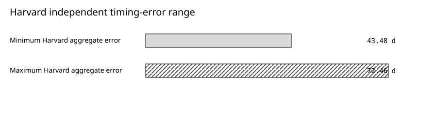
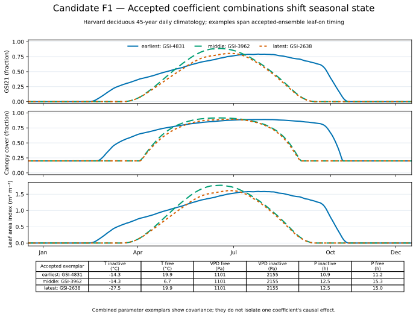
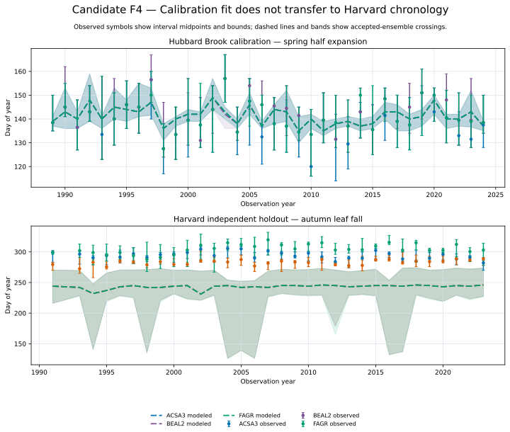
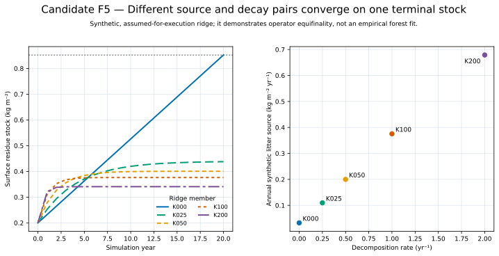
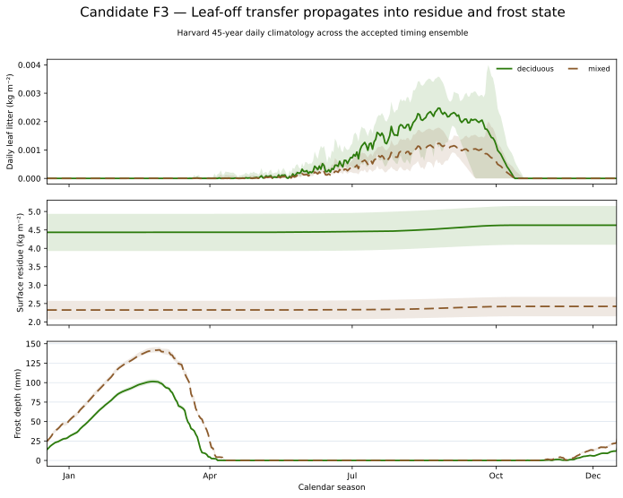
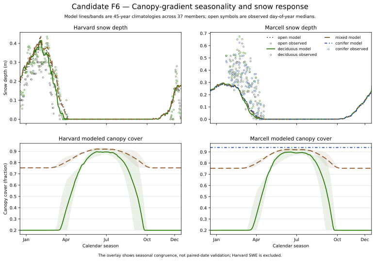
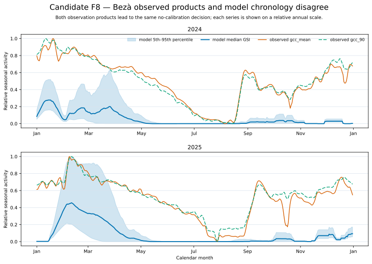

# Evaluation of Native-Forest Canopy Phenology in openWEPP

**Authorship and accountability.** Draft authors: Codex (AI coding agent). Accountable report lead: Not yet assigned. Material producers: None recorded.

**Assurance status.** This report is `DRAFT`. Independent scientific, reproduction/publication, and assurance-steward approval remain pending; no approval lock exists. It does not authorize public export, vendoring, or an application-fitness determination.

## Key Findings

- The temperature, vapor-pressure-deficit (VPD), and photoperiod formulation
  passed mathematical, state, mass-ledger, chronology, and real-consumer
  verification. This establishes implementation behavior, not general
  predictive accuracy.
- Hubbard Brook timing calibration retained
  a correlated set of 37 members.
  Independent Harvard errors ranged from
  43.48 d to
  72.46 d, and
  34 members had no interval
  coverage. Transferability is unsupported for that holdout.
- At Bezà, 0 members reproduced all
  12 seasonal transitions under
  both camera-greenness products. The best joint member's penalized error was
  59.12 d for `gcc_mean` and
  65.87 d for `gcc_90`. Further threshold
  calibration was stopped and the tropical dry-forest mismatch was retained
  as an ecosystem-model limitation.

## Plain-Language Summary

Forests are not agricultural fields with a planting and harvest calendar.
Mixed and deciduous forests retain woody structure while foliage changes
gradually, and leaf loss transfers organic material to the forest floor.
openWEPP's `native_forest` formulation represents those processes with a daily
weather-and-latitude signal, separate evergreen and deciduous foliage, a
persistent structural canopy, and same-day litter transfer.

The mechanics worked as designed in the tests and simulations examined here.
The model also produced coherent seasonal differences among deciduous, mixed,
and conifer forest configurations. The evidence does not support a universal
accuracy claim. Temperate timing fitted at Hubbard Brook transferred poorly to
Harvard, litter source and decay remain confounded without repeated
material-specific observations, and the formulation missed important seasonal
transitions in the Bezà tropical dry forest. Users should calibrate to local
canopy observations and should not tune canopy coefficients to compensate for
snow, runoff, erosion, or missing litter-source processes.

## Abstract

We evaluated openWEPP's native-forest canopy formulation from daily forcing
through generalized growing season index (GSI), foliage, leaf area index
(LAI), canopy cover and height, litter transfer, surface residue, and
downstream hydrologic and erosion consumers. Evidence combined analytical and
software verification, daily and annual mass closure, a Hubbard Brook timing
search over 9261 members, independent Harvard
scoring without refit, litter-source and decomposition recovery,
261 runs in the canopy-gradient experiment, Southern
Hemisphere phase tests, two years of Bezà camera greenness, and a bounded
legacy comparison. The Hubbard calibration retained
37 members that were partially identifiable; Harvard
aggregate timing errors were 43.48 d to
72.46 d. Five source-decay pairs reproduced the same
year-20 stock within 1.11e-15 kg m^-2, showing that a
single terminal stock does not identify both operands. Winter canopy ordering
held for all 37 members in every available
within-site forest gradient. In contrast, no member completed all Bezà
transitions, and the best member hit only one `gcc_mean` uncertainty interval
and no `gcc_90` interval. We conclude that the implementation and temperate
site calibration are mechanically established, while geographic transfer,
predictive nonfoliar litter sources, and tropical dry-forest phenology remain
bounded, missing, or contradicted.

## 1. Introduction

Historical WEPP forest applications commonly encoded forest through perennial
cropland management. That compatibility route cannot directly express a
persistent woody canopy combined with gradual leaf-on and leaf-off, evergreen
retention, and recurring litter deposition. Those seasonal states interact
with interception, transpiration, snow accumulation, frost insulation,
raindrop shielding, runoff, and erosion.

The native-forest formulation addresses this representation gap. The broader
scientific basis and user coefficient guide are given in the
[native-forest canopy-phenology model narrative](../../../../openwepp-canopy-phenology.md).
This study asks: does openWEPP produce internally correct
seasonal forest states, and where is that behavior corroborated, bounded, or
contradicted by available evidence?

The study does not approve the model for a particular site or decision. It
does not introduce new physics, refit the retained ensemble, infer missing
needle or woody litter sources, or use downstream residuals to select canopy
coefficients.

## 2. Model Formulation And Process Chain

Following Jolly et al. (2005), minimum temperature, VPD, and photoperiod each
produce a daily indicator between zero and one. Temperature and photoperiod
increase between inactive and unconstrained thresholds; VPD decreases because
greater atmospheric dryness is constraining. Their product is instantaneous
GSI. A trailing mean over the current and preceding 20 available days produces
GSI21. Signed latitude enters FAO-56 solar geometry for photoperiod.

If `f_e` is evergreen fraction, realized foliage fraction is
`f_e + (1 - f_e) × GSI21`. This fraction scales full-leaf foliar biomass and
maximum LAI. Canopy cover is the larger of a persistent structural floor and
the foliar biomass-cover relation. Canopy height uses persistent structural
plus current foliar biomass.

Daily foliage gain is allocation and daily loss is leaf litter. The first
modeled day initializes state without creating either flux. Later days satisfy
`current foliage = previous foliage + allocation - litter`. Litter reaches the
surface-residue state before that day's decomposition, cover, depth, frost,
hydrology, and erosion consumers. Persistent woody biomass affects height but
is not silently converted into branch litter.

## 3. Evaluation Design And Methods

We kept six evidence roles separate: software verification, calibration,
independent evaluation, model-response characterization, legacy comparison,
and diagnostic evidence. The core empirical timing calibration used Hubbard
Brook observations. Harvard was opened once after the accepted ensemble was
frozen and caused no refit. CAL-05 used synthetic source-decay recovery and
ridge calculations to assess identifiability, not empirical calibration.
CAL-06 crossed all 37 members with source-supplied
forest strata at Marcell, Harvard, and Hubbard
Brook. Southern Hemisphere evaluation
separated synthetic phase mechanics from Alerce forcing diagnostics and the
independent Bezà camera products.

We use four verdicts. `SUPPORTED` means the prespecified evidence supports the
bounded claim. `BOUNDED` means behavior is constrained but does not support a
broader inference. `CONTRADICTED` means retained evidence materially disagrees.
`NOT_EVALUATED` means required authority, observation, or consumer output is
absent. These are claim-level scientific dispositions, not application
grades.

All headline quantities were reconstructed by the
[retained synthesis procedure](research-objects/reproduce_canopy_synthesis.py)
from the identified predecessor CSVs. Full methods and object identities are
in the supplement.

## 4. Implementation, Mass, And State Assurance

Independent calculations reproduced the three daily indicators, their product,
the available-day GSI21 mean, signed-latitude photoperiod behavior, and the
foliar-to-canopy transformations. Domain and ordering guards failed closed for
invalid thresholds or state. Daily allocation and litter reconciled foliage
change; annual transfer and repeated cycles showed no unexplained mass drift.
Shadow cohort sums reconstructed aggregate surface residue where the equations
were equivalent.

Real production consumers read the post-phenology state on the same day.
Canopy, litter, residue, frost, interception, evapotranspiration, runoff, and
erosion inputs therefore share one chronology. These results support the
implementation path. They do not establish ecological timing or downstream
accuracy outside the tested evidence.

## 5. Temperate Calibration And Independent Transfer

The Hubbard search evaluated
9261 members. It retained
37 members within one day of the minimum objective.
Every retained member lay on the admitted support boundary, so the six
thresholds are partially identifiable rather than uniquely estimated.
The accepted combinations should remain intact; their marginal ranges are not
independent physiological bounds.

**Independent Harvard aggregate timing-error range.** Minimum and maximum aggregate timing error across the 37 frozen Hubbard members scored at Harvard without refit.

| Evaluation | Minimum (`d`) | Maximum (`d`) |
| --- | ---: | ---: |
| Harvard no-refit holdout | 43.48 | 72.46 |

*Accessible table summary: Harvard aggregate timing errors ranged from 43.48 to 72.46 days across 37 frozen members.*

*Figure: Range endpoints for aggregate timing error across 37 frozen Hubbard members scored at Harvard without refit; these bars summarize adverse transfer evidence and are not uncertainty bounds.*

| Series | Value (`d`) |
| --- | ---: |
| Minimum Harvard aggregate error | 43.48 |
| Maximum Harvard aggregate error | 72.46 |

*Accessible data alternative: Two bars show minimum Harvard aggregate error of 43.48 days and maximum error of 72.46 days.*

Harvard scoring produced finite results for all retained members without
refit. Aggregate error ranged from 43.48 d to
72.46 d.
34 members of
37 members had zero observation-interval
coverage, and the maximum coverage was only
18.81 %. The Harvard result is adverse
independent evidence: it does not erase the Hubbard calibration, but it does
not support transferability.

*Figure: Three accepted Hubbard calibration members spanning early, middle, and late Harvard leaf-on responses illustrate ensemble covariance in annual GSI21, canopy-cover, and LAI dynamics.*

[Caption, source data, and ancillary information](research-objects/f1-coefficient-response.md)

*Figure: Observed phenology intervals and modeled accepted-ensemble crossings expose both the Hubbard Brook calibration relationship and poor Harvard transfer.*

[Caption, source data, and ancillary information](research-objects/f4-temperate-observed-modeled-timing.md)

The retained
[coefficient-response time series](research-objects/f1-coefficient-response.svg)
shows how accepted correlated coefficient combinations shift GSI21, canopy
cover, and LAI. The
[temperate observed-versus-modeled chronology figure](research-objects/f4-temperate-observed-modeled-timing.svg)
shows the calibration and holdout together. See the F1
[caption, data, and limitations](research-objects/f1-coefficient-response.md)
and F4
[caption, data, and limitations](research-objects/f4-temperate-observed-modeled-timing.md).

## 6. Litter Sources, Decomposition, And Forest-Floor State

The native path transfers modeled broadleaf foliage loss to the forest floor.
Authenticated daily external forcing can separately supply observed needle
and fine-woody deposition. openWEPP does not currently predict those recurring
sources from evergreen fraction or structural biomass.

Complete daily synthetic stock recovered its frozen source-rate truth within
the tested grid, showing that information can pass through the calibration
operator when the input record is informative. A single
year-20 stock was nonidentifying: 5 pairs reproduced
0.852 kg m^-2 within
1.11e-15 kg m^-2. The
[source-decay time series](research-objects/f5-source-decay-trajectories.svg) makes this
equifinality visible. Repeated material-specific inputs and stock measurements
are needed before interpreting decay.

*Figure: Different 20-year source-decay trajectories converge on the same terminal stock, demonstrating that the endpoint does not identify source and decay independently.*

[Caption, source data, and ancillary information](research-objects/f5-source-decay-trajectories.md)

The [caption, data, and limitations](research-objects/f5-source-decay-trajectories.md)
defines the synthetic boundary.

*Figure: Harvard simulations show the modeled seasonal sequence from leaf-off litter transfer to aggregate surface-residue state and frost depth.*

[Caption, source data, and ancillary information](research-objects/f3-litter-residue-frost.md)

The
[litter, residue, and frost time series](research-objects/f3-litter-residue-frost.svg)
shows how leaf-off propagates through the modeled forest floor. It is a
process-chain result, not proof that total litter or residue is adequate at a
site.
The [caption, data, and limitations](research-objects/f3-litter-residue-frost.md)
identifies the modeled quantities and exclusions.

## 7. Canopy Gradient And Downstream Response

CAL-06 completed 261 runs. Winter
cover retained deciduous below mixed below conifer at Marcell, and deciduous
below mixed at Harvard and Hubbard Brook, for all
37 members. This coherent
within-model ordering is `BOUNDED`: no independent canopy-amplitude
observations established an accuracy tolerance.

The
[canopy-gradient snow figure](research-objects/f6-canopy-gradient-snow-response.svg) compares
modeled canopy and snow climatologies with observed day-of-year medians.
Those observation medians are not paired-date validation series. Exact-date
snow-depth and density residuals were retained without canopy retuning.
Harvard SWE was excluded because provider units conflicted with the same-row
depth-density identity.
The [caption, data, and limitations](research-objects/f6-canopy-gradient-snow-response.md)
distinguishes observations from modeled responses.

Interception, ET, runoff, frost, and erosion-facing inputs consumed the real
daily state. Their changes are model responses with competing causes, not
empirical validation of canopy phenology. No erosion consequence output was
available, and no zero or proxy was substituted.

*Figure: Harvard and Marcell climatologies show modeled snow-depth response and canopy-cover gradients together with admitted observed snow-depth medians.*

[Caption, source data, and ancillary information](research-objects/f6-canopy-gradient-snow-response.md)

## 8. Southern Hemisphere Robustness

Synthetic producer-state tests supported signed-latitude cyclic phase
invariance. Ordinary production runs separately established common-state and
consumer ordering, but a phase-transformed real-consumer trajectory was not
evaluated. The combined observed Southern seasonal-direction cell remained
contradicted. The Alerce lane initially exposed negative VPD created by a
daily-summary operator; reconstruction from paired hourly products produced
finite nonnegative daily VPD and allowed bounded research execution without
clipping.

At Bezà, `gcc_mean` and `gcc_90` daily camera products agreed on the diagnosis.
Complete 12-transition chronologies were achieved by
0 members under both products.
The best member intersected one `gcc_mean` confidence interval and no `gcc_90`
interval. The typed interval-hit totals are retained below.

| Observation product | Interval-hit total |
| --- | ---: |
| `gcc_mean` | 1 transition(s) |
| `gcc_90` | 0 transition(s) |

Its
penalized mean absolute residuals were
59.12 d and
65.87 d, respectively. Falling transitions
were generally early; higher rising transitions were late or absent.

The [Bezà product-consistent time series](research-objects/f8-beza-observed-modeled.svg)
shows the contradiction directly. It is robust to product choice and
to a permissive crossing sensitivity. Another threshold round was therefore
rejected. The evidence cannot distinguish rainfall response, rooting-zone or
stored-water access, species composition, another seasonal cue, or their
interaction, so it cannot authorize a replacement equation.

*Figure: The two Bezà observation products closely agree with each other but not with modeled seasonal chronology, supporting the product-consistent no-calibration decision.*

[Caption, source data, and ancillary information](research-objects/f8-beza-observed-modeled.md)

The [caption, data, and limitations](research-objects/f8-beza-observed-modeled.md)
records the product/operator boundary.

## 9. Elliot Comparative Evidence

The authorized reconstruction retained
64 targets for comparison;
53 targets were contradicted. The delivered
Hubbard `dropfc=0.95` branch reproduced reported live biomass approximately,
whereas the report-described `0.92` branch did not. Santee biomass, residue,
runoff, sediment, and most return levels remained inconsistent with the
reported values.

The result is `NOT_REPRODUCIBLE`, partly because the exact historical Windows
project is unavailable. It remains useful comparative evidence and motivated
the staged source-to-stock design, but it is not correctness authority for
openWEPP.

## 10. Integrated Results And Claim Matrix

| Claim | Evidence role | Result | Verdict | Boundary |
| --- | --- | --- | --- | --- |
| Daily GSI, foliar state, mass ledger, and real consumers | Verification | Independent equations, closure, chronology, and production consumers agree | `SUPPORTED` | Tested contracts, fixtures, and realization |
| Hubbard timing | Calibration | 37 members with correlated boundary solutions accepted | `BOUNDED` | Hubbard support only |
| Harvard timing transfer | Independent evaluation | 43.48 d–72.46 d aggregate error; 34 members/37 members zero coverage | `CONTRADICTED` | Tested Harvard observations |
| Source-decay identifiability | Synthetic readiness | Five equifinal terminal-stock pairs | `BOUNDED` | Operator readiness, not empirical fit |
| Predictive needle and fine-woody source | Science authority | No authorized predictive law | `NOT_EVALUATED` | External observed forcing only |
| Winter canopy ordering | Model response | Ordering held for 37 members out of 37 members at each available gradient | `BOUNDED` | Configured strata; no amplitude tolerance |
| Bezà chronology | Independent evaluation | 0 members achieved a complete chronology; large residuals under both GCC products | `CONTRADICTED` | Provisional 2024–2025 ROI record |
| Erosion consequences | Consumer availability | Inputs present; consequence output absent | `NOT_EVALUATED` | No proxy admitted |

## 11. Discussion

The evidence is strongest for mathematical and implementation coherence. One
daily state reaches foliage, litter, residue, and consumers without a crop
calendar or asynchronous handoff. The canopy-gradient runs also show that the
configured structural and evergreen distinctions have interpretable seasonal
effects.

Ecological transfer is much less secure. Hubbard timing parameters are
covariant and support-boundary limited. Their poor Harvard result shows why a
site calibration cannot be treated as a general forest parameter set. The
Bezà contradiction is more fundamental: changing camera products or searching
the same threshold family does not restore the missing active-season
chronology.

Litter evidence illustrates a different limitation. The decay operator is
mechanically identifiable from an informative daily record, yet source and
decay are confounded by a single stock. Missing predictive needle and woody
inputs are missing processes, not values that may be tuned to zero or absorbed
into decay.

## 12. Limitations And Application Guidance

The empirical record is small relative to forest diversity. Hubbard is the
only fitted phenology site; Harvard is an adverse temperate holdout; the
Southern evidence includes an Alerce forcing reconstruction and two
provisional Bezà years. Camera greenness is not identical to LAI or foliar dry
mass. Several canopy-structure coefficients lack general empirical ranges.

Snow evidence has incomplete source uncertainty, Harvard SWE is excluded, and
common snow residuals must not be assigned to canopy. Downstream ET and runoff
are model responses rather than independent accuracy tests, while erosion
consequences were unavailable. The report does not evaluate disturbance,
species succession, branch turnover, hydraulic storage, or a predictive
tropical dry-forest cue.

Users should obtain locally matched foliage, LAI, winter and summer canopy,
height, phenology, litter, and forest-floor observations. Fit the six GSI
thresholds jointly and preserve covariance. Do not use snow, runoff, erosion,
or sediment residuals to select upstream canopy parameters. A named user or
institution remains responsible for deciding whether this evidence is adequate
for a particular site and consequence of error.

## 13. Conclusions

openWEPP's native-forest canopy formulation produces internally coherent
seasonal state and transfers that state consistently into the tested
downstream process chain. The available evidence supports implementation
correctness within the tested contracts and supports bounded, interpretable
forest-class behavior.

It does not support universal timing or downstream accuracy. Temperate
calibration transferred poorly to Harvard, source and decay are not separately
identified by a single stock, predictive nonfoliar litter sources are absent,
and the current GSI structure contradicts the assessed Bezà tropical
dry-forest chronology. These limitations should remain explicit inputs to any
application judgment.

## 14. Open Research And Reproduction

Strict-result reproduction requires only repository-retained CSV evidence and
the standard-library Python procedure. The separate time-series figure build
uses the declared Python plotting environment. The technical supplement gives
exact commands, roles, units, and source identities. The reviewed time-series
figures, source tables, captions, and generation procedure are declared as
public-safe research objects for any future approved publication.

The Bezà limitation should reopen only with field-corresponded phenology and
water/climate observations, authoritative process science, or an independently
testable alternative formulation with a reserved validation lane. More
threshold searching on the same provisional record is not a reactivation
trigger.

## References

Jolly, W. M., Nemani, R., and Running, S. W. (2005). A generalized, bioclimatic index to predict foliar phenology in response to climate. Global Change Biology 11, 619-632. [doi:10.1111/j.1365-2486.2005.00930.x](https://doi.org/10.1111/j.1365-2486.2005.00930.x)

Allen, R. G., Pereira, L. S., Raes, D., and Smith, M. (1998). Crop evapotranspiration. FAO Irrigation and Drainage Paper 56. (`FAO-Irrigation-and-Drainage-Paper-56`)

Keenan, T. F., et al. (2014). Tracking forest phenology and seasonal physiology using digital repeat photography. Ecological Applications 24, 1478-1489. [doi:10.1890/13-0652.1](https://doi.org/10.1890/13-0652.1)

Lim, H., et al. (2024). Overlooked branch turnover creates a widespread bias in forest carbon accounting. PNAS 121, e2401035121. [doi:10.1073/pnas.2401035121](https://doi.org/10.1073/pnas.2401035121)

Rivera, G., et al. (2002). Increasing day-length induces spring flushing of tropical dry forest trees in the absence of rain. Trees 16, 445-456. [doi:10.1007/s00468-002-0185-3](https://doi.org/10.1007/s00468-002-0185-3)

Chapotin, S. M., Razanameharizaka, J. H., and Holbrook, N. M. (2006). Baobab trees in Madagascar use stored water to flush new leaves. New Phytologist 169, 549-559. [doi:10.1111/j.1469-8137.2005.01618.x](https://doi.org/10.1111/j.1469-8137.2005.01618.x)

Donnelly, A., et al. (2022). Exploring discrepancies between in situ phenology and remotely derived phenometrics at NEON sites. Ecosphere 13, e3912. [doi:10.1002/ecs2.3912](https://doi.org/10.1002/ecs2.3912)

Flanagan, D. C., and Nearing, M. A., eds. (1995). USDA-Water Erosion Prediction Project hillslope profile and watershed model documentation. NSERL Report 10. (`NSERL-Report-10-1995`)

Keane, R. E. (2008). Surface fuel litterfall and decomposition in the northern Rocky Mountains, USA. RMRS-RP-70. [doi:10.2737/RMRS-RP-70](https://doi.org/10.2737/RMRS-RP-70)

Méndez-Alonzo, R., et al. (2013). Leaf phenology is associated with soil water availability and xylem traits in a tropical dry forest. Trees 27, 745-754. [doi:10.1007/s00468-012-0829-x](https://doi.org/10.1007/s00468-012-0829-x)

Olson, J. S. (1963). Energy storage and the balance of producers and decomposers in ecological systems. Ecology 44, 322-331. [doi:10.2307/1932179](https://doi.org/10.2307/1932179)

Qualls, R. G. (2016). Long-term decomposition rates of forest floor organic matter on paired coniferous and deciduous watersheds. Forests 7, 231. [doi:10.3390/f7100231](https://doi.org/10.3390/f7100231)

## About This Report

This version evaluates retained openWEPP native-forest evidence through
CAL-07F against source commit `c42dde3136bbbf2b9c8a62ffe96ca6d28d77e615`.
Codex materially assisted evidence synthesis, deterministic reconstruction,
figure production, and drafting. No external peer review is claimed. Human
scientific approval, reproduction/publication approval, release transfer, and
publication remain unavailable for this draft.
