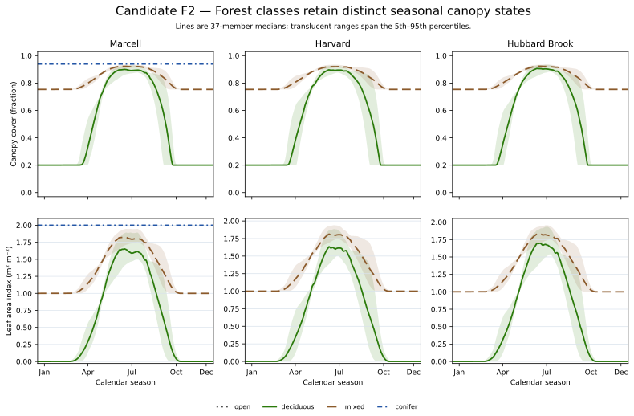
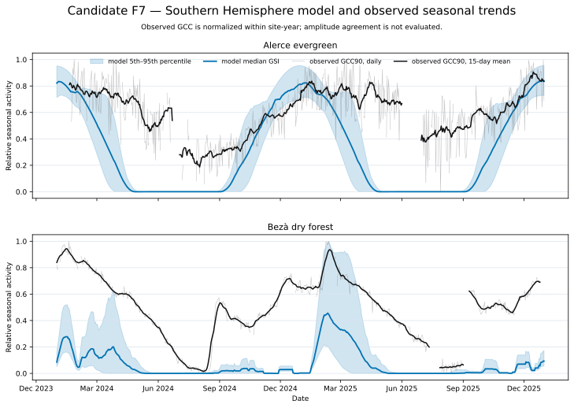

# Technical Supplement: Native-Forest Canopy-Phenology Evaluation

**Authorship and accountability.** Draft authors: Codex (AI coding agent). Accountable report lead: Not yet assigned. Material producers: None recorded.


**Assurance status.** This report is `DRAFT`. Independent scientific, reproduction/publication, and assurance-steward approval remain pending; no approval lock exists. It does not authorize public export, vendoring, or an application-fitness determination.


## S1. Study Decomposition And Claim Envelopes

The report combines one process chain because the same daily phenology state
feeds foliage, litter, residue, snow, frost, hydrology, and erosion consumers.
It does not pool evidence roles. The separate envelopes are:

1. mathematical, implementation, mass, state, and consumer verification;
2. Hubbard Brook empirical calibration;
3. Harvard independent timing evaluation without refit;
4. litter-source/decomposition calibration readiness;
5. canopy-gradient model-response characterization and bounded observation
   comparisons;
6. Southern Hemisphere phase verification and independent observational
   evaluation; and
7. Elliot legacy comparison.

The verdict vocabulary is `SUPPORTED`, `BOUNDED`, `CONTRADICTED`, and
`NOT_EVALUATED`. These terms describe only the named process, quantity,
domain, realization, referent, and method.

## S2. Science And Consumer Lineage

The authoritative process contracts are `SC-PLANT-001`,
`SC-RESIDUE-001`, and `SC-INFILE-MANAGEMENT-YAML-001`. The implementation
sequence is:

```text
daily weather + signed latitude
  -> temperature, VPD, and photoperiod indicators
  -> instantaneous GSI
  -> available-day GSI21 mean
  -> evergreen + deciduous foliar fraction
  -> foliar biomass, LAI, cover, and height
  -> leaf allocation or litter
  -> surface residue addition and decomposition
  -> residue cover and frost-facing depth
  -> snow, frost, ET, interception, runoff, and erosion consumers
```

The first day initializes foliage without allocation or litter. Later daily
closure is `previous foliage + allocation - litter - current foliage = 0`.
Structural biomass is not a leaf-transfer operand. Predictive needle and
fine-woody deposition are absent; authenticated observed daily forcing is a
separate boundary.

## S3. Realization And Input Identities

The assessed source realization is commit
`c42dde3136bbbf2b9c8a62ffe96ca6d28d77e615`. The report retrospectively
synthesizes executed evidence from the completed canopy implementation and
CAL-01 through CAL-07F. Fresh CAL-09 reconstruction reads seven retained CSV
objects:

| Role | Retained source |
| --- | --- |
| Accepted timing ensemble | `accepted-calibration-ensemble.csv` from CAL-04B |
| Complete timing search | `candidate-configurations.csv` from CAL-04B |
| Harvard timing holdout | `harvard-holdout-results.csv` from CAL-04B |
| Source-decay ridge | `terminal-stock-equifinality.csv` from CAL-05 |
| Canopy-gradient ensemble | `ensemble-summary.csv` from CAL-06 |
| Bezà product/member scores | `member-summary.csv` from CAL-07F |
| Elliot target comparison | `report-comparison.csv` from CAL-02 |

The report descriptor binds these paths as local content. The CAL-09
reproduction record retains SHA-256 identities and verifies that fresh output
matches the strict result byte for byte.

## S4. Evidence Roles And Observation Operators

Hubbard observations were assigned to `CALIBRATION`. The complete candidate
search was frozen before Harvard was opened. Harvard is
`INDEPENDENT_VALIDATION` with respect to member selection, although the small
campaign and shared model-development context still limit generalization.

CAL-05 synthetic daily stocks and ridge values are `SOFTWARE_VERIFICATION` and
`DIAGNOSTIC_ONLY`; they demonstrate identifiability structure, not empirical
forest decomposition. CAL-06 canopy time series are `MODEL_OUTPUT`.
Exact-date Harvard and Marcell snow observations are independent comparison
data, but no complete uncertainty model or acceptance tolerance was available.

Alerce camera and forcing work is diagnostic after hourly VPD reconstruction.
Bezà `gcc_mean` and `gcc_90` are separate `INDEPENDENT_VALIDATION` observation
products. Relative camera greenness thresholds are compared with same-direction
GSI21 crossings within seasonal windows. Missing crossings receive the frozen
penalty; wrong-season recovery crossings are excluded from the principal
operator and retained in sensitivity analysis.

Elliot output is `LEGACY_COMPARISON`. Legacy agreement is not correctness
authority.

## S5. Deterministic Reconstruction

Run from the repository root:

```text
.venv/bin/python \
  assurance/v2/reports/native-forest-canopy-phenology-evaluation/procedures/reproduce_canopy_synthesis.py \
  --accepted-ensemble docs/work-packages/20260727-canopy-cal-04b-calibration-readiness-and-ensemble-execution-001/artifacts/accepted-calibration-ensemble.csv \
  --candidate-configurations docs/work-packages/20260727-canopy-cal-04b-calibration-readiness-and-ensemble-execution-001/artifacts/candidate-configurations.csv \
  --harvard-holdout docs/work-packages/20260727-canopy-cal-04b-calibration-readiness-and-ensemble-execution-001/artifacts/harvard-holdout-results.csv \
  --litter-ridge docs/work-packages/20260728-canopy-cal-05-litter-source-decomposition-readiness-001/artifacts/terminal-stock-equifinality.csv \
  --gradient-summary docs/work-packages/20260728-canopy-cal-06-canopy-gradient-congruence-001/artifacts/ensemble-summary.csv \
  --beza-members docs/work-packages/20260729-canopy-cal-07f-observation-product-operator-audit-001/artifacts/member-summary.csv \
  --elliot-comparison docs/work-packages/20260726-canopy-cal-02-elliot-reproduction-001/artifacts/report-comparison.csv \
  --output /tmp/canopy-synthesis.json
cmp /tmp/canopy-synthesis.json \
  assurance/v2/reports/native-forest-canopy-phenology-evaluation/results/canopy-synthesis.json
```

The procedure asserts the accepted/holdout count, exact CAL-06 site/stratum
inventory, 37 members in every forest
gradient, and presence of the best Bezà member under both products. It
calculates minima, maxima, counts, percentages, and ridge differences from
retained rows.

## S6. Timing Search And Identifiability

CAL-04B evaluated 9261 members. The
minimum-plus-one-day rule retained 37 members. All
accepted members lie on the admitted support boundary:
20 members are double-boundary cases and
17 members are upper-support-boundary cases. Timing
is therefore `PARTIALLY_IDENTIFIABLE`.

The admitted Hubbard-only marginal ranges are:

| Coefficient | Retained accepted range | Units |
| --- | ---: | --- |
| Minimum-temperature inactive threshold | -27.52 °C to -4.67 °C | °C |
| Minimum-temperature unconstrained threshold | 6.70 °C to 19.91 °C | °C |
| VPD unconstrained threshold | 655.90 Pa to 1100.65 Pa | Pa |
| VPD inactive threshold | 2155.33 Pa to 2155.33 Pa | Pa |
| Photoperiod inactive threshold | 10.936 h to 12.479 h | h |
| Photoperiod unconstrained threshold | 11.239 h to 15.294 h | h |

These ranges are an accepted correlated ensemble, not independent priors,
physiological bounds, or universal calibration guidance.

Harvard scores were finite for 37 members out of
37 members and ranged from
43.48 d to
72.46 d. Interval coverage was zero for
34 members and reached at most
18.81 %.

## S7. Litter And Decomposition

The complete synthetic daily trace uniquely recovered frozen truth `S020-K050`
with zero daily-stock sum of squared errors. All other frozen grid members had
positive error. That demonstrates information flow through the source-rate
operator.

Terminal stock alone is nonidentifying. The five `RIDGE-K000` through
`RIDGE-K200` pairs converge on
0.852 kg m^-2 at year 20; the largest absolute difference
is 1.11e-15 kg m^-2. These are assumed-for-execution
synthetic pairs, not fitted forest values.

Harvard observations include a pooled nonfoliar contribution but cannot
partition needle and fine-woody sources or convert organic-horizon carbon into
modeled dry residue mass. No missing source is set to zero and no decay
constant is fitted.

## S8. Canopy Gradient And Downstream Cells

The prespecified matrix comprised seven forest lanes crossed with
37 members plus two open controls:
261 runs. Winter cover ordering held for every
member:

- Marcell: deciduous < mixed < conifer;
- Harvard: deciduous < mixed; and
- Hubbard Brook: deciduous < mixed.

This is within-model congruence. Seed foliar mass, evergreen fraction, LAI,
structural cover, and closure remain data-limited.

Harvard and Marcell snow depth and density were compared on exact dates. The
reported bias, MAE, and RMSE are bounded because no source uncertainty model or
acceptance threshold was authorized. Harvard SWE is excluded: metadata says
centimeters, while raw values conflict by about tenfold with the same-row
depth-density identity. Marcell SWE remains usable within its own stated
limits.

Predictive needle and fine-woody sources were null in every forest/member run.
Consequently, total residue adequacy and frost consequences do not advance.
ET, interception, and runoff are modeled responses. Erosion-facing inputs were
present, but no erosion consequence output was emitted.

## S9. Southern Hemisphere Diagnostics

CAL-07B attributed Alerce's three negative daily-summary VPD values to the
temperature-extrema summary operator. CAL-07C retained the paired hourly
products, admitted 1,666 finite nonnegative daily signed-mean VPD values, and
proved zero executor residual without clipping.

CAL-07F retained all 24 Bezà product/year/direction/threshold transition
records. Member ranks were identical for `gcc_mean` and `gcc_90`, and their
top-quartile sets overlapped completely. 0 members
completed all 12 crossings under both products. Best member `GSI-4831`
intersected one of 12 `gcc_mean` confidence intervals and none of the 12
`gcc_90` intervals:

| Observation product | Interval-hit total |
| --- | ---: |
| `gcc_mean` | 1 transition(s) |
| `gcc_90` | 0 transition(s) |

Penalized
errors were 59.12 d and
65.87 d.

Only operator independence and mechanical year-role separation passed the six
prospective calibration criteria. Crossing sufficiency, uncertainty fit,
direction coherence, and parameter plausibility failed. Removing the seasonal
window admitted wrong-season recovery crossings but did not produce a joint
uncertainty or direction-coherence passer.

## S10. Elliot Scorecard

The retained comparison contains 64 targets, of
which 53 targets are classified
`CONTRADICTED`. Hubbard `dropfc=0.95` reproduced live biomass within the frozen
tolerance, but old and total residue were high. Hubbard `dropfc=0.92` produced
substantially lower live biomass. Santee live biomass, residue, hydrology, and
sediment targets mostly disagreed.

The exact historical Windows project and manually transcribed soil remain
unavailable. The `NOT_REPRODUCIBLE` verdict is therefore bounded to the
authorized reconstructions and does not establish a defect in openWEPP.

## S11. Figure And Table Inventory



*Figure: Daily modeled canopy cover and LAI distinguish source-supplied deciduous, mixed, conifer, and open strata across Marcell, Harvard, and Hubbard Brook.*

[Caption, source data, and ancillary information](research-objects/f2-forest-class-seasonality.md)




*Figure: Accepted-ensemble GSI is compared with observed GCC90 seasonal activity for Alerce evergreen and Bezà tropical dry forest.*

[Caption, source data, and ancillary information](research-objects/f7-hemisphere-seasonality.md)


Main-report time-series research objects are F1, F3, F4, F5, F6, and F8.
F2 and F7 are supplement objects because their broader context is useful but
duplicates the main causal spine or precedes the more diagnostic product-
consistent figure. Each SVG has a Markdown sidecar with caption, quantities,
units, source identity, ancillary interpretation, and limitations.

The V2 assembler's current result-figure vocabulary is limited to linear
magnitude bars. `CANOPY-FIGURE-TRANSFER` therefore gives a compact,
schema-native visualization of Harvard error-range endpoints. It does not
replace the reviewed time-series research objects.

## S12. Adverse, Excluded, And Not-Evaluated Evidence

- Harvard timing transfer is contradicted.
- Bezà tropical dry-forest chronology is contradicted.
- Predictive needle and fine-woody source laws lack authority.
- Harvard SWE is excluded for a unit/identity contradiction.
- Camera GCC is not treated as direct LAI or dry foliar mass.
- Canopy-amplitude accuracy lacks independent tolerances.
- Total litter/residue and frost adequacy do not advance where sources are
  missing.
- ET and runoff consequences are not calibration evidence.
- Erosion consequence output is unavailable.
- Elliot numerical targets are not reproducible and are not correctness
  authority.

## S13. Public Research-Object Inventory

The complete public-safe object set is linked here so a reader can inspect the
strict result, its inputs, the figure sources, and every caption:

- [model narrative](../../../../openwepp-canopy-phenology.md)
- [strict synthesis result](research-objects/canopy-synthesis.json)
- [synthesis reproducer](research-objects/reproduce_canopy_synthesis.py)
- [accepted calibration ensemble](research-objects/accepted-calibration-ensemble.csv)
- [Harvard holdout scores](research-objects/harvard-holdout-results.csv)
- [terminal-stock ridge](research-objects/terminal-stock-equifinality.csv)
- [gradient ensemble summary](research-objects/ensemble-summary.csv)
- [Bezà member summary](research-objects/member-summary.csv)
- [Elliot comparison](research-objects/report-comparison.csv)
- [figure builder](research-objects/build_candidate_figures.py)
- [figure source manifest](research-objects/source-manifest.csv)
- [daily canopy climatology](research-objects/daily-climatology.csv)
- [complete timing configurations](research-objects/candidate-configurations.csv)
- [source-decay ridge design](research-objects/terminal-stock-ridge-design.csv)
- [Southern daily ensemble](research-objects/ensemble-daily.csv)
- [Bezà daily product curves](research-objects/daily-product-curves.csv)
- [Harvard snow observations](research-objects/harvard_hf237_strata.csv)
- [Marcell snow observations](research-objects/marcell_rds_2021_0016_stratum_means.csv)
- [F1 coefficient data](research-objects/f1-exemplar-coefficients.csv)
- [F4 timing data](research-objects/f4-temperate-timing-summary.csv)
- [F6 snow data](research-objects/f6-observed-snow-climatology.csv)
- [F1 coefficient-response figure](research-objects/f1-coefficient-response.svg)
- [F2 forest-class figure](research-objects/f2-forest-class-seasonality.svg)
- [F3 residue/frost figure](research-objects/f3-litter-residue-frost.svg)
- [F4 temperate timing figure](research-objects/f4-temperate-observed-modeled-timing.svg)
- [F5 source-decay figure](research-objects/f5-source-decay-trajectories.svg)
- [F6 snow-response figure](research-objects/f6-canopy-gradient-snow-response.svg)
- [F7 hemisphere figure](research-objects/f7-hemisphere-seasonality.svg)
- [F8 Bezà figure](research-objects/f8-beza-observed-modeled.svg)
- [F1 caption and limitations](research-objects/f1-coefficient-response.md)
- [F2 caption and limitations](research-objects/f2-forest-class-seasonality.md)
- [F3 caption and limitations](research-objects/f3-litter-residue-frost.md)
- [F4 caption and limitations](research-objects/f4-temperate-observed-modeled-timing.md)
- [F5 caption and limitations](research-objects/f5-source-decay-trajectories.md)
- [F6 caption and limitations](research-objects/f6-canopy-gradient-snow-response.md)
- [F7 caption and limitations](research-objects/f7-hemisphere-seasonality.md)
- [F7 relative-seasonality data](research-objects/f7-relative-seasonality.csv)
- [F8 caption and limitations](research-objects/f8-beza-observed-modeled.md)
- [agent-assistance disclosure](research-objects/agent-assistance-packet.json)

## S14. References

Jolly, W. M., Nemani, R., and Running, S. W. (2005). A generalized, bioclimatic index to predict foliar phenology in response to climate. Global Change Biology 11, 619-632. [doi:10.1111/j.1365-2486.2005.00930.x](https://doi.org/10.1111/j.1365-2486.2005.00930.x)

Allen, R. G., Pereira, L. S., Raes, D., and Smith, M. (1998). Crop evapotranspiration. FAO Irrigation and Drainage Paper 56. (`FAO-Irrigation-and-Drainage-Paper-56`)

Keenan, T. F., et al. (2014). Tracking forest phenology and seasonal physiology using digital repeat photography. Ecological Applications 24, 1478-1489. [doi:10.1890/13-0652.1](https://doi.org/10.1890/13-0652.1)

Lim, H., et al. (2024). Overlooked branch turnover creates a widespread bias in forest carbon accounting. PNAS 121, e2401035121. [doi:10.1073/pnas.2401035121](https://doi.org/10.1073/pnas.2401035121)

Rivera, G., et al. (2002). Increasing day-length induces spring flushing of tropical dry forest trees in the absence of rain. Trees 16, 445-456. [doi:10.1007/s00468-002-0185-3](https://doi.org/10.1007/s00468-002-0185-3)

Chapotin, S. M., Razanameharizaka, J. H., and Holbrook, N. M. (2006). Baobab trees in Madagascar use stored water to flush new leaves. New Phytologist 169, 549-559. [doi:10.1111/j.1469-8137.2005.01618.x](https://doi.org/10.1111/j.1469-8137.2005.01618.x)

Donnelly, A., et al. (2022). Exploring discrepancies between in situ phenology and remotely derived phenometrics at NEON sites. Ecosphere 13, e3912. [doi:10.1002/ecs2.3912](https://doi.org/10.1002/ecs2.3912)

Flanagan, D. C., and Nearing, M. A., eds. (1995). USDA-Water Erosion Prediction Project hillslope profile and watershed model documentation. NSERL Report 10. (`NSERL-Report-10-1995`)

Keane, R. E. (2008). Surface fuel litterfall and decomposition in the northern Rocky Mountains, USA. RMRS-RP-70. [doi:10.2737/RMRS-RP-70](https://doi.org/10.2737/RMRS-RP-70)

Méndez-Alonzo, R., et al. (2013). Leaf phenology is associated with soil water availability and xylem traits in a tropical dry forest. Trees 27, 745-754. [doi:10.1007/s00468-012-0829-x](https://doi.org/10.1007/s00468-012-0829-x)

Olson, J. S. (1963). Energy storage and the balance of producers and decomposers in ecological systems. Ecology 44, 322-331. [doi:10.2307/1932179](https://doi.org/10.2307/1932179)

Qualls, R. G. (2016). Long-term decomposition rates of forest floor organic matter on paired coniferous and deciduous watersheds. Forests 7, 231. [doi:10.3390/f7100231](https://doi.org/10.3390/f7100231)

## S15. Review And Publication Boundary

The source remains `DRAFT`. Internal agent review, deterministic build, and
reconstruction cannot supply accountable human scientific approval,
reproduction/publication approval, assurance-steward authorization, or release
transfer. No draft output may enter tracked `usersum`, export, snapshot, or
vendor surfaces.
