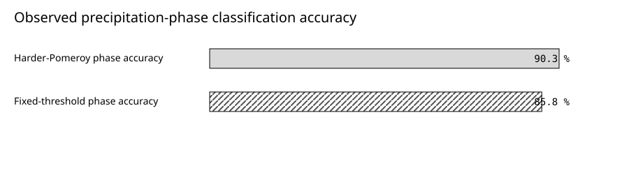
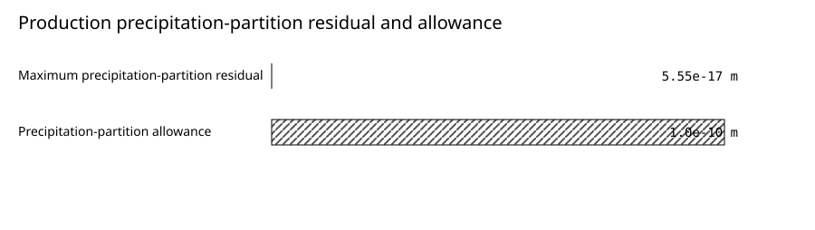

# Observational Evaluation of openWEPP Snow and Frozen-Soil Processes

*Version 1.0 — 2026-08-05*

Prepared with disclosed Codex assistance for openWEPP scientific-assurance
maintainers. The findings below are a bounded synthesis of identified evidence.

**Authorship and accountability.** Draft authors: Codex (AI coding agent). Accountable report lead: Roger Lew. Material producers: None recorded.

**Assurance status.** This report is `DRAFT`. Independent scientific, reproduction/publication, and assurance-steward approval remain pending; no approval lock exists. It does not authorize public export, vendoring, or an application-fitness determination.

## Key Findings

- Across 11711058 rows of observed hourly precipitation-phase
  records from 6883 stations, the humidity-aware
  Harder-Pomeroy formulation classified 90.3 % correctly,
  compared with 85.8 % for the fixed 0 degrees
  Celsius threshold: a difference of 4.5 percentage points.
  The observations were used in model selection, so this is substantial
  retrospective corroboration rather than untouched post-selection validation.
- Daily snow comparisons at five mountain SNOTEL and five forest-canopy
  surfaces reproduced many timing and depth-SWE response signatures while
  exposing coherent residuals: densification trajectory at
  9 cells, mountain timing or persistence at
  4 cells, and depth-SWE geometry at
  2 cells. The site-resolved results, not a pooled
  rubric percentage, are the primary interpretation.
- Frozen-soil evidence is heterogeneous and adverse results are retained.
  Frost-tube residuals reached 0.99 m. The
  isotherm-bound exceedance rate was 32.6 %
  at Mandan and 2.4 % at Reynolds
  Creek. Failed or unavailable paired snow-depth control prevents attribution
  of these coupled residuals solely to frozen-soil physics.
- Production precipitation partition closed across
  53711 rows with active precipitation. Separately,
  four selected production WAT rows—two snow and two frozen-soil rows—were
  reconstructed from their storage and transfer operands and closed at
  floating-point residuals. These are named spot verifications, not a general
  predictive or all-row conservation claim.
- The 2026-08-05 authority refresh separates current implementation from
  target authority: CoE remains the byte-identical compatibility melt runtime,
  while Stage 3 is admitted only as the future sole melt owner under an
  implementation hold. This authority decision is not empirical efficacy,
  noninferiority, runtime cutover, or a change to the retained observational
  results.

## Plain-Language Summary

Snow affects runoff, erosion, soil freezing, and the timing of water delivery.
openWEPP therefore has to answer several linked questions correctly: whether
precipitation falls as rain or snow, how the snowpack stores and releases water,
how depth and density change, and how the insulating pack alters soil freezing.
We assembled the project's observational and production evidence for that
complete chain instead of reporting a single validation grade.

The precipitation-phase result is substantial. The scored hourly observations
show that a physical, humidity-aware formulation classifies
rain and snow more accurately than a fixed freezing-point threshold and
reproduces the observed direction of the humidity effect on the rain-snow
transition. Production traces also show exact selection of that formulation and
near-machine-precision rain-plus-snow closure.

The seasonal snowpack evidence is more informative than a single score.
Site-resolved comparisons show that remaining discrepancies cluster in snow
densification,
early peak or meltout timing at mountain sites, and depth relative to SWE at two
humid New England surfaces. Absolute SWE and depth often inherit large errors
from precipitation and temperature forcing, so those magnitudes cannot be
assigned solely to snow physics.

Later campaign evidence corrected a duplicate wet-compaction input and changed
density and depth without changing generated melt or upstream snow mass. Its
annual-first site medians localized nearly all pre-peak loss to warm or mixed
days, but the
temperature, moisture, radiation, density, and pack-depth signals occur
together and do not identify one cause. The current CoE equations reproduce the
pinned post-2007 baseline, yet the material post-handbook changes lack an
independently validated production envelope. Consequently, CoE remains the
current compatibility runtime while Stage 3 is only the admitted future owner;
the required atomic implementation and cutover have not occurred.

The frozen-soil observations show why the chain must be evaluated together.
Where frost-tube depth was available, the simulated frost response could be
compared directly, but modeled snow depth frequently failed its paired control.
At two soil-temperature sites, observed snow depth was unavailable. Snow is the
dominant surface insulation boundary, so these comparisons cannot tell us how
much residual error belongs to frozen-soil physics alone. They remain valuable
coupled-system evidence and identify exactly what a future independent campaign
must control.

## Abstract

Snow accumulation and soil freezing couple atmospheric phase, snow mass and
energy storage, surface insulation, and subsurface heat and water transfer. We
synthesized retained observational and production evidence for openWEPP's
precipitation-phase, seasonal snowpack, and frozen-soil process chain. The
retrospective design comprised: 11711058 rows of hourly
precipitation-phase observations across 6883 stations;
13590 rows of paired daily SWE-depth observations at five
SNOTEL sites and 1229 rows of paired observations at five
canopy surfaces; frost-tube observations at
3 sites, with 675 rows of matched
depth comparisons; soil-temperature profiles from
2 sites, with 14939 rows of
evaluated zero-degree-isotherm bounds; and
independent reconstruction of production conservation ledgers. The
Harder-Pomeroy hourly phase formulation achieved
90.3 % classification accuracy versus
85.8 % for the fixed 0 degrees Celsius threshold and
captured the observed direction of humidity dependence. Rubric-designated
forcing-robust seasonal-snow diagnostics identified failures concentrated in
densification, under-persistent mountain timing, and depth-SWE geometry; these
correlated site-by-signature cells are not independent trials or a portable
success rate. Frost-tube residuals
reached 0.99 m, but paired snow-depth control
failed on 74.7 % of evaluated dates; the
soil-temperature sites lacked paired snow-depth observations. Production
partition and four selected-row water-storage spot verifications closed within
floating-point residuals.
The evidence supports the physical and numerical credibility of the coupled
snow/frost implementation and identifies specific residual mechanisms. Because
the observational corpora influenced model development and frozen-soil
comparisons remain snow-confounded, the synthesis does not constitute an
independent predictive validation or authorize fitness for an untested site.
The 2026-08-05 authority refresh does not change those retained empirical
results: it records that current CoE melt remains a compatibility
implementation and that Stage 3 future ownership is not yet implemented or
empirically validated.

## 1. Introduction

In erosion and watershed simulation, snow is not merely delayed rainfall. The
phase of precipitation determines whether water is immediately available for
infiltration and runoff or enters seasonal storage. Snow water equivalent (SWE)
controls stored mass; physical depth and density influence surface heat
exchange; liquid retention and ablation determine release timing; and snow
insulation modifies soil freezing and thawing. Errors propagate downstream to
runoff timing, soil-water availability, and erodibility.

Traditional WEPP snow calculations combined a temperature threshold with a
bulk accumulation and melt treatment. openWEPP retains the established process
lineage but has added a humidity-aware hydrometeor-temperature phase calculation,
explicit liquid holding and release, physical bulk-density evolution, typed
snow-state carry, and a stateful frozen-soil column. The development program
used external observations, conservation constraints, literature, negative
mechanism tests, and production-path checks to decide which changes warranted
activation.

The resulting evidence is unusually broad but was created across many bounded
engineering studies. This synthesis asks what that evidence establishes when
read as a scientific whole. It deliberately keeps four questions separate:
phase classification, seasonal snowpack response, frozen-soil response, and
software/conservation verification. The aim is not to declare the subsystem
“validated,” but to show a domain reader the strongest evidence, the residual
structure, the experimental dependencies, and the limits on inference.

## 2. Model Formulation and Conceptual Basis

### 2.1 Precipitation phase

The active hourly phase method follows Harder and Pomeroy's hydrometeor-
temperature approach. Air temperature, humidity, pressure-dependent vapor
properties, and heat/mass transfer determine the equilibrium temperature of a
falling hydrometeor. A logistic relation then maps hydrometeor temperature to
rain and snow fractions. This formulation represents the physical observation
that humidity changes the air temperature at which solid precipitation melts;
it replaces a universal 0 degrees Celsius threshold as the direct-production
default while retaining that threshold as an explicit rollback and diagnostic
comparison.

### 2.2 Snow accumulation, liquid release, and density

Snowfall adds SWE to a bulk pack. Melt and rain can be retained only to a
bounded liquid-water holding capacity; excess liquid is routed out of the pack.
Physical depth is derived from SWE and evolving bulk density, with fresh-snow,
dry-compaction, and wet-compaction behavior drawn from the Anderson/SNOBAL
lineage. SWE remains the mass authority. Density and depth may change without
inventing or removing water, and the direct runtime keeps the snowpack boundary
used by melt distinct from diagnostic or alternative-model state.

The active wet-compaction driver is now explicitly positive hourly generated
melt plus interval-start snow-contact rain, counted once before runoff. The
retired driver double counted bounded pack loss through an adjacent routed-
liquid alias. This correction materially changes density and depth trajectories
but not generated melt, upstream mass, phase, forcing, canopy, or the active
default selectors.

The current melt owner remains the post-2007 coefficient-of-efficiency (CoE)
generator for compatibility. Canonical
[snow-energy v7](research-objects/SC-SNOWENERGY-001.md) and
snow/frost v127 authority admit the resolved
Stage 3 surface-energy and phase-change system as the future sole melt owner,
but only after one atomic implementation closes complete sensible and
precipitation-advection heat, thin-pack residual-snow phase disposition, a
canonical physical recipient and next-state disposition for terminal remaining
energy without proxy transfer, same-substep liquid handling, linked
ledgers, selectors, rollback, and the real downstream consumer. Until that
implementation passes, Stage 3 cannot generate production melt and CoE cannot
be partially retired.

The bulk representation is intentionally simpler than a multilayer energy-
balance snow model. That simplicity is useful for hillslope-scale erosion
simulation, but it limits representation of vertical temperature gradients,
wind redistribution, canopy interception and unloading, and layer-specific
metamorphism.

### 2.3 Frozen soil

The frozen-soil calculation represents vertical heat flow, latent heat,
freezing and thawing fronts, liquid and frozen water, and the insulating effects
of residue and snow. Physical snow depth is the relevant insulation boundary;
SWE cannot substitute for it. The model publishes frost depth and soil-water
state, but the observational referent matters: frost tubes approximate a
frozen-water boundary, whereas the 0 degrees Celsius soil-temperature isotherm
is an upper-bound/timing referent and need not coincide with the ice front. Dun
et al. (2010) provide the primary published WEPP formulation and evaluation
lineage used here; the frost-tube data publications are separate observational
authorities.

## 3. Data and Methods

### 3.1 Study design and evidence role

This is a retrospective synthesis, not a new held-out experiment. The Jennings
phase observations informed phase-method selection. SNOTEL and canopy-site
profiles informed mechanism development, rejection, and activation. The
frozen-soil observations were used to classify residuals and govern allowable
physics work. Results therefore describe the breadth and consistency of the
evidence supporting the current formulation, while selection bias is carried as
a central limitation.

Each retained source was bound by SHA-256. A standard-library reconstruction
procedure recomputed phase accuracy from integer confusion matrices, summed
site and rubric counts, checked residual-family closure, aggregated method-
specific frozen-soil counts, authenticated the production conservation source,
and emitted the strict result used by every table, figure, and quantitative
statement in this report.

### 3.2 Precipitation-phase observations

The Jennings et al. Northern Hemisphere corpus contains hourly rain/snow phase
labels with colocated air temperature, dew point, relative humidity, and
pressure. Of 17810805 rows read,
11711058 rows met the retained scoring requirements across
6883 stations. We evaluated the active
Harder-Pomeroy hourly method and the legacy fixed 0 degrees Celsius threshold
against identical rows.

The scorer excluded 6099747 rows
(34.2 %) before comparison. Eligible rows
had all required numeric fields, a station in the supplied threshold table, a
finite valid temperature and humidity, a successful Harder-Pomeroy evaluation,
and an observed label that was exclusively rain or exclusively snow. Mixed-
phase and neither-phase labels were not scored. The retained aggregate does not
separate the skipped rows by exclusion reason, so no reason-specific exclusion
rate is inferred.

Primary operands were the four confusion-matrix cells. Accuracy was
reconstructed as correctly classified rain plus correctly classified snow
divided by all scored rows. Harder-Pomeroy classified an event as rain when its
predicted rain fraction was at least one-half; the fixed baseline classified air
temperatures above freezing as rain. For each station, the modeled transition
temperature was the scored event whose predicted rain fraction was nearest
one-half; the observed transition came from the Jennings station-threshold file.
Mean station humidity defined the lowest and highest deciles, each containing
688 stations. Bias, mean absolute error, and
the high-minus-low humidity contrast test physical pattern and magnitude
separately from event classification. The exact scoring implementation is
included as the
[phase-scoring research object](research-objects/snowbench_jennings_phase.rs).

### 3.3 Seasonal snow observations

Five NRCS SNOTEL stations span northern Rockies, Cascades maritime, Sierra
maritime, Wasatch intermountain, and Front Range continental snow climates. The
paired sonic-depth era supplied 13590 rows of daily paired
SWE-depth observations. Five additional open, deciduous, and coniferous
surfaces at Harvard and Marcell supplied 1229 rows of
paired observations and extended the vegetation/climate range.

The comparison used a signature-based, multi-timescale profile rather than one
goodness-of-fit score. Each cell was designated forcing-robust or forcing-
limited before interpretation. Forcing-robust cells included seasonal timing,
densification, depth-SWE geometry, and other response signatures. Absolute SWE
and depth magnitudes were reported but did not carry mechanism verdicts because
the fixtures mix DAYMET, GRIDMET, CLIGEN, and PRISM inputs and point-station
support with modeled hillslope support.

The ordinal bands—fail, marginal, pass, and strong—encode prespecified
signature-specific noise floors. They are useful for locating residuals across
regimes; they are not probabilities, regulatory grades, or comparable to an
NSE value. Cells from the same site and signature family are correlated and are
not independent observations. We therefore lead with the site-resolved profile,
paired counts, physical diagnostics, and fail-cell families; the pooled ordinal
distribution is a secondary development diagnostic.

### 3.4 Frozen-soil observations

The frozen-soil corpus contains three frost-tube sites at Sleepers River,
Vermont, and Morris, Minnesota, plus soil-temperature profiles at Mandan, North
Dakota, and Reynolds Creek, Idaho. Frost-tube comparisons used magnitude
residuals at matched dates. Temperature-profile comparisons tested whether the
simulated frost front remained bounded by the observed 0 degrees Celsius
isotherm; they were not treated as equivalent frost-depth measurements.
Sleepers River measurements are identified by the USGS data release; Morris
measurements are identified by the NSIDC GGD498 release. Full persistent
identifiers are given in the references.

At the frost-tube sites, paired observed snow depth supplied an explicit snow-
control test. At the two temperature sites, paired observed snow depth was not
available. This distinction was fixed before frost residual interpretation.

### 3.5 Production verification and conservation

Production traces checked that all 159986 rows
selected the declared phase, melt, and density models and that rain plus snow
reconstructed active precipitation on
53711 rows. Separately, four selected rows from
independently read production WAT outputs were retained for spot verification:
snow accumulation and release rows, and a dry freeze-growth and material-thaw
row. Their precipitation, routed melt, liquid water, frozen water, external
sink, and prior/current storage operands were retained, content identified, and
reconstructed mechanically. Physical snow depth, frost depth, and diagnostic
state were explicitly rejected as water-storage operands. These rows test exact
identities at named consumers; they do not establish all-row or all-realization
closure.

## 4. Results

### 4.1 Precipitation phase

**Harder-Pomeroy hourly phase confusion matrix.** Integer observed-versus-classified counts for the humidity-aware phase formulation across all retained scored rows.

| Observed phase | Classified rain (`rows`) | Classified snow (`rows`) |
| --- | ---: | ---: |
| Rain | 3396066 | 498328 |
| Snow | 635996 | 7180668 |

*Accessible table summary: Most observed rain and snow rows are classified correctly; snow classified as rain is the larger error cell.*

*Figure: Hourly observed phase-classification accuracy for the active humidity-aware formulation and prior fixed 0 degrees Celsius threshold on identical rows.*

| Series | Value (`%`) |
| --- | ---: |
| Harder-Pomeroy phase accuracy | 90.3 |
| Fixed-threshold phase accuracy | 85.8 |

*Accessible data alternative: Harder-Pomeroy accuracy is 90.3 percent and fixed-threshold accuracy is 85.8 percent.*

The Harder-Pomeroy method correctly classified
90.3 % of scored observations, compared with
85.8 % for the fixed threshold. Most of the gain
came from reducing observed-snow events classified as rain: the count fell from
1339353 rows under the fixed threshold to
635996 rows under Harder-Pomeroy, while
snow was assigned to 498328 rows of observed-rain events.
The fixed-threshold confusion operands were
3574653 rows rain-as-rain,
319741 rows rain-as-snow,
1339353 rows snow-as-rain, and
6477311 rows snow-as-snow, retaining the full numerator
and denominator behind its reported accuracy.

The modeled station threshold had a mean bias of
0.55 degrees C and mean absolute error of
0.94 degrees C. More importantly for mechanism
evaluation, the observed high-minus-low-humidity threshold contrast was
-0.88 degrees C; the model predicted a contrast of
-0.77 degrees C in the same direction. The
formulation therefore captured the principal humidity dependence, although its
mean station threshold remained warm-biased.

### 4.2 Seasonal snowpack response

**Site-resolved seasonal snow diagnostics.** Site-level paired rows, correlated rubric-designated forcing-robust cell counts, and representative physical diagnostics. Offsets are modeled minus observed; slope ratio is modeled divided by observed.

| Comparison surface | Paired rows (`rows`) | Fail cells (`cells`) | Marginal cells (`cells`) | Pass cells (`cells`) | Strong cells (`cells`) | Density KGE (`unitless`) | Peak SWE offset (`days`) | Meltout offset (`days`) | Depth-SWE slope ratio (`unitless`) |
| --- | ---: | ---: | ---: | ---: | ---: | ---: | ---: | ---: | ---: |
| Mica Creek | 2540 | 2 | 2 | 2 | 3 | -1.16 | -18.0 | -35.0 | 0.94 |
| Paradise | 3170 | 2 | 1 | 4 | 2 | -0.45 | -18.0 | -37.0 | 1.20 |
| CSS Lab | 1744 | 1 | 1 | 3 | 4 | -0.87 | -8.0 | -12.5 | 1.12 |
| Snowbird | 2754 | 2 | 2 | 2 | 3 | -0.56 | -45.0 | -20.0 | 1.23 |
| Niwot | 3382 | 2 | 3 | 0 | 4 | -0.96 | -31.0 | -19.0 | 1.03 |
| Harvard open | 352 | 1 | 2 | 0 | 6 | 0.55 | 0.0 | 1.0 | 9.62 |
| Harvard hardwood | 442 | 2 | 0 | 0 | 7 | -0.16 | 1.0 | -2.0 | 10.69 |
| Marcell conifer | 146 | 1 | 1 | 3 | 4 | -0.62 | 0.0 | -13.0 | 0.75 |
| Marcell deciduous | 145 | 1 | 1 | 3 | 4 | -1.09 | 0.0 | -14.0 | 0.77 |
| Marcell open | 144 | 1 | 1 | 1 | 6 | -0.47 | 0.0 | 0.0 | 0.77 |

*Accessible table summary: Ten sites show heterogeneous density, timing, and depth-SWE geometry responses; the rubric cells are correlated diagnostics, not independent trials.*

**Forcing-robust seasonal snow response profile.** Prespecified signature-band counts across the 90 available forcing-robust cells at ten snow comparison surfaces.

| Signature band | Cells (`cells`) |
| --- | ---: |
| Fail | 15 |
| Marginal | 14 |
| Pass | 18 |
| Strong | 43 |

*Accessible table summary: Strong and pass cells are the majority; 15 cells fail and 14 are marginal.*

The site-resolved table is the primary result. Negative timing offsets identify
early modeled dates: median meltout was
-35.0 days at Mica Creek and
-37.0 days at Paradise, while median
peak SWE was -45.0 days at Snowbird
and -31.0 days at Niwot. Harvard open
and hardwood depth-SWE slope ratios reached
9.62 unitless and
10.69 unitless, respectively. Seasonal
densification KGE varied by site and was negative at most surfaces. These are
physical and timing diagnostics, not interchangeable replicates.

Secondarily, across the 90 cells correlated
site-by-signature cells, 43 cells were strong,
18 cells passed, 14 cells were
marginal, and 15 cells failed. The corresponding
67.8 % is a rubric summary used during
development, not an empirical success probability or portable performance
estimate.

The fail cells were structured rather than random.
9 cells described seasonal densification
trajectory and were distributed across SNOTEL and canopy sites.
4 cells described under-persistence: early peak SWE
or early meltout at mountain stations, with substantially early retained
median dates. 2 cells described excessive depth
relative to SWE at the Harvard open and hardwood surfaces. Absolute paired
values also showed modeled SWE below observations at
all ten surfaces, but that direction cannot be assigned solely to snow physics
because forcing and spatial support affect the magnitude directly.

The retained model-development sequence tested and rejected several plausible
alternatives when they worsened the cross-site profile, including some
sublimation, shallow-pack, spring-densification, and climate-class-density
variants. These negative results increase confidence that the activated process
combination was not selected from one favorable site, while the reuse of the
same observation network still prevents an independent validation claim.

The later
[21K wet-compaction correction](research-objects/authority-impact-21k-wet-compaction.md),
[21L warm/mixed attribution](research-objects/authority-impact-21l-warm-mixed.md),
[21M CoE authority audit](research-objects/authority-impact-21m-coe-audit.md), and
[21N ownership reconciliation](research-objects/authority-impact-21n-stage3-owner.md) change how
these residuals are interpreted. The wet-compaction correction removed a
density/geometry confounder, so pre-21K
density, depth, and loss baselines cannot carry causal attribution forward.
Annual-first site medians place almost all pre-peak loss on warm or mixed days
and identify CoE's empirical `cmelt` term as the largest annual-first positive
term at all four canonical mountain sites. These observations are
chronology-confounded: warm,
moist, more radiative, denser, and shallower states co-occur. They do not prove
that `cmelt`, radiation, forcing, density, or another individual process caused
the loss, and they supply no correction or calibration authority.

The CoE implementation audit found exact post-2007 baseline fidelity rather
than a Rust transcription defect. Because the material 2007/2008 changes lack
cited independent validation or bounded transferability authority, v7/v127
admit Stage 3 as the future sole melt owner. This is a target-authority decision,
not evidence that Stage 3 currently controls SWE or runoff. CoE remains the
unchanged default compatibility owner on `IMPLEMENTATION_HOLD`; Stage 3
cutover, efficacy, noninferiority, and warm-maritime conifer transfer remain
unproven.

### 4.3 Frozen-soil response

**Frozen-soil comparison and snow-control counts.** Method-specific retained counts; frost-tube residuals and soil-temperature bounds are not pooled as equivalent depth measurements.

| Quantity | Rows (`rows`) |
| --- | ---: |
| Frost-tube matched residuals | 675 |
| Paired snow-depth controls | 660 |
| Failed snow-depth controls | 493 |
| Soil-temperature isotherm bounds | 14939 |
| Soil-temperature isotherm exceedances | 3556 |

*Accessible table summary: The table shows 675 frost-tube residuals, 493 failed snow controls among 660 paired dates, and 3,556 zero-isotherm exceedances among 14,939 evaluated bounds.*

**Site-resolved frost-tube comparisons and snow controls.** Frost-depth residual extrema and paired snow-control outcomes by site; a failed snow control blocks attribution of a frost residual to frozen-soil physics.

| Frost-tube site | Matched frost rows (`rows`) | Maximum absolute residual (`m`) | Paired snow rows (`rows`) | Snow-control failures (`rows`) |
| --- | ---: | ---: | ---: | ---: |
| Sleepers River South Field | 392 | 0.26 | 384 | 322 |
| Sleepers River W9 hardwood | 200 | 0.38 | 193 | 143 |
| Morris GGD498 | 83 | 0.99 | 83 | 28 |

*Accessible table summary: Maximum frost-depth residuals range from 0.26 to 0.99 meters, while snow controls fail frequently at all three sites.*

**Site-resolved soil-temperature isotherm comparisons.** Zero-degree-isotherm upper-bound evaluations by site; no paired observed snow depth was available at either site.

| Soil-temperature site | Evaluated bounds (`rows`) | Exceedances (`rows`) | Exceedance rate (`%`) | Maximum exceedance margin (`m`) |
| --- | ---: | ---: | ---: | ---: |
| Mandan SCAN | 10583 | 3452 | 32.6 | 0.91 |
| Reynolds Creek | 4356 | 104 | 2.4 | 0.05 |

*Accessible table summary: Mandan has a 32.6 percent exceedance rate and 0.91 meter maximum margin; Reynolds Creek has a 2.4 percent rate and 0.05 meter maximum margin.*

Frost tubes were evaluated at 3 sites. The matched
dataset contained 675 rows; the largest site-level
absolute residual was
0.99 m. At those same sites, snow-depth control
failed in 493 rows among
660 rows of paired dates
(74.7 %). Because snow depth controls
thermal resistance, those frost residuals cannot be uniquely attributed to
soil heat-flow or freeze/thaw physics.

At Mandan, 3452 rows of
10583 rows isotherm bounds were exceeded
(32.6 %), with a maximum margin of
0.91 m. Reynolds Creek had
104 rows exceedances among
4356 rows
(2.4 %), with a maximum margin of
0.05 m. Both sites lacked paired observed
snow depth, and the zero-degree isotherm is not the same physical boundary as a
frost-tube ice front. The heterogeneous adverse evidence is retained, but it is
not a transferable frost-depth error distribution. Their pooled exceedance
rate, 23.8 %, is retained only as arithmetic
context and must not replace the site-specific rates.

### 4.4 Conservation and real production consumers

*Figure: Maximum rain-plus-snow partition residual across active precipitation rows compared with the production-trace allowance.*

| Series | Value (`m`) |
| --- | ---: |
| Maximum precipitation-partition residual | 5.55e-17 |
| Precipitation-partition allowance | 1.0e-10 |

*Accessible data alternative: The maximum residual is many orders of magnitude smaller than the declared allowance.*

**Selected-row production water-ledger spot verifications.** Reconstructed storage operands and residuals for the two selected snow rows and two selected frozen-soil rows. Frozen-soil prior and current storage are liquid plus frozen water.

| Selected production row | Prior storage (`mm`) | External input (`mm`) | External sink (`mm`) | Current storage (`mm`) | Residual (`mm`) |
| --- | ---: | ---: | ---: | ---: | ---: |
| Snow accumulation, row 0 | 0.000e+00 | 4.400e+00 | 8.662e-10 | 4.400e+00 | 8.882e-16 |
| Snow release, row 1 | 4.400e+00 | 0.000e+00 | 4.400e+00 | 0.000e+00 | 0.000e+00 |
| Frozen-soil freeze growth, row 2 (year 1, day 3) | 3.054e+02 | 0.000e+00 | 1.809e+00 | 3.036e+02 | 8.527e-14 |
| Frozen-soil material thaw, row 1384 (year 4, day 290) | 3.141e+02 | 0.000e+00 | 1.152e+00 | 3.129e+02 | -2.633e-14 |

*Accessible table summary: Four selected rows close within floating-point residuals relative to storage and transfer magnitudes from approximately one to hundreds of millimeters.*

The maximum active-row rain-plus-snow partition residual was
5.55e-17 m, compared with a declared allowance of
1.0e-10 m. For the four selected-row WAT spot
verifications, independent reconstruction gave a snow accumulation-day storage residual of
8.88e-16 mm, a release-day residual of
0.00e+00 mm, and a maximum combined frozen-plus-
liquid soil-water residual of
8.53e-14 mm. The table exposes storage and transfer
magnitudes beside each residual. These are selected-row numerical closure
results, not all-row evidence or estimates of measurement or model-form error.

## 5. Discussion

### 5.1 What the evidence supports

The precipitation-phase evidence supports the physical choice to represent
humidity rather than use one universal air-temperature threshold. It is both
large in sample size and mechanistically coherent: classification improves, the
humidity contrast has the observed sign, and production partition mass closes.
The remaining warm station-threshold bias is visible and should be carried into
snowfall interpretation rather than erased by the classification aggregate.

The seasonal snow evidence supports a model that reproduces many robust aspects
of accumulation, density, timing, and depth-SWE response across disparate
climates and vegetation surfaces. The residuals identify three research needs:
vertical or structural density evolution, mountain snow persistence and
representativeness, and canopy/subcanopy control of depth relative to SWE. That
is a more useful conclusion than either “validated” or “insufficient.”

The campaign's authority result sharpens, but does not strengthen, that
empirical conclusion. Corrected wet-compaction lineage is now authoritative;
warm/mixed loss evidence remains multifactor and observational; CoE is
baseline-faithful but lacks an adequate independent production envelope; and
Stage 3 is a future implementation target, not an evaluated production
replacement. No noninferiority or default-change claim follows from authority
admission alone.

The frozen-soil evidence supports implementation credibility and shows that the
model responds across long observational records. It does not yet isolate
frozen-soil predictive skill. This is not because the frost model lacks
evidence; it is because the dominant boundary condition—snow depth—was wrong or
unobserved in the retained comparisons. A scientifically defensible next
campaign must first obtain acceptable paired snow state or propagate snow-
boundary uncertainty into frost conclusions.

### 5.2 Relation to prior knowledge

Harder-Pomeroy phase physics and the Jennings station analysis both imply that
humidity shifts the rain-snow transition, consistent with the present
directional result. Anderson/SNOBAL and Sturm research establish that snow
density evolves with metamorphism, overburden, liquid water, temperature, and
snow climate; the diffuse densification residual is therefore plausible for a
bulk model and motivates, but does not by itself validate, multilayer work.
Published frost literature likewise treats snow thermal resistance as a
first-order control, supporting the decision not to tune frozen-soil physics
against snow-confounded residuals.

### 5.3 Application interpretation

The tested domains include thousands of phase stations, five mountain SNOTEL
climates, five northeastern canopy surfaces, and five frozen-soil sites. That
breadth makes the evidence relevant to scientific scrutiny, but it does not
remove site dependence. A practitioner must compare their forcing source,
elevation, snow climate, canopy, wind exposure, soil, management, quantity of
interest, and consequence of error with these domains. In particular, accurate
phase classification does not guarantee accurate SWE magnitude, and
conservation does not guarantee correct runoff timing.

## 6. Limitations

- All empirical analyses were retrospective and influenced model development,
  mechanism rejection, or activation; no untouched held-out site set was
  retained for this synthesis.
- The full Jennings hourly observation file is large and locally retained from
  the CC0 Dryad archive rather than committed to Git. Reproduction requires
  reacquisition by its DOI and verification against the admitted procedure.
- SNOTEL is point support in open clearings. The modeled surfaces are hillslope
  representations driven by mixed DAYMET, GRIDMET, CLIGEN, and PRISM products;
  absolute precipitation and temperature uncertainty was not propagated.
- SNOTEL snow depth is station-derived, begins later than SWE at every site, and
  can contain sensor artifacts. Bulk density compounds SWE and depth error.
- The ten-surface snow rubric is a development diagnostic. Its ordinal bands
  are signature-specific and cannot be interpreted as a probability of
  correctness or a transferable accuracy grade.
- The later Snowbird precipitation-normalized lane is development-only input-
  sensitivity evidence. It is not precipitation truth, calibration,
  independent validation, or authority to transfer a multiplier to production.
- The 21L warm/mixed contrasts are chronology-confounded and cannot identify a
  unique forcing, radiation, density, canopy, or melt-process owner.
- Stage 3 future melt ownership is canonical target authority, not implemented
  physics, empirical efficacy, noninferiority, a default change, or a runtime
  cutover. CoE remains the compatibility owner until all atomic cutover gates
  pass.
- The evidence does not support transfer to warm-maritime conifer conditions;
  that claim remains explicitly withheld.
- Wind redistribution, canopy interception/unloading, subcanopy longwave
  radiation, and vertical snow layering are incomplete or simplified relative
  to advanced snow models.
- Frost-tube and soil-temperature isotherm observations are not interchangeable.
  Failed or missing snow control prevents clean attribution of frozen-soil
  residuals.
- Evidence spans named historical software realizations. Static source currency
  does not replace a fresh release reproduction, and this report has no release
  transfer.
- The study evaluates process behavior and software realization, not runoff,
  erosion, operational forecasting, design, regulation, or site-specific
  fitness.

## 7. Conclusions

openWEPP's snow and frozen-soil process chain is supported by substantial and
quantitative evidence. The humidity-aware precipitation-phase formulation is
substantially corroborated across the scored retrospective station corpus and
behaves correctly in the production consumer. Seasonal snow comparisons locate
persistent limitations in
densification, mountain persistence, and depth-SWE geometry. Conservation and
consumer checks verify precipitation partition across the retained production
trace and water-storage arithmetic at four selected WAT rows.

The post-synthesis campaign corrected a duplicate wet-compaction operand, and
its annual-first site medians showed that corrected pre-peak loss is
concentrated on warm or mixed days, but it did not isolate one causal
mechanism. The current CoE melt implementation
matches the pinned post-2007 baseline while lacking a sufficient independent
validation envelope for its material changes. Stage 3 is therefore admitted as
the future sole melt owner under v7/v127, while CoE remains the byte-identical
current compatibility runtime on implementation hold. This authority decision
does not establish Stage 3 efficacy, noninferiority, transferability, or
production readiness.

The frozen-soil evidence is valuable but not independently attributable because
snow-depth control frequently failed or was unavailable. The appropriate
scientific conclusion is therefore claim-specific: phase and snow-process
credibility are well supported within the tested retrospective domains;
seasonal residual mechanisms are known and nontrivial; and transferable
frost-depth accuracy remains unresolved pending a design that controls snow
insulation and forcing uncertainty.

These findings equip, but do not replace, an application decision by a
hydrologist, soil scientist, practitioner, or responsible institution.

## 8. Open Research and Reproduction

The report binds the exact 21K-21N terminal dispositions as inputs. Its
version-bound research-object surface exposes their public-safe authority-
impact extracts alongside the compact strict result, reconstruction procedure,
conservation operands, four primary machine-readable evidence sources,
production conservation record, snow/frost and snow-energy science contracts,
exact phase-scoring implementation, selected-row operand log, the
[archived authority-refresh prompt](research-objects/20260805-codex-execute-assure06-refresh_prompt.md),
and [dataset provenance](research-objects/dataset-provenance.md).
The technical supplement maps each
claim to those objects and gives the exact offline command.

Priority independent work is to preregister and run held-out site evaluation;
propagate forcing and snow-boundary uncertainty; evaluate snow density and
layering without site calibration; add paired snow observations to frozen-soil
sites; implement and close the complete Stage 3 sole-owner cutover without a
dual-owner interval; evaluate warm-maritime conifer transfer independently;
and reproduce the selected evidence against an exact release candidate.

## References

- Anderson, E. A. 1976. *A Point Energy and Mass Balance Model of a Snow Cover*.
  NOAA Technical Report NWS 19.
Harder, P. and Pomeroy, J. W. 2013. Estimating precipitation phase using a psychrometric energy balance method. Hydrological Processes 27, 1901-1914. [doi:10.1002/hyp.9799](https://doi.org/10.1002/hyp.9799)

Jennings, K. S., Winchell, T. S., Livneh, B., and Molotch, N. P. 2018. Spatial variation of the rain-snow temperature threshold across the Northern Hemisphere. Nature Communications 9, 1148. [doi:10.1038/s41467-018-03629-7](https://doi.org/10.1038/s41467-018-03629-7)

Data from Spatial variation of the rain-snow temperature threshold across the Northern Hemisphere, Dryad version 2019-01-31. [doi:10.5061/dryad.c9h35](https://doi.org/10.5061/dryad.c9h35)

- Sturm, M., Holmgren, J., König, M., and Morris, K. 1997. The thermal
  conductivity of seasonal snow. *Journal of Glaciology* 43:26–41. DOI
  `10.3189/S0022143000002781`.
Sturm, M., Taras, B., Liston, G. E., Derksen, C., Jonas, T., and Lea, J. 2010. Estimating snow water equivalent using snow depth data and climate classes. Journal of Hydrometeorology 11, 1380-1394. [doi:10.1175/2010JHM1202.1](https://doi.org/10.1175/2010JHM1202.1)

Dun, S., Wu, J. Q., McCool, D. K., Frankenberger, J. R., and Flanagan, D. C. 2010. Improving frost-simulation subroutines of the Water Erosion Prediction Project model. Transactions of the ASABE 53(5), 1399-1411. [doi:10.13031/2013.34896](https://doi.org/10.13031/2013.34896)

USGS Sleepers River frost-tube and paired snow-depth data release used by the South Field and W9 hardwood fixtures. [doi:10.5066/P96753GI](https://doi.org/10.5066/P96753GI)

NSIDC GGD498 seasonal frost-tube observations used by the Morris, Minnesota fixture. [doi:10.7265/1mcs-q536](https://doi.org/10.7265/1mcs-q536)

openWEPP snow-surface energy, sub-canopy longwave, Stage 3 energy closure, and future melt-owner science contract. (`openwepp:SC-SNOWENERGY-001:v7`)

NRCS SNOTEL and SCAN station records and USDA-ARS Reynolds Creek soil-
temperature records are identified in the dataset-provenance research object.
openWEPP snow and frozen-soil process, evaluation, and production-obligation science contract. (`openwepp:SC-SNOWFREEZE-001:v127`)

## About This Report

This report is production-domain V2 source version 1.0.0. It synthesizes named
historical evidence at the source identities listed in its supplement, was
assembled at openWEPP Git `47c2cf9eae6eef95f0f670d157d2d31df4cbf9cc`, and
was refreshed on 2026-08-05 against campaign increments 21K-21N and canonical
v7/v127 authority. Version 127 also admits two tagged, default-off,
consumer-forbidden evaluation operators without authorizing persistence,
production mutation, or cutover.
Codex drafted the report and deterministic reconstruction procedure. The
current attribution and governance status below are generated from the
principal registry, report descriptor, and review lock.

**Authorship and accountability.** Draft authors: Codex (AI coding agent). Accountable report lead: Roger Lew. Material producers: None recorded.

**Assurance status.** This report is `DRAFT`. Independent scientific, reproduction/publication, and assurance-steward approval remain pending; no approval lock exists. It does not authorize public export, vendoring, or an application-fitness determination.

